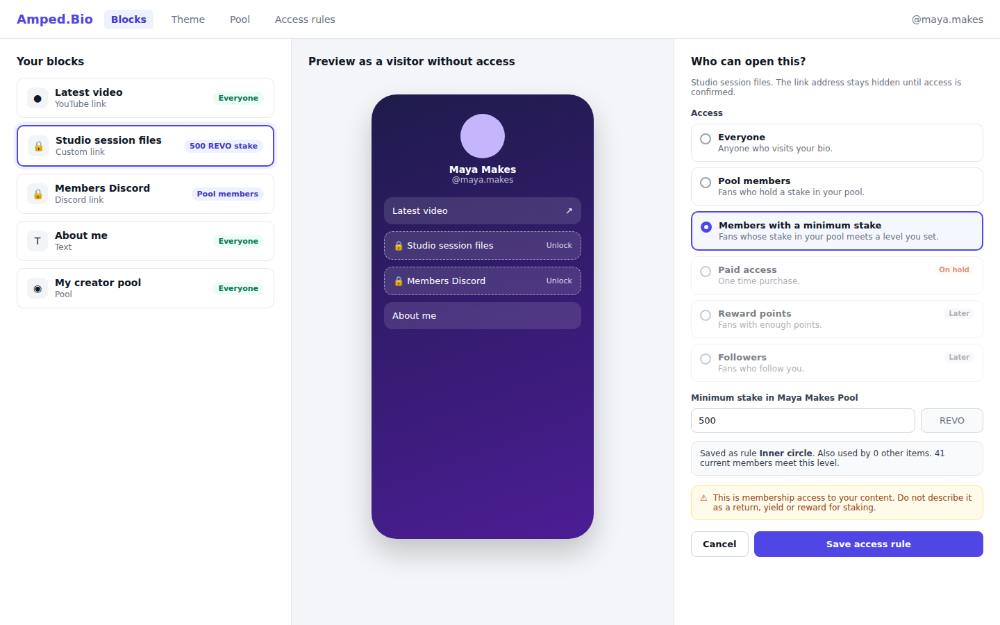
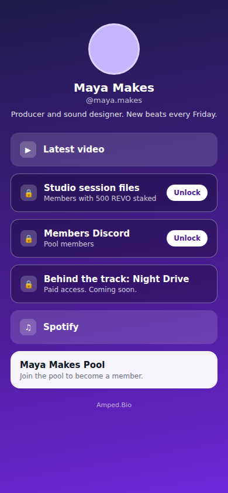
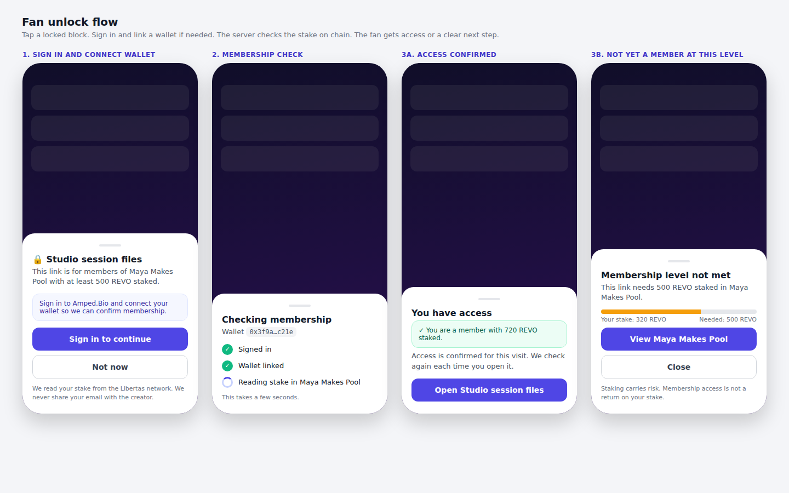
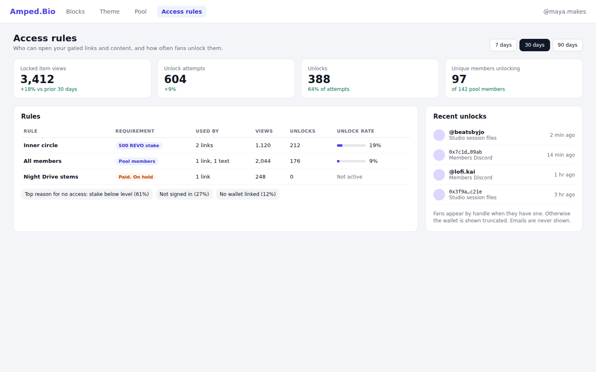

# Access Gating Engine

Status: spec for review. Build Board item #21.
Owner: Rob Frasca. Drafted by Claude, 2026-09-26.
Business overview: [docs/overviews/access-gating-engine.md](../overviews/access-gating-engine.md)

One rule engine decides who can open a gated link, content item or broadcast. It powers paid links (#16), reward gated links (#17), paid content (#18), stake gated content (formerly #19, merged into #20 and this spec) and gated broadcasts. This spec owns the shared contract that the content system, broadcast, pool explorer and brand portal specs depend on. Section 3.1 is that contract.

## 1. Research

### 1.1 Current code

- **Blocks.** `Block` in `apps/server/prisma/schema.prisma` has `id`, `user_id`, `type`, `order`, `clicks`, `config Json`. Types are `link`, `media`, `text`, `pool`, `referral` (`packages/constants/src/blocks.ts`). Config is validated per type with zod (`linkConfigSchema` and siblings; server copy in `apps/server/src/routes/blocks-schemas.ts`). There is no gate concept.
- **Public bio payload.** `handle.getHandle` in `apps/server/src/trpc/handle.ts` is a `publicProcedure`. It returns every block with its full `config`, including `config.url`. It also returns `clicks`. It also returns the creator's email. That is the creator email exposure (D1). The D1 fix must ship before gating launches publicly (3.9, 3.11).
- **Public bio render.** `apps/landingpage/src/app/[handle]/page.tsx` is `force-dynamic` and renders `ProfileView` server side. `ProfileView.tsx` renders link blocks as `<a href={block.config.url}>`. For `custom` links it loads a favicon from `google.com/s2/favicons?domain=...`. That favicon request also reveals the destination domain.
- **Click tracking.** `blocks.registerClick` (`apps/server/src/trpc/blocks.ts`) increments `Block.clicks` from the browser after the click.
- **SEO.** The SEO branch (`origin/feature/seo-llm-discoverability`, `apps/landingpage/src/lib/seo.ts`) builds JSON-LD `sameAs` from link blocks. Gated blocks must be excluded there.
- **Auth.** better-auth sessions. `createContext` in `apps/server/src/trpc/trpc.ts` exposes `ctx.user = { sub, email, role, wallet, poolAddresses }`. `sub` is the numeric `User.id`.
- **Wallets.** `UserWallet` is one to one with `User` (`userId @unique`, `address @unique`). `wallet.linkWalletAddress` verifies a Web3Auth ID token against `https://api-auth.web3auth.io/jwks` before linking. So `ctx.user.wallet` is a server verified address. The server never needs to trust a wallet address from the browser.
- **Pools and stakes.** `CreatorPool` (one per wallet per chain, `poolAddress` unique). `StakedPool` mirrors each fan's stake per pool (`stakeAmount` wei string). `StakeEvent` logs stake and unstake by tx hash. `pools.fan.confirmStake` and `confirmUnstake` (`apps/server/src/trpc/pools/fan.ts`) wait for the receipt, decode `Stake` logs from `L2_BASE_TOKEN_ABI` and update the mirror. The mirror only updates when the fan uses Amped. A stake or unstake made directly on chain is not mirrored until the next confirm call.
- **On chain reads.** `CREATOR_POOL_ABI` in `packages/web3/src/index.ts` exposes `fanStakes(address) view returns (uint256)`, `totalFanStaked()` and `creatorStaked()`. The server already builds viem `createPublicClient` per chain via `getChainConfig`. Libertas testnet is chain 73863.
- **Cache.** `apps/server/src/utils/cache.ts` wraps ioredis with an in memory fallback. It has `CACHE_TTL` and `CacheKeys` enums. Pool public data is cached 15 minutes.
- **Signing keys.** `apps/server/src/utils/auth.ts` holds an RS256 key pair (`JWT_KEYS`) used by the better-auth `jwt` plugin and published at `/.well-known/jwks.json` (`apps/server/src/routes/well-known.ts`). `jose` is already a dependency.
- **Files.** `apps/server/src/services/S3Service.ts` already presigns S3 URLs with `@aws-sdk/s3-request-presigner`.
- **Rewards.** `Referral` records referrer and referred with an optional payout `txid`. The faucet records `UserWallet.last_airdrop_request`. There is no points ledger.
- **Follows.** No follow graph exists.

### 1.2 Best in breed

| Product | What it does | Copy | Avoid |
|---|---|---|---|
| [Guild.xyz](https://docs.guild.xyz/guild/how-guild-works) | Requirements roll up to roles. Roles grant rewards. AND, OR and "should not satisfy" logic. Access is gained and lost automatically. | Separate the rule (requirement) from the thing it unlocks. Reuse one rule across many items. Revoke automatically when the fan stops qualifying. | Deep boolean builders on day one. They confuse creators and multiply test cases. |
| [Collab.Land](https://help.collab.land/key-features/token-gate-communities) | Token gating rules with min and max balance. [Background balance checks](https://dev.collab.land/help-docs/command-center/bot-config/balance-check/) every 24 hours on paid plans, 7 days on Starter. | A stated freshness window. Balance rules as the core primitive. | A long freshness window. A fan who unstakes keeps access for a day. We re-check at open time instead. |
| [Lit Protocol](https://developer.litprotocol.com/sdk/access-control/condition-types/unified-access-control-conditions) | Access control conditions as JSON. [Boolean logic](https://developer.litprotocol.com/sdk/access-control/condition-types/boolean-logic) with `and` and `or` operators and nesting. | A typed, serializable condition format keyed by kind. A clear place for combinators later. | Client side decryption as the only gate. We gate on the server and never ship the secret to the browser. |
| [Unlock Protocol](https://docs.unlock-protocol.com/core-protocol/public-lock/) | Locks sell keys. `getHasValidKey` checks a non expired key. Keys expire. | Access as a time bound credential. Our grant is short lived for the same reason. | Minting an NFT per access. It adds gas and a transferable asset where we only need a check. |
| [Shopify tokengating](https://www.shopify.com/blog/token-gating) | Product, discount and content gates. Wallet connect to verify. Guidance to lead with the benefit, explain failures and offer a non gated path. | Benefit first copy on the locked state. A clear reason on failure. A path forward (view pool) on failure. | Hiding the item entirely. A visible locked item drives membership. |
| [Base Verify](https://docs.base.org/apps/guides/verify-onchain) | SIWE signature exchanged for a short lived signed verification that expires in minutes, bound to wallet and contract. | Short lived signed grant bound to the subject and the target. Anti replay by binding, not by secrecy. | Requiring a signature per visit when the wallet is already verified server side. |
| [Linktree locks](https://linktr.ee/help/en/articles/6214962-nft-lock-on-links) | Code, Age, Subscribe and NFT locks with a lock icon. [Payment Lock](https://techcrunch.com/2022/11/16/linktree-intros-payment-lock-paywalls-for-individual-pieces-of-music-playlists-videos-newsletters-meeting-slots-and-more/) is a one time payment on a simple link. | One lock per link. Lock icon and a short requirement line. | Payment Lock gives buyers the raw destination for as long as it exists. Anyone can share it. We redirect per visit and sign files per request. |
| [Patreon post access](https://support.patreon.com/hc/en-us/articles/37807653033997-Setting-post-access-for-your-Patreon-audience) | Public, free members, all paid, specific tiers, or sell a single post. | Tier style reuse: one rule named "Inner circle" used by many items. A per item purchase option later via `paid`. | Nothing specific. |

Delivery patterns from [Stan Store](https://help.stan.store/article/74-how-will-my-customer-download-my-digital-product) (confirmation page plus email) and [Gumroad license keys](https://gumroad.com/help/article/76-license-keys) inform the `paid` kind. They are out of scope until payments ship.

### 1.3 Patterns we adopt

1. Rules are reusable objects owned by the creator. Items reference a rule.
2. The locked item stays visible. The requirement is stated in one line.
3. The secret (URL, file, text) never leaves the server until the check passes.
4. Checks run at open time against fresh data. No day long freshness window.
5. A pass becomes a short lived grant bound to viewer, resource and rule version.
6. Failures return a machine readable reason and a hint. The UI turns the hint into a next step.

## 2. Overview

Creators mark any link, media or text block as "who can open this". Fans who meet the rule open it. Fans who do not see a locked card with a clear next step. The same engine gates content items and broadcasts from the sibling specs.

**Outcome for a creator.** Pool membership has a visible, concrete benefit on the bio: access to member content. The creator sees how often fans try and succeed.

**Outcome for a fan.** One tap shows what is required. If they qualify, they are in within seconds.

**Outcome for Amped.** One audited code path for every gate. Paid access plugs in later through one interface.

### In scope

1. `AccessRule` model, zod params per kind, `accessRuleId` on `Block`.
2. Engine: `checkAccess`, `checkAccessBatch`, `issueAccessGrant`, `verifyAccessGrant`, resource resolver registry.
3. Kinds live in v1: `stake_min`, `pool_member`.
4. Kinds defined but not live: `paid` (via `PaymentVerifier`), `reward_points`, `follower`.
5. Gated link redirect `GET /go/:blockId`. Gated media and text reveal via `access.revealBlock`.
6. Locked block DTO in `handle.getHandle`. Exclusion from JSON-LD, sitemap, `llms.txt` and share previews (Open Graph and X card tags).
7. Creator rule builder in the block editor. Access rules page with unlock stats.
8. Fan unlock sheet on the public bio.
9. `AccessEvent` log for stats.

### Out of scope

- Payments, checkout and on/off ramps. Rob is building payments in the Revolution Network project. This spec defines `PaymentVerifier` only.
- A points ledger. Section 3.1.6 states what `reward_points` needs.
- A follow graph.
- Rule combinators (any/all). Reserved for v2 (Decision 2).
- External wallets without an Amped account (SIWE). Future.
- Gating the whole profile.
- Content storage and broadcast delivery. Those specs own them and call this engine.

### Decisions for Rob

1. **Stake data source.** Recommended: hybrid. Bio rendering uses a cached value (Redis, 60 s) seeded from chain. Opening a gated item always uses a chain read no older than 60 s. `confirmStake` and `confirmUnstake` purge the cache. The DB mirror (`StakedPool`) is used only for audience lists and stats, never to grant access. Reason: the mirror misses stakes made outside Amped, and chain reads for every block on every bio view are wasteful.
2. **Combinators.** Recommended: none in v1. One resource references one rule. The schema reserves `kind: "any" | "all"` with `params.ruleIds` for v2. Reason: every real case in the Build Board is a single condition. Combinators double the test surface and the builder UI.
3. **Which pools a creator can gate on.** Recommended: only the creator's own pool in v1. Reason: it keeps the gate a membership benefit of one creator's community. Gating on another creator's pool looks like cross promotion of a staking position.
4. **Floor for `pool_member`.** Recommended: a platform floor of 1 REVO. Reason: a 1 wei stake is nearly free. The floor blunts dust wallets. `stake_min` rules cannot go below the same floor.
5. **Grant lifetime.** Recommended: 10 minutes. Reason: long enough to stream a video or finish a download. Short enough that an unstake ends access quickly.
6. **Who can unlock.** Recommended: signed in Amped users with a linked wallet. Reason: the wallet is already verified server side through Web3Auth. External wallets via SIWE come later.
7. **Link destinations after redirect.** Recommended: accept that the fan sees the destination after the 302. Reason: any redirect ends at a real URL. Creators who need stronger control use a content item, which is served from signed S3 URLs. The builder states this plainly.
8. **Counsel review.** Required before launch or public marketing of `stake_min` and `pool_member`. See section 3.9.

## 3. Detailed spec

### 3.1 Shared contract

Sibling specs depend on the names in this section. Changes after approval need a note to the content, broadcast, pool explorer and brand portal owners.

#### 3.1.1 Prisma models

```prisma
model AccessRule {
  id          Int       @id @default(autoincrement())
  ownerUserId Int       @map("owner_user_id")
  name        String    @db.VarChar(80)   // creator label, for example "Inner circle"
  kind        String    @db.VarChar(32)   // "stake_min" | "pool_member" | "paid" | "reward_points" | "follower"
  params      Json                        // validated by accessRuleParamsSchema[kind]
  createdAt   DateTime  @default(now())
  updatedAt   DateTime  @updatedAt

  owner  User          @relation(fields: [ownerUserId], references: [id], onDelete: Cascade)
  blocks Block[]
  events AccessEvent[]
  // ContentItem and Broadcast add their own back relations in their specs.

  @@index([ownerUserId])
  @@map("access_rules")
}

model Block {
  // existing fields unchanged
  accessRuleId Int?        @map("access_rule_id")
  accessRule   AccessRule? @relation(fields: [accessRuleId], references: [id], onDelete: Restrict)

  @@index([accessRuleId])
}

model AccessEvent {
  id           Int      @id @default(autoincrement())
  ruleId       Int      @map("rule_id")
  ownerUserId  Int      @map("owner_user_id")     // creator, for fast stats queries
  resourceType String   @db.VarChar(16)           // "block" | "content" | "broadcast"
  resourceId   Int      @map("resource_id")
  viewerUserId Int?     @map("viewer_user_id")
  type         String   @db.VarChar(24)           // see 3.8
  reason       String?  @db.VarChar(32)           // AccessReason when denied
  createdAt    DateTime @default(now())

  rule AccessRule @relation(fields: [ruleId], references: [id], onDelete: Cascade)

  @@index([ownerUserId, createdAt])
  @@index([ruleId, createdAt])
  @@map("access_events")
}
```

Rules for referencing resources:

- A gated resource has a nullable `accessRuleId Int?` column with a foreign key to `AccessRule.id` and `onDelete: Restrict`. `null` means public.
- `ContentItem` (content spec) and `Broadcast` (broadcast spec) add exactly this column and relation.
- The rule's `ownerUserId` must equal the resource owner. The server enforces this on attach.
- The gate lives in a column, not in `Block.config`. Config stays the per type payload that is hidden when locked.
- A rule in use cannot be deleted. The API returns `CONFLICT` with the count of items using it. The UI offers "Make these items public and delete".
- Allowed block types for gating: `link`, `media`, `text`. `pool` and `referral` blocks cannot be gated.
- `name` is an addition to the field list in the brief. The rules page needs a label.

#### 3.1.2 Zod params per kind

New file `packages/constants/src/access.ts`, exported from `@repo/constants`.

```ts
import { z } from "zod";

export const ACCESS_RULE_KINDS = ["stake_min", "pool_member", "paid", "reward_points", "follower"] as const;
export type AccessRuleKind = (typeof ACCESS_RULE_KINDS)[number];

// Kinds a creator can create today. Others are defined for the contract and rejected on create.
export const LIVE_ACCESS_RULE_KINDS: readonly AccessRuleKind[] = ["stake_min", "pool_member"];

export const MIN_GATE_STAKE_WEI = "1000000000000000000"; // 1 REVO platform floor (Decision 4)

const address = z.string().regex(/^0x[a-fA-F0-9]{40}$/).transform(a => a.toLowerCase());
const weiString = z.string().regex(/^[0-9]{1,78}$/, "Must be an integer amount in wei");
const chainId = z.number().int().positive();

export const stakeMinParamsSchema = z.object({
  chainId,
  poolAddress: address,
  minStakeWei: weiString.refine(v => BigInt(v) >= BigInt(MIN_GATE_STAKE_WEI), "Below the platform minimum"),
});

export const poolMemberParamsSchema = z.object({
  chainId,
  poolAddress: address,
});

export const paidParamsSchema = z.object({
  offerId: z.string().min(1).max(128),       // id issued by the payments system
  priceDisplay: z.string().max(32).optional(), // display only, never used for verification
  accessPeriodDays: z.number().int().positive().nullable(), // null = lifetime
});

export const rewardPointsParamsSchema = z.object({
  programId: z.string().min(1).max(64), // points program, scoped to the creator
  minPoints: z.number().int().positive(),
});

export const followerParamsSchema = z.object({}).strict();

export const accessRuleSchema = z.discriminatedUnion("kind", [
  z.object({ kind: z.literal("stake_min"), params: stakeMinParamsSchema }),
  z.object({ kind: z.literal("pool_member"), params: poolMemberParamsSchema }),
  z.object({ kind: z.literal("paid"), params: paidParamsSchema }),
  z.object({ kind: z.literal("reward_points"), params: rewardPointsParamsSchema }),
  z.object({ kind: z.literal("follower"), params: followerParamsSchema }),
]);
export type AccessRuleInput = z.infer<typeof accessRuleSchema>;

export const accessResourceSchema = z.object({
  type: z.enum(["block", "content", "broadcast"]),
  id: z.number().int().positive(),
});
export type AccessResource = z.infer<typeof accessResourceSchema>;

export const ACCESS_REASONS = [
  "ok",                // allowed
  "owner",             // viewer owns the resource
  "public",            // resource has no rule
  "not_signed_in",
  "no_wallet",
  "stake_below_min",
  "not_pool_member",
  "not_purchased",
  "insufficient_points",
  "kind_unavailable",  // paid before PaymentVerifier exists, reward_points, follower
  "chain_unavailable", // chain read failed and no usable cached value
  "not_found",
] as const;
export type AccessReason = (typeof ACCESS_REASONS)[number];

export type UnlockHint =
  | { action: "none" }
  | { action: "sign_in" }
  | { action: "link_wallet" }
  | { action: "stake"; chainId: number; poolAddress: string; requiredWei: string; currentWei: string }
  | { action: "purchase"; offerId: string; priceDisplay?: string }
  | { action: "earn_points"; programId: string; requiredPoints: number; currentPoints: number }
  | { action: "unavailable" };

export type AccessDecision = {
  allowed: boolean;
  reason: AccessReason;
  unlockHint: UnlockHint;
  rule: { id: number; kind: AccessRuleKind; summary: string } | null; // summary is display copy, e.g. "Members with 500 REVO staked"
  checkedAt: string; // ISO
};
```

v2 reservation: `kind: "any" | "all"` with `params: { ruleIds: number[] }` (max 5, depth 1). Not in the union in v1.

#### 3.1.3 Server API

New module `apps/server/src/services/access/`:

```ts
// engine.ts
export type AccessViewer = { userId: number | null; walletAddress: string | null };

export async function checkAccess(viewer: AccessViewer, resource: AccessResource,
  opts?: { freshness?: "render" | "open" }): Promise<AccessDecision>;

export async function checkAccessBatch(viewer: AccessViewer, resources: AccessResource[],
  opts?: { freshness?: "render" | "open" }): Promise<Record<string, AccessDecision>>; // key: `${type}:${id}`

export async function listEligibleUserIds(ruleId: number,
  page: { cursor?: number; limit: number }): Promise<{ userIds: number[]; nextCursor: number | null }>;

// resolvers.ts: sibling specs register their resource types here
export type AccessResourceResolver = {
  getGate(id: number): Promise<{ ownerUserId: number; accessRuleId: number | null } | null>;
};
export function registerAccessResourceResolver(type: AccessResource["type"], r: AccessResourceResolver): void;
```

- `viewer` is always built on the server from `ctx.user`: `{ userId: ctx.user?.sub ?? null, walletAddress: ctx.user?.wallet ?? null }`. No endpoint accepts a wallet address from the client.
- `freshness: "render"` accepts a cached stake up to 60 s old and never blocks on the chain for more than 1.5 s. `"open"` requires a value no older than 60 s and waits up to 5 s. Grants and redirects always use `"open"`.
- `listEligibleUserIds` reads the `StakedPool` mirror. It is for broadcast audience targeting only. Delivery targets it. Opening a gated broadcast still calls `checkAccess`.

tRPC router `apps/server/src/trpc/access.ts`, mounted as `access`:

| Procedure | Type | Input | Output |
|---|---|---|---|
| `access.check` | public | `{ resource, intent?: "render" \| "open" }` | `AccessDecision`. `intent` defaults to `"render"`. `"open"` uses open freshness and is logged as an attempt (3.8) |
| `access.checkBio` | public | `{ handle }` | `Record<string, AccessDecision>` for every gated block on that bio |
| `access.issueGrant` | private | `{ resource }` | `{ grant: string; expiresAt: string }` or `FORBIDDEN` with the decision |
| `access.revealBlock` | private | `{ blockId }` | the block `config` for `media` and `text` blocks, after an `"open"` check |
| `access.rules.list` | private | none | creator's rules with usage counts |
| `access.rules.create` | private | `{ name } & AccessRuleInput` | `AccessRule` |
| `access.rules.update` | private | `{ id, name?, params? }` | `AccessRule` (kind is immutable) |
| `access.rules.delete` | private | `{ id }` | `CONFLICT` if in use |
| `access.rules.stats` | private | `{ from, to }` | per rule counts from `AccessEvent` |
| `access.rules.recentUnlocks` | private | `{ limit }` | handle or truncated wallet, item label, time |
| `blocks.setAccessRule` | private | `{ blockId, accessRuleId: number \| null }` | updated block |
| `access.trackPoolVisit` | public | `{ resource }` | none. The pool page calls it when opened with `?ref=gate&rid={type}:{id}`. Logs `pool_visit` (3.8) |

- `rules.create` rejects kinds not in `LIVE_ACCESS_RULE_KINDS`, except `paid` once a real `PaymentVerifier` is registered.
- `rules.create` and `update` for `stake_min` and `pool_member` check that `poolAddress` is a `CreatorPool` owned by the creator's wallet on `chainId` (Decision 3).
- Rate limits: `check`, `checkBio`, `issueGrant`, `revealBlock` and `trackPoolVisit` at 30 per minute per user or IP. `/go` at 60 per minute.

#### 3.1.4 Access grant

A pass becomes a signed JWT. Name: **AccessGrant**. Format:

```
header  { "alg": "HS256", "typ": "amped-access+jwt", "kid": "<key id>" }
payload {
  "iss": "amped.bio/access",
  "aud": "block" | "content" | "broadcast",
  "sub": "<viewer User.id>",
  "rid": "<type>:<id>",          // e.g. "content:812"
  "rul": <AccessRule.id>,
  "rv":  <AccessRule.updatedAt epoch seconds>,
  "wal": "<sha256 of lowercased wallet, hex, first 16 chars>",
  "jti": "<uuid>",
  "iat": <now>,
  "exp": <now + 600>
}
```

- Signed with `ACCESS_GRANT_SECRET` (new env, 32 bytes, rotated with a `kid`). HS256 is enough because only the Amped server verifies. It is kept separate from the better-auth RS256 keys so a grant can never pass as a session token.
- `issueAccessGrant(decision, viewer, resource): Promise<{ grant, expiresAt }>` and `verifyAccessGrant(token, expect: { resource: AccessResource; userId: number }): Promise<AccessGrantClaims>` live in `services/access/grant.ts`.
- `verifyAccessGrant` rejects when: signature or `exp` fails; `aud` or `rid` does not match; `sub` differs from the current session user; `rv` differs from the rule's current `updatedAt` (the creator changed the rule); the resource's `accessRuleId` changed.
- The client holds the grant in memory only. No cookie, no localStorage.
- Single use is optional per caller. The content spec can require it for downloads by recording `jti` in Redis with `SET NX EX 600`.

**Content system usage.** `content.getReadUrl({ contentItemId, grant })` calls `verifyAccessGrant`, then signs CloudFront URLs over the private content bucket (`content-system.md` 3.6). File URL expiry is `min(300, grant exp minus now)` or lower. The signed URL is returned in the response body. It never appears in SSR HTML.

The 5 minute ceiling applies to every file URL issued under a grant. Blur previews and public item URLs follow the content spec TTL table. Video and audio use Mux signed playback tokens. A Mux token must cover the full playback, so its lifetime is the media length plus 10 minutes, capped at 4 hours, and may exceed the 10 minute grant. This stream exception is accepted by this spec (see 3.6). The grant still gates issuance: no token is minted without a valid grant.

**Broadcast usage.** Opening a gated broadcast calls `access.issueGrant({ resource: { type: "broadcast", id } })` and then the broadcast body endpoint with the grant. Email or push delivery never includes the gated body. It includes a link back to Amped.

#### 3.1.5 Gated link redirect

- Express route `GET /go/:blockId` in `apps/server/src/routes/go.ts`, mounted beside `well-known`. It is a top level navigation, so the better-auth session cookie is sent (SameSite Lax).
- Steps: load block; if `accessRuleId` is null, 302 to `config.url` (works for public links too); build viewer from the session; `checkAccess(..., { freshness: "open" })`; on pass, increment `Block.clicks`, log `link_redirect`, respond `302` with `Cache-Control: no-store` and `Referrer-Policy: no-referrer`; on fail, 302 to `https://amped.bio/@{handle}?locked={blockId}&reason={reason}`, which opens the unlock sheet.
- Gated link cards render `href="{API_BASE}/go/{blockId}"`. The destination is never in the HTML, the tRPC bio payload, or the favicon request.
- A vanity `amped.bio/go/:blockId` rewrite to the API host can come later.

#### 3.1.6 Kind status and evaluation

| Kind | Status v1 | Check |
|---|---|---|
| `stake_min` | Live | `fanStakes(wallet)` on `params.poolAddress` via viem on `params.chainId` is at least `minStakeWei` |
| `pool_member` | Live | `fanStakes(wallet)` is at least `MIN_GATE_STAKE_WEI` |
| `paid` | Defined. Returns `kind_unavailable` until a `PaymentVerifier` is registered | `PaymentVerifier.verifyPurchase` |
| `reward_points` | Defined. Returns `kind_unavailable` | Needs a ledger (below) |
| `follower` | Future. Create is rejected | Needs a follow graph |

Build check: confirm in integration tests that `CreatorPool.fanStakes` reflects stakes made through `L2_BASE_TOKEN.stake`. If it does not, read the L2 base token instead. The engine hides this behind `readFanStake(chainId, pool, wallet)`.

**What `reward_points` needs.**
1. `RewardPointsLedger { id, userId, programId, delta Int, source ("referral" | "faucet" | "engagement" | "manual"), refType, refId, createdAt }` with a unique key on `(programId, source, refType, refId)` so each event pays once.
2. A cached balance per `(userId, programId)`.
3. A program owned by a creator. The creator defines what earns points.
4. Points are non transferable and have no cash value. Copy says "points", never "tokens" or "rewards you can redeem for value". Counsel reviews before launch.
5. Existing `Referral` rows can seed the first program.

#### 3.1.7 PaymentVerifier interface

Lives in `apps/server/src/services/access/payment.ts`. The Revolution Network payments work implements it.

```ts
export type PurchaseStatus = "purchased" | "not_purchased" | "pending" | "refunded" | "expired";

export interface PaymentVerifier {
  /** Has this viewer bought access for this rule? Must be idempotent and read only. */
  verifyPurchase(viewer: AccessViewer, rule: { id: number; params: z.infer<typeof paidParamsSchema> },
    resource: AccessResource): Promise<{ status: PurchaseStatus; purchaseRef?: string; accessUntil?: string }>;

  /** Display data for the unlock sheet. No checkout logic in the engine. */
  describeOffer(offerId: string): Promise<{ priceDisplay: string; currency: string; available: boolean }>;

  /** URL or client action that starts checkout for this viewer. */
  startCheckout(viewer: AccessViewer, rule: { id: number; params: z.infer<typeof paidParamsSchema> },
    resource: AccessResource): Promise<{ checkoutUrl: string }>;
}

export function registerPaymentVerifier(v: PaymentVerifier): void;

/** Payments calls this on purchase, refund or chargeback so cached decisions drop. */
export async function invalidatePurchase(viewerUserId: number, ruleId: number): Promise<void>;
```

Default is `NullPaymentVerifier`. It returns `not_purchased` and `available: false`. The engine then answers `kind_unavailable` with `unlockHint.action = "unavailable"`.

### 3.2 Screens

**Creator rule builder in the block editor.** A "Who can open this?" panel on each link, media or text block. Everyone, Pool members, Members with a minimum stake. Paid, Points and Followers show as disabled with the label "Later" and no date. The panel shows how many current members meet the level (from the mirror) and a compliance note. Saving creates or reuses a named rule.



**Locked state on a public bio (mobile).** The card stays visible with a lock, the label, a one line requirement and an Unlock button. No destination, domain or favicon.



**Fan unlock flow.** A bottom sheet. Step 1 sign in and link a wallet if needed. Step 2 server check. Step 3a open. Step 3b shows current stake against the level, the required disclosure and a link to the pool page. For `stake_min` and `pool_member` rules the disclosure shows in every step of the sheet (3.9). No yield, APY or pool performance figures near the gate.



**Creator rules and stats.** Rules with usage, views, unlock attempts, unlocks and unlock rate. Top denial reasons. Recent unlocks by handle or truncated wallet.



Copy rules for all screens follow the single list in 3.9: banned words, approved alternatives and the required disclosure.

### 3.3 Evaluation algorithm

```
checkAccess(viewer, resource, freshness):
  gate = resolver[resource.type].getGate(resource.id)        // not found -> deny "not_found"
  if gate.accessRuleId == null        -> allow "public"
  if viewer.userId == gate.ownerUserId -> allow "owner"
  rule = getRule(gate.accessRuleId)                           // Redis 5 min, purged on update
  if kind not live (or paid with Null verifier) -> deny "kind_unavailable"
  if viewer.userId == null            -> deny "not_signed_in", hint sign_in
  if viewer.walletAddress == null     -> deny "no_wallet", hint link_wallet
  switch kind:
    stake_min, pool_member:
      stake = readFanStakeCached(chainId, pool, wallet, freshness)
      if stake == UNAVAILABLE -> deny "chain_unavailable"
      pass = stake >= (kind == stake_min ? minStakeWei : MIN_GATE_STAKE_WEI)
      deny reason "stake_below_min" or "not_pool_member", hint stake {requiredWei, currentWei}
    paid: PaymentVerifier.verifyPurchase -> "purchased" passes, else "not_purchased"
  log AccessEvent (sampled for "render", always for "open", deduplicated per 3.8)
```

Batch: `checkAccessBatch` groups resources by rule, reads each rule once, and reads each `(pool, wallet)` stake once. A bio with ten gated blocks on one pool costs one chain read at most.

### 3.4 Caching and invalidation

| Key | Value | TTL | Purged by |
|---|---|---|---|
| `access_rule:{id}` | rule row | 300 s | `rules.update`, `rules.delete` |
| `fan_stake:{chainId}:{pool}:{wallet}` | wei string and `readAt` | 60 s fresh; kept 15 min as stale fallback | `confirmStake`, `confirmUnstake` for that wallet and pool |
| `access_decision:{userId}:{ruleId}:{v}` | decision | 60 s | `v` comes from `access_ver:{userId}`, incremented on stake events, purchases, wallet link or unlink |

- Freshness `"render"` may use a stake up to 60 s old. If the chain read fails it may show a stale value up to 15 minutes old as a hint. It never issues a grant from a stale value.
- Freshness `"open"` needs a value no older than 60 s. If the chain read fails and no fresh value exists, the answer is `chain_unavailable`. The engine fails closed.
- Add `CacheKeys.ACCESS_RULE_PREFIX`, `FAN_STAKE_PREFIX`, `ACCESS_VER_PREFIX` and `CACHE_TTL.FAN_STAKE = 60` to `utils/cache.ts`.
- The public bio SSR response stays viewer agnostic and cacheable. Per viewer state comes from `access.checkBio` after hydration.

### 3.5 SSR and SEO for locked blocks

- `handle.getHandle` returns gated blocks as a locked DTO:

  ```ts
  { id, type, order, gated: true,
    gate: { ruleId, kind, summary },          // "Members with 500 REVO staked"
    config: { label, platform } }             // no url, no content, no custom domain
  ```
  `platform` is kept for the icon, except `custom`, which is sent as `"locked"` so no favicon domain is revealed. `clicks` is removed from gated blocks.
- Owners see the full block in the editor through the private blocks API. The public payload is locked even for the owner, so a cached page never carries a secret.
- `ProfileView` renders a `LockedBlock` card. Link cards point to `/go/{blockId}`. Media and text cards open the unlock sheet and then call `access.revealBlock`.
- `seo.ts` `profileSameAs` skips blocks with `gated: true`. Sitemap and `llms.txt` never list gated URLs. JSON-LD may state the count of member items, never their targets.
- Share previews: Open Graph and X card tags on the bio never carry a gated destination, domain, text or media URL. Link unfurlers see only the public bio.
- Add an automated test: render a bio with a gated link and assert its destination string does not appear anywhere in the HTML, the JSON-LD, the share preview tags, the sitemap or `llms.txt`.
- Add a nightly leak scan in production. It fetches every public bio with a gated block, plus the sitemap and `llms.txt`, and searches for each gated destination string. It logs `access_leak_scan { pagesScanned, leaksFound }`. Any leak pages the on call engineer.

### 3.6 Security threat model

| Threat | Control |
|---|---|
| URL leakage in HTML, JSON-LD, tRPC payload, favicon, referrer | Locked DTO strips `url` and `content`. `/go` redirect with `no-store` and `no-referrer`. Custom favicon suppressed. SSR test in 3.5. |
| Leakage after unlock | Links: inherent after redirect, stated to creators (Decision 7). Files: CloudFront signed URLs expire in 5 minutes or less. Text and media: returned only in the `revealBlock` response. |
| Grant replay by another user | `sub` must match the session user. `rid`, `aud` and `rv` must match. 10 minute `exp`. Optional single use `jti`. |
| Forged wallet | Wallet comes only from `ctx.user.wallet`, which was linked through a verified Web3Auth ID token. No client supplied address is accepted. |
| Stale stake (unstaked outside Amped) | Open time reads are at most 60 s old. Grants last 10 minutes. Worst case for new opens after unstake is about 11 minutes. Stream exception: a video or audio play session already started may finish, up to the 4 hour Mux token cap (3.1.4). The next play session is denied. |
| Stake, unlock, unstake loop | Same bound as above. Access is per visit. Nothing permanent is handed out except a link destination, which Decision 7 covers. |
| Sybil wallets | One wallet per account and one account per wallet (existing unique keys). 1 REVO floor. Creators set higher levels with `stake_min`. |
| Chain RPC outage | Fail closed on open. Show "We could not confirm membership right now" with retry. |
| Rule tampering | Rules are owned. Attach checks owner. Kind is immutable. Edits bump `rv` and void open grants. |
| Enumeration of gated items | Block ids are already public in the bio. Locked DTO exposes no secret. Rate limits on `check` and `/go`. |
| Privacy | No emails in any access response or stats. Wallets shown as `0x1234…abcd`. Recent unlocks show handle when public, else truncated wallet. The D1 fix removes the creator email from `handle.getHandle` before public launch. |

### 3.7 Integration points for sibling specs

- **Content system (#18, and stake-gated content, formerly #19).** Add `accessRuleId` to `ContentItem`. Register a resolver for `"content"`. Use `issueGrant` then `verifyAccessGrant` before signing CloudFront URLs or minting Mux tokens. Log `locked_view` for locked content renders so the 90-day KPIs cover content items. Members-only content ships no earlier than 2 weeks after Phase 1 of this spec (3.11).
- **Broadcast.** Add `accessRuleId` to `Broadcast`. Register a resolver for `"broadcast"`. Use `listEligibleUserIds` for targeting and `checkAccess` at open time.
- **Pool explorer.** May show "Members get access to N items" using `access.rules.list` counts for that pool. It must not show this next to APY or pool performance figures. The pool page calls `access.trackPoolVisit` when opened with `?ref=gate`.
- **Brand portal.** Can reuse `stake_min` and `pool_member` rules for brand campaign items once resolvers exist. No new kinds in v1.

### 3.8 Analytics events

Server side, written to `AccessEvent`:

| `type` | When |
|---|---|
| `locked_view` | Locked block rendered in `checkBio`, or locked content item rendered on a bio or content page (sampled 1 in 10, scaled in stats) |
| `check` | An unlock attempt. Logged once at the first open time entry point: `/go`, `access.check` with `intent: "open"`, `issueGrant` or `revealBlock` |
| `denied` | Any attempt that fails, with `reason` |
| `unlocked` | Attempt passed |
| `link_redirect` | `/go` returned 302 to the destination |
| `grant_issued` | `issueGrant` succeeded |
| `content_url_issued` | Content spec signed a CloudFront URL or minted a Mux token |
| `pool_visit` | Pool page opened from a gate link, through `access.trackPoolVisit` |

- `check`, `denied` and `unlocked` are deduplicated per viewer key and resource for 10 minutes. Redis `SET NX EX 600` on `access_attempt:{viewerKey}:{type}:{rid}`. The viewer key is `u:{userId}` when signed in. Otherwise it is the first 16 hex characters of `sha256(ip + daily salt)`. The IP itself is never stored.
- A daily job writes the product analytics event `access_adoption_snapshot { poolOwners, poolOwnersWithGatedItem }`. `poolOwners` counts users who own a `CreatorPool`. `poolOwnersWithGatedItem` counts those who own at least one block, content item or broadcast with a non null `accessRuleId`.
- The nightly leak scan (3.5) writes `access_leak_scan { pagesScanned, leaksFound }`.

Client side GA4 events (item #11): `gate_view`, `gate_unlock_start`, `gate_unlock_result {reason}`, `gate_open`, `gate_pool_link_click`. Parameters carry `rule_kind` and `resource_type`. Never a user id, email or full wallet.

Rule lifecycle events for product analytics: `access_rule_created`, `access_rule_updated`, `access_rule_deleted`, `block_gate_set`.

**KPI to event.** Each 90-day target in the business overview maps to one measurement. Server events are the source of truth. GA4 events are for funnel debugging.

| KPI (90-day target, proposed) | Measurement |
|---|---|
| Pool owners with at least one gated item (30%) | `poolOwnersWithGatedItem` divided by `poolOwners` from the latest `access_adoption_snapshot` |
| Unlock success rate (45%) | `unlocked` count divided by `check` count over the window |
| Locked views that lead to an unlock attempt (8%) | `check` count divided by scaled `locked_view` count (sampled count times 10) |
| Visits to the pool page from a locked item (10% of denied attempts) | `pool_visit` count divided by `denied` count |
| Denials because the chain was unreachable (under 1%) | `denied` with `reason = chain_unavailable` divided by `check` count |
| Leaked destinations in public pages (0) | Sum of `leaksFound` from `access_leak_scan`. The SSR leak test in CI must also pass on every build |

### 3.9 Compliance

One list covers product copy and marketing. It matches the business overview's "Compliance guardrails for marketing".

- **Counsel sign-off first.** Stake-based gates (`stake_min`, `pool_member`) cannot launch or be marketed publicly until securities counsel approves the rule types, the copy and the stats screen. Access tied to staking can look like a benefit of an investment. Pilot outreach uses counsel-approved copy only.
- **Securities.** Never promise returns, yield, earnings or price movement. Gates unlock creator content only. They never grant tokens, revenue share, discounts or any economic benefit, and copy must not imply otherwise.
- **Banned words** near a gate and in gating marketing: earn, yield, return, returns, reward for staking, profit, APY, APR, invest, investment, passive income, price, gains, unlock value. The list lives in `packages/constants/src/compliance.ts` as `ACCESS_BANNED_TERMS`.
- **Approved alternatives:** member, membership, members only, access, join, support, back, "members of my pool".
- **Required disclosure.** The unlock sheet shows "Staking carries risk. Membership access is not a return on your stake." It shows in every step of the sheet for `stake_min` and `pool_member` rules. It is the constant `ACCESS_STAKE_DISCLOSURE` in `compliance.ts`. Keep it in screenshots and demo videos.
- **Placement.** Never show gate benefits next to APY or pool performance figures. The pool link from a gate goes to the pool page. It never starts a stake transaction in one tap. Ads and posts link to the pool page and never to a one-tap stake.
- **Privacy.** Stats show public handles or shortened wallets, never emails. Demo screenshots use test accounts. The creator email exposure (D1) must be fixed before public launch.
- **Later features.** Describe paid access as "later" with no date. Points are "points" with no cash value, never "tokens". `reward_points` points cannot be transferred and need counsel review before launch. For `paid`, tax, refund and consumer protection terms come from the payments project, and counsel reviews paid copy before any price appears near a gate.
- **FTC.** Pilot creators who promote gating in exchange for early access or perks must disclose it.

**Automated check.** `scripts/check-compliance-copy.ts` runs in every build and in CI. It scans string literals and JSX text in the gating components of `apps/client` and `apps/landingpage` (rule builder, locked card, unlock sheet, rules and stats page) plus any gating marketing copy stored in the repo. It matches `ACCESS_BANNED_TERMS` case insensitive on word boundaries and fails the build on any match. It also fails on em dashes and en dashes. The only exemption is `ACCESS_STAKE_DISCLOSURE`, which contains "return" by design. Gating marketing copy kept outside the repo is checked against the same exported list before publishing.

### 3.10 Acceptance criteria

1. A creator can create a `stake_min` or `pool_member` rule only for their own pool and attach it to a link, media or text block.
2. `rules.create` rejects `follower` and `reward_points`, and rejects `paid` while `NullPaymentVerifier` is active.
3. A signed out visitor sees the locked card. The page HTML, the `getHandle` response, the JSON-LD, the Open Graph and X card tags, the sitemap and `llms.txt` contain no destination URL, domain or text content of the gated block.
4. A member at or above the level opens the link through `/go` in under 2 s at p95 with a warm cache.
5. A member below the level sees current stake, required stake, the required disclosure and a link to the pool page.
6. After an unstake confirmed through Amped, the next open is denied. After an unstake made directly on chain, opens are denied within 60 s.
7. A grant for resource A fails on resource B, for another user, after 10 minutes, and after the rule is edited.
8. When the chain RPC fails, opens are denied with `chain_unavailable` and no grant is issued.
9. The rules page shows views, attempts, unlocks, unlock rate and top denial reasons. No emails. Wallets are truncated.
10. No em dashes or en dashes in any shipped copy.
11. `pnpm run typecheck` and `pnpm run build` pass. Unit tests cover each kind, the batch path, grant verification failures and the SSR leak test.
12. The rule builder shows Paid, Points and Followers as disabled with "Later" and no date.
13. For `stake_min` and `pool_member` rules, `ACCESS_STAKE_DISCLOSURE` shows in every step of the unlock sheet. The pool link opens the pool page and never starts a stake transaction.
14. `scripts/check-compliance-copy.ts` finds no term from `ACCESS_BANNED_TERMS` and no em or en dash on gating surfaces. Any match fails the build. Only `ACCESS_STAKE_DISCLOSURE` is exempt.
15. `handle.getHandle` returns no creator email (D1 fix) before any public gating post.
16. On staging, every server event in 3.8 is written, and each KPI in the KPI to event table computes from those events. Repeated attempts on one resource by one viewer within 10 minutes count once.
17. The nightly leak scan runs in production and reports `leaksFound = 0`.

### 3.11 Phased rollout

Timings follow the business overview launch plan. All dates are proposed.

| Phase | Timing | Scope | Gate |
|---|---|---|---|
| 0 | October to November 2026 (proposed) | Counsel review of rule types, copy and the stats screen. Contract merged: Prisma models, `@repo/constants` access schemas, resolver registry, `compliance.ts` list and disclosure. D1 email fix in `handle.getHandle`. Recruit 10 pilot creators with counsel-approved outreach copy. | Counsel sign off. D1 fix live. Sibling spec owners confirm contract. |
| 1 | December 2026, after counsel sign off (proposed) | Engine with `stake_min` and `pool_member`. Link blocks only. `/go`. Locked DTO. SEO and share preview exclusions. Rule builder. Analytics events from 3.8 and the compliance copy check, so 90-day KPIs start at launch. Behind flag `ACCESS_GATING_ENABLED` and a creator allowlist of the 10 pilot creators. | Counsel sign off recorded. SSR leak test green and nightly leak scan clean before any public post. |
| 2 | January to February 2027 (proposed) | Media and text reveal. `issueGrant` for content (#18, and stake-gated content, formerly #19) and broadcasts. Members-only content (content spec Phase 2) connects here, no earlier than 2 weeks after Phase 1 ships. Rules and stats page. General availability for stake based kinds: open to all pool owners. | Pilot unlock rate and error rate reviewed. |
| 3 | Later, no date | `paid` via the Revolution payments `PaymentVerifier` (#16, #18). `reward_points` ledger (#17). | Payments shipped. Counsel review of points and paid copy. |
| 4 | Later, no date | Combinators (`any`, `all`). SIWE for external wallets. `follower` once a follow graph exists. | Demand from creators. |

Gating ships before any members-only content or gated broadcast. Those features depend on Phase 1 being live and on the counsel sign off above.

## Sources

- Guild, How Guild works: https://docs.guild.xyz/guild/how-guild-works
- Collab.Land, Token gate communities: https://help.collab.land/key-features/token-gate-communities
- Collab.Land, Background balance checks: https://dev.collab.land/help-docs/command-center/bot-config/balance-check/
- Lit Protocol, Unified access control conditions: https://developer.litprotocol.com/sdk/access-control/condition-types/unified-access-control-conditions
- Lit Protocol, Boolean logic: https://developer.litprotocol.com/sdk/access-control/condition-types/boolean-logic
- Unlock Protocol, PublicLock: https://docs.unlock-protocol.com/core-protocol/public-lock/
- Shopify, Token gated commerce guide: https://www.shopify.com/blog/token-gating
- Shopify, About tokengating: https://shopify.dev/docs/apps/build/blockchain/tokengating
- Base, Verify users onchain: https://docs.base.org/apps/guides/verify-onchain
- Linktree, NFT Lock on links: https://linktr.ee/help/en/articles/6214962-nft-lock-on-links
- Linktree, Code Lock on links: https://linktr.ee/help/en/articles/5576271-code-lock-on-links
- TechCrunch, Linktree Payment Lock: https://techcrunch.com/2022/11/16/linktree-intros-payment-lock-paywalls-for-individual-pieces-of-music-playlists-videos-newsletters-meeting-slots-and-more/
- Patreon, Setting post access: https://support.patreon.com/hc/en-us/articles/37807653033997-Setting-post-access-for-your-Patreon-audience
- Stan Store, How customers access a digital product: https://help.stan.store/article/74-how-will-my-customer-download-my-digital-product
- Gumroad, License keys: https://gumroad.com/help/article/76-license-keys

## Revision log

2026-09-26: aligned with business overview (added overview link; D1 email exposure noted and made a launch gate; share preview exclusion and a nightly leak scan added; builder labels set to "Later" with Points in place of Reward points; unlock sheet shows the disclosure in every step for stake rules; banned words, approved alternatives, disclosure, placement, privacy, later features and FTC rules matched to the overview as one product plus marketing list; build-time copy check added; stream exception and CloudFront wording aligned with the content spec; attempt dedupe, `intent` on `access.check`, `pool_visit`, adoption snapshot and leak scan events plus a KPI to event table added; phases given proposed timings, counsel and D1 gates and the gating before members-only content dependency; acceptance criteria 12 to 17 added and 3, 5 and 9 tightened).
