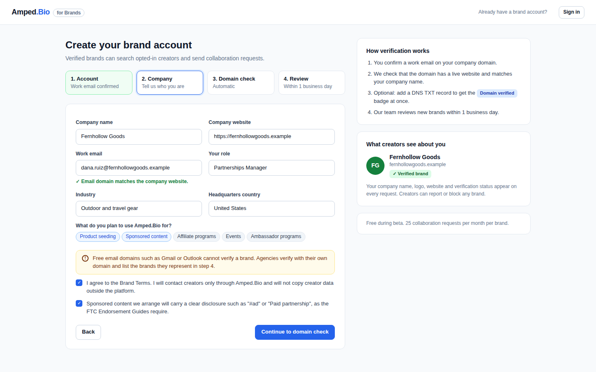
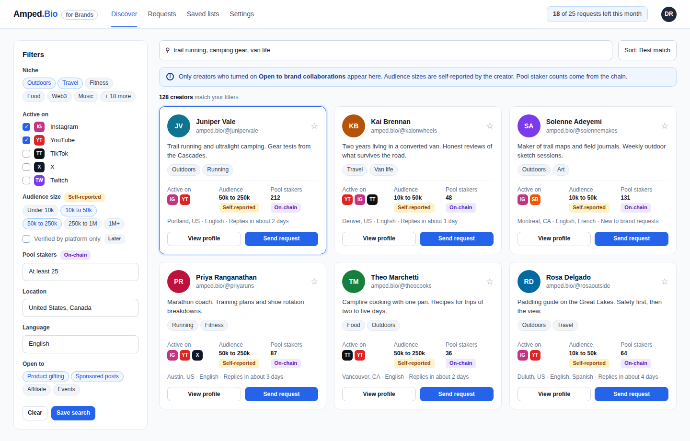
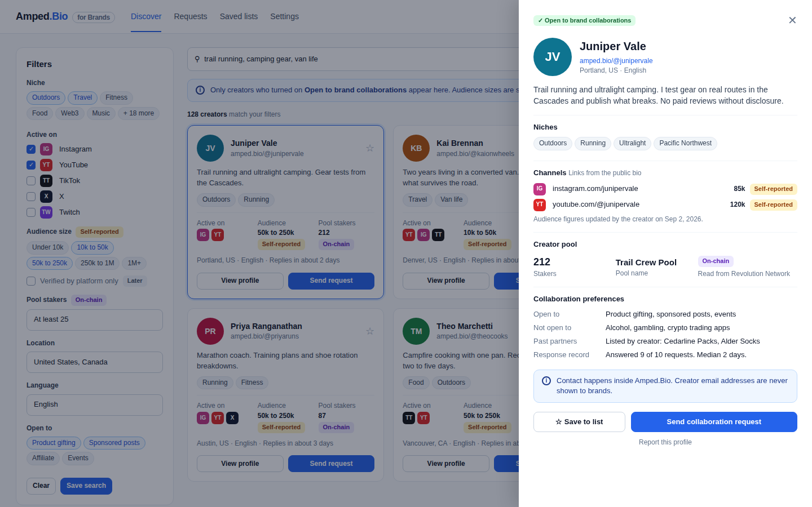
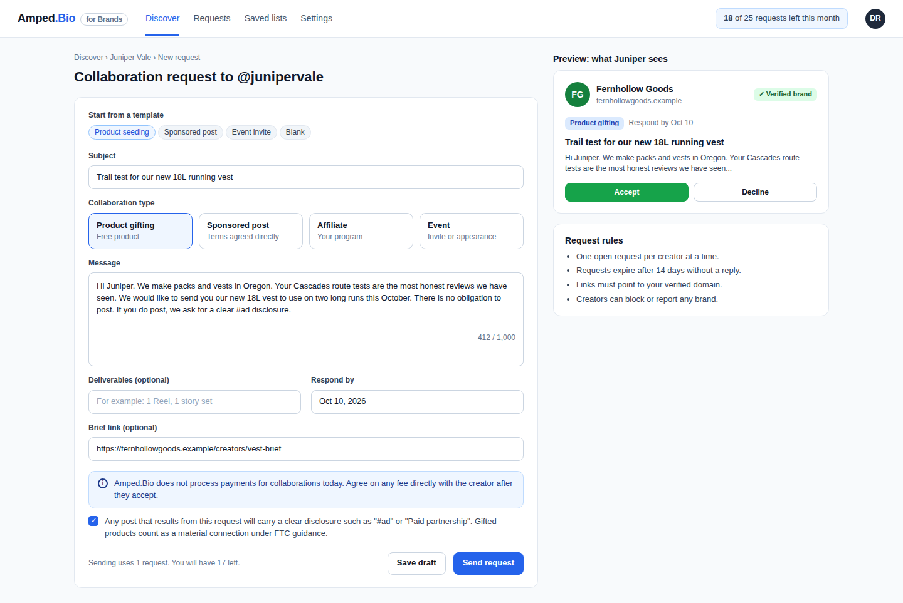
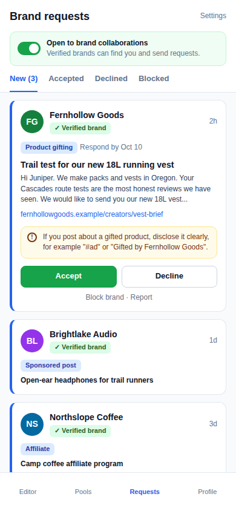
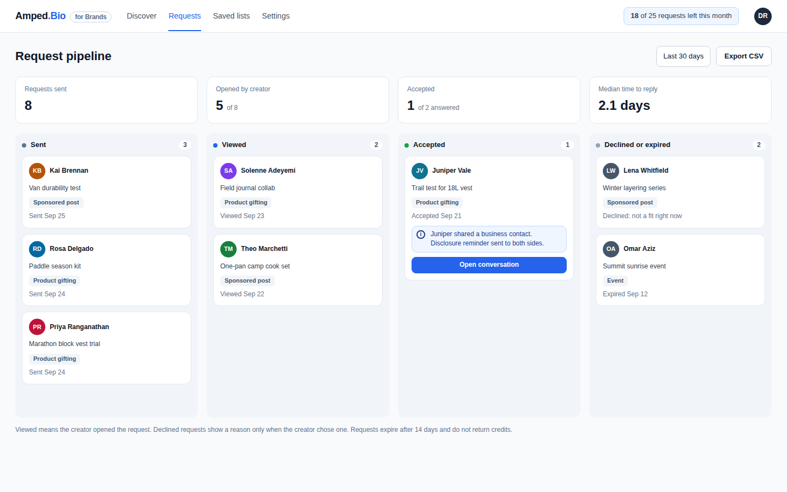

# Brand Portal

Status: spec for review. Build Board item #7.
Owner: Rob Frasca. Drafted by Claude, 2026-09-26.
Business overview: [docs/overviews/brand-portal.md](../overviews/brand-portal.md)

Rob's brief: "a brand portal that allows brands to search for Amped bios and contact those bios or creators directly."

This spec covers brand accounts, creator discovery, collaboration requests and the creator inbox. It does not cover the brand ad unit on bios (Build Board item #8). Section 2.6 names the extension points item #8 will use.

## 1. Research

### 1.1 What the code has today

| Area | Location | What exists | Gap for this feature |
|---|---|---|---|
| Creator identity | `apps/server/prisma/schema.prisma`, model `User` | `name`, `handle` (column `littlelink_name`), `description`, `image`, `role`, `block` ("yes" means suspended), `email_verified` | No niche, location, language or audience fields. No opt-in for brand contact. |
| Bio content | model `Block`, `packages/constants/src/blocks.ts` | Link blocks carry `config.platform` from `allowedPlatforms` (instagram, tiktok, youtube, twitter, linkedin and more). Media blocks carry `mediaPlataforms` (adds twitch, spotify, substack). `Block.clicks` is a lifetime counter. | Platform presence is known. Follower counts are not. |
| Creator pools | models `CreatorPool`, `StakedPool`, `UserWallet` | `CreatorPool.fans` and the staker count computed in `apps/server/src/trpc/pools/creator.ts`. `CreatorPool.hidden` hides a pool. | Usable as an on-chain signal. Staker identities and wallet addresses must stay out of the portal. |
| Auth | `apps/server/src/utils/auth.ts` | better-auth with email and password, Google, reCAPTCHA (`captcha` plugin), 2FA, JWT. `role` is a comma-separated string checked by `createRoleProtectedProcedure`. | No organization or team model. No brand account type. |
| API | `apps/server/src/trpc/*`, merged in `trpc/index.ts` | `publicProcedure`, `privateProcedure`, `adminProcedure`. | Needs a `brandProcedure` middleware and new routers. |
| Email | `apps/server/src/utils/email/email.ts` | nodemailer with React email templates (verify, reset, welcome, email change). | Needs request, accept and digest templates. |
| One-time codes | model `ConfirmationCode`, enum `ConfirmationCodeType` | 6-digit codes with expiry. | Add `BRAND_WORK_EMAIL`. |
| Cache and limits | `apps/server/src/utils/cache.ts` (ioredis with in-memory fallback), Redis in `compose.yaml` | Redis client exists. | No rate limiting anywhere in the server. |
| Editor app | `apps/client/src/App.tsx` | Routes are `/:panel?` and `/:handle/edit/:panel?`. Each editor section is a panel. | The creator inbox becomes a new panel. Brand screens need a new `/brands/*` route. |
| Public site | `apps/landingpage/src/app/[handle]` | Every top-level path is a handle. `/i/` is the reserved prefix for site pages. | There is no reserved-handle list. A public `/brands` page would collide with a creator who claims `brands`. |
| Admin | `apps/admin`, `trpc/admin/*` | User list with suspend (`block`). | Needs brand review and report queues. |
| Indexable rule | SEO spec, `docs/features/seo-llm-discoverability.md` section 3.5 | Handle set, not suspended, verified email, description or at least one block. | Reused as the floor for search eligibility. |

**Findings that change scope**

1. **Email exposure is a blocker.** `handle.getHandle` returns `user.email` to any caller (`apps/server/src/trpc/handle.ts`, destructured near line 162 and returned near line 289). A brand could read a creator's email from the public bio today and skip the portal entirely. The fix must ship before or with Phase 1. This spec does not duplicate the fix. It adds a test that no brand-facing procedure returns an email field.
2. **No audience data exists.** Amped has no follower counts and no niche taxonomy. v1 shows self-reported ranges, labelled as such. Verified counts come later from official platform APIs (section 3.4).
3. **No job runner.** The server has no cron or queue. Index updates run inline in the mutation that changes the data, plus a nightly rebuild (section 3.5).
4. **No reserved handles.** Public marketing for brands goes under `/i/brands`, following the SEO spec pattern.

### 1.2 Best-in-breed review

| Product | Model | Patterns to copy | Patterns to avoid |
|---|---|---|---|
| **Linktree Brand Deals** ([help](https://linktr.ee/help/en/articles/12135302-create-your-brand-deals-profile)) | Opt-in Brand Deals profile inside a link-in-bio product. US only. Brands search by metrics and collaboration history. | Closest analogue to Amped. Explicit opt-in. Profile fields for partnership types (paid, sponsored links, affiliate, gifted), past brand work, optional rate card. Stats pulled from connected Instagram and TikTok accounts, not typed in. | Direct messaging gated behind a creator loyalty tier. It rewards engagement with Linktree, not fit with the brand. |
| **Beacons Media Kit** ([permissions](https://help.beacons.ai/en/articles/4705345)) | Creator-owned media kit with five access levels: unlocked, email, brand deal offer, password, approved access. | The creator decides how much a brand sees and when. "Submit an offer to unlock" turns browsing into a qualified request. | Email-gate mode collects brand emails with no verification. |
| **Passionfroot** ([creators](https://www.passionfroot.me/creators)) | Creator storefront with booking forms. B2B focus. Brands pay 5% on creator-sourced deals. Creators pay 15% on partner network deals. | Structured request form instead of free chat. Clear split between deals the creator brought and deals the platform brought. | Depends on in-platform payments, which Amped has on hold. |
| **Collabstr** ([pricing](https://collabstr.com/pricing)) | Open marketplace. Free brand search. Pro $249 per month, Premium $333 per month billed annually. 10% hiring fee, 5% on Premium. | Free search lowers the barrier. Chat before hiring is a paid feature, which limits spam. | Creator listings with public prices invite a race to the bottom. |
| **Modash** ([pricing](https://www.modash.io/pricing)) | Discovery database of 380M+ profiles. Essentials $199 per month with 300 opened profiles and 150 email unlocks. | Credit model: opened profiles and unlocks are metered per month. Strong filters. | Indexes creators who never opted in and sells their emails. Amped must not do this. |
| **Aspire** ([marketplace](https://help.aspireiq.com/en/articles/6023393-overview-of-aspire-s-creator-marketplace)) | Brands post campaigns. Creators apply. Free for creators. | Inbound model: creators self-select, so brands get warm replies. Good Phase 3 addition. | Heavy campaign tooling is more than Amped needs now. |
| **Platform-native marketplaces**: TikTok One ([signup](https://ads.tiktok.com/resources/help/article/how-creators-can-sign-up-for-tiktok-one), [requirements](https://stackinfluence.com/blog/tiktok-marketplace-requirements)), YouTube BrandConnect ([help](https://support.google.com/youtube/answer/9385307)), Instagram creator marketplace ([Meta](https://about.fb.com/news/2024/02/creator-marketplace-for-brands-and-creators-to-collaborate-on-instagram/), [partnership messages](https://help.instagram.com/1421295241646809/)) | Free to brands. Creators must be 18+, in good standing and above a follower threshold. First-party stats. | 18+ eligibility. Brand messages land in a separate partnership folder, not the main inbox. YouTube shares creator contact details only after the creator signals interest. | Follower thresholds exclude most small creators. Amped's audience is small creators and pool communities, so no follower floor. |

### 1.3 Patterns we adopt

1. **Opt-in only, default off.** Only creators who turn on "Open to brand collaborations" are searchable.
2. **Structured first contact.** A request is a form with a type, subject, message and deadline. It is not an open chat.
3. **Contact after consent.** The brand never sees the creator's email. The creator decides on accept whether to share a business contact.
4. **Honest labels.** Every audience number carries its source: "Self-reported" or "Verified". Pool member counts carry "On-chain".
5. **Metered outreach.** A monthly request quota per brand, one open request per creator, and creator-side caps.
6. **Separate inbox.** Brand requests live in their own editor panel, with their own notifications.

## 2. Overview

### 2.1 Outcomes

- **Brands** find creators by niche, platform, audience range, pool member count, location and language. They send a structured request and track it to a reply.
- **Creators** receive vetted requests from verified brands in one place. They stay in control of what brands see and who can reach them. Their email stays private.
- **Amped** gains a two-sided reason to join: creators get deal flow, brands get a discovery channel. Pool member counts become a visible, verifiable proof of community that other link-in-bio products cannot show. The brand account is the identity item #8 will reuse for ads. 90 days of accept-rate data set brand pricing.

### 2.2 In scope

1. Brand signup, work email verification, domain checks and admin review.
2. Creator opt-in and a brand-facing profile with self-reported fields.
3. Creator search with filters and a profile drawer.
4. Collaboration request composer with templates and FTC disclosure acknowledgment.
5. Creator inbox panel with accept, decline, block and report.
6. Brand request pipeline with basic stats.
7. Email notifications for new requests and accepts. A weekly creator digest follows in Phase 2.
8. Admin queues for brand review and reports.
9. Abuse controls: quotas, rate limits, cooldowns, auto-pause.

### 2.3 Out of scope

- Payments, escrow, payouts, contracts or invoices. Creator payments are on hold.
- The brand ad unit (item #8).
- Verified follower counts via platform OAuth (planned, section 3.4).
- Campaign listings that creators apply to (Phase 3 candidate).
- Scraping or importing data from third-party platforms. Never in scope.
- Brand access to staker identities or wallet addresses.

### 2.4 Decisions for Rob

1. **Where the portal lives.**
   - Option A: `app.amped.bio/brands/*` inside `apps/client`, with a public explainer at `amped.bio/i/brands`. One login, one tRPC client, one deploy.
   - Option B: `brands.amped.bio` as a separate app. Cleaner brand identity, but a new deploy, new cookie scope and duplicated auth UI.
   - Option C: `amped.bio/brands`. Needs a reserved-handle list first.
   - **Recommendation: A.** Move to B later if brand volume justifies a separate product.
2. **Verification bar.**
   - Low: verified work email on a non-free domain.
   - Medium: low bar plus live website on the same domain plus admin review within 1 business day. DNS TXT record optional, earns a "Domain verified" badge.
   - High: DNS TXT record required for every brand.
   - **Recommendation: Medium.** Manual review is cheap at launch volume and stops the worst actors. Revisit after 200 brands.
3. **Pricing.** The market uses these models (list only):
   - Free to search, fee per completed deal (Collabstr 10% or 5%, Passionfroot 5% or 15%). Requires payments, which are on hold.
   - Monthly subscription with metered credits (Modash from $199 per month, Collabstr Pro $249 per month).
   - Free for brands, funded by ads (TikTok One, YouTube BrandConnect, Instagram).
   - Pay per request credit packs.
   - Always free for creators. Every product reviewed does this.
   - **Recommendation:** free during beta with 25 requests per brand per month. Decide on paid plans after 90 days of data on accept rates. Creators stay free.
4. **Messaging.**
   - Option A: on accept, the creator may share a business contact. No thread in Amped.
   - Option B: on accept, a text-only thread opens in Amped.
   - **Recommendation:** ship A in Phase 1, add B in Phase 2. A is small and keeps Amped out of message moderation at launch.
5. **Crypto and token promotions.** Brands that promote tokens or trading products raise securities and financial promotion questions. **Recommendation:** allow them only after manual review, and let creators exclude the category (default excluded).

### 2.5 Shared contract with sibling specs

- **Access gating engine.** Portal permissions are role checks (brand member, creator owner, admin). They do not use `AccessRule`. A later phase can let a creator gate a media kit `ContentItem` with an `AccessRule` whose audience is "verified brands", evaluated by `checkAccess(viewer, resource)`. The viewer type needs a brand membership flag for that.
- **Content system.** Brand-facing profile fields are not `ContentItem`s in v1.
- **Broadcast.** The portal shows pool member counts only. It never exposes the stakers audience, its members or its addresses.
- **Creator payments.** On hold. No field in this spec moves money.

### 2.6 Extension points for item #8 (brand ad unit)

- `BrandAccount` is the advertiser identity. Its `status` and verification gate ad creation.
- `CreatorBrandProfile` will take a separate opt-in for ads. It is not the same consent as brand contact.
- `excluded_categories` on the creator profile applies to ads as well.
- Analytics events use the `brand_` prefix so ad events can join them.

## 3. Detailed spec

### 3.1 Screens

**Screen 1. Brand signup and verification** (`app.amped.bio/brands/signup`)



- Step 1: create or sign in to an Amped account. reCAPTCHA as today.
- Step 2: company name, website, work email, role, industry, country, use cases. Agency toggle with a list of represented brands.
- The work email domain must equal the website's registrable domain. Free email domains are rejected with a clear message.
- Two acknowledgments are required: Brand Terms (contact only through Amped, no copying of creator data) and FTC disclosure.
- Step 3: automatic checks. The domain has MX records and the website returns HTTP 200. Optional DNS TXT record `amped-verify=<token>`.
- Step 4: admin review. Status `PENDING_REVIEW` until approved. The target is a decision within 1 business day. The brand can browse the explainer but not search.
- Signup copy says brands reach creators "through Amped". It never offers direct email access.

**Screen 2. Creator search** (`/brands/discover`)



- Keyword search over name, handle, bio and niches.
- Filters: niche, active platforms, audience range (self-reported), minimum pool members, country, language, open-to collaboration types.
- "Verified by platform only" is shown disabled with a "Later" badge until section 3.4 ships.
- Cards show only fields from section 3.3. Every audience figure shows its source badge.
- A standing banner states that only opted-in creators appear and that audience sizes are self-reported.
- Sort: best match (default), most pool members, recently active.

**Screen 3. Creator profile drawer** (`/brands/discover?creator=<handle>`)



- Bio text, niches, channels from public link blocks, self-reported audience per channel with its update date.
- Creator pool: member count and pool name, read from the chain, with an "On-chain" badge. Hidden pools are not shown. No stake amount, token price or yield is shown.
- Preferences: open to, not open to, past partners (typed by the creator).
- Response record: shown after the creator has received at least 3 requests.
- Actions: save to list, send collaboration request, report.

**Screen 4. Request composer** (`/brands/requests/new?creator=<handle>`)



- Templates: product seeding, sponsored post, event invite, blank. Templates include disclosure language.
- Fields: type, subject (120 characters), message (1,000 characters, plain text), deliverables (300 characters, optional), respond-by date (3 to 30 days out), brief link (optional, must be on the verified domain).
- A notice states that Amped does not process payments for collaborations.
- The FTC checkbox is required to send.
- A live preview shows the request as the creator will see it.
- The footer shows the quota cost and the remaining count.

**Screen 5. Creator inbox, mobile** (editor panel `app.amped.bio/brand-requests`)



- The "Open to brand collaborations" switch sits at the top. Turning it off removes the creator from search at once. Existing requests stay in the inbox.
- Tabs: New, Accepted, Declined, Blocked.
- Each request shows the brand name, logo, verified domain, type, deadline, subject and message.
- Accept opens a sheet: optional business contact to share (defaults to empty, never pre-filled with the login email), a required disclosure acknowledgment, and the notice that Amped does not process payments for collaborations.
- Decline takes an optional reason: not a fit, timing, compensation, category, other.
- Block brand and Report are on every request.

**Screen 6. Brand request pipeline** (`/brands/requests`)



- Columns: Sent, Viewed, Accepted, Declined or expired.
- Stats: requests sent, opened, accepted of answered, median time to reply.
- "Viewed" is set when the creator opens the request. Creators are told this when they opt in.
- CSV export contains request metadata and public handles only.

### 3.2 Data model (Prisma)

All new tables follow existing conventions: `Int` autoincrement ids, snake_case columns, `@@map` to plural table names.

```prisma
enum BrandStatus {
  PENDING_REVIEW
  ACTIVE
  PAUSED        // auto-paused by abuse rules, pending review
  SUSPENDED
  REJECTED
}

enum BrandMemberRole {
  OWNER
  MEMBER
}

enum CollabType {
  PRODUCT_GIFTING
  SPONSORED_POST
  AFFILIATE
  EVENT
}

enum CollabRequestStatus {
  SENT
  VIEWED
  ACCEPTED
  DECLINED
  EXPIRED
  WITHDRAWN
}

enum AudienceSource {
  SELF_REPORTED
  PLATFORM_OAUTH
}

model BrandAccount {
  id                    Int         @id @default(autoincrement())
  name                  String      @db.VarChar(120)
  website               String      @db.VarChar(255)
  domain                String      @unique @db.VarChar(255) // lowercased registrable domain
  industry              String?     @db.VarChar(80)
  country               String?     @db.Char(2)
  logo_file_id          Int?
  is_agency             Boolean     @default(false)
  represented_brands    Json?       // string[], max 20
  status                BrandStatus @default(PENDING_REVIEW)
  dns_token             String?     @db.VarChar(64)
  domain_verified_at    DateTime?
  reviewed_by           Int?
  reviewed_at           DateTime?
  review_note           String?     @db.Text
  monthly_request_quota Int         @default(25)
  terms_version         String      @db.VarChar(20)
  terms_accepted_at     DateTime
  created_at            DateTime    @default(now())
  updated_at            DateTime?   @updatedAt

  logo     UploadedFile?          @relation("BrandLogo", fields: [logo_file_id], references: [id], onDelete: SetNull)
  members  BrandMember[]
  requests CollaborationRequest[]
  saved    BrandSavedCreator[]
  blocks   CreatorBrandBlock[]

  @@index([status])
  @@map("brand_accounts")
}

model BrandMember {
  id                     Int             @id @default(autoincrement())
  brand_id               Int
  user_id                Int             @unique // one brand per user in v1
  role                   BrandMemberRole @default(MEMBER)
  work_email             String          @db.VarChar(255)
  work_email_verified_at DateTime?
  created_at             DateTime        @default(now())

  brand BrandAccount @relation(fields: [brand_id], references: [id], onDelete: Cascade)
  user  User         @relation(fields: [user_id], references: [id], onDelete: Cascade)

  @@index([brand_id])
  @@map("brand_members")
}

model CreatorBrandProfile {
  id                  Int       @id @default(autoincrement())
  user_id             Int       @unique
  open_to_brands      Boolean   @default(false)
  consent_version     String?   @db.VarChar(20)
  opted_in_at         DateTime?
  opted_out_at        DateTime?
  age_confirmed_at    DateTime? // 18+ self-attestation, required to opt in
  niches              Json?     // string[] from CREATOR_NICHES, max 5
  country             String?   @db.Char(2)
  region              String?   @db.VarChar(80)
  languages           Json?     // ISO 639-1 codes, max 5
  collab_types        Json?     // CollabType[]
  excluded_categories Json?     // from BRAND_CATEGORIES
  past_partners       Json?     // string[], max 10, typed by the creator
  weekly_request_cap  Int       @default(20)
  paused_until        DateTime?
  created_at          DateTime  @default(now())
  updated_at          DateTime? @updatedAt

  user     User                 @relation(fields: [user_id], references: [id], onDelete: Cascade)
  audience CreatorAudienceStat[]

  @@map("creator_brand_profiles")
}

model CreatorAudienceStat {
  id          Int            @id @default(autoincrement())
  profile_id  Int
  platform    String         @db.VarChar(40) // PlatformId or MediaBlockPlatform
  bucket      Int            // 0: under 10k, 1: 10k to 50k, 2: 50k to 250k, 3: 250k to 1M, 4: 1M+
  count       Int?           // exact figure, optional
  source      AudienceSource @default(SELF_REPORTED)
  verified_at DateTime?
  updated_at  DateTime       @updatedAt

  profile CreatorBrandProfile @relation(fields: [profile_id], references: [id], onDelete: Cascade)

  @@unique([profile_id, platform])
  @@map("creator_audience_stats")
}

model CollaborationRequest {
  id                     Int                 @id @default(autoincrement())
  brand_id               Int
  sender_user_id         Int
  creator_user_id        Int
  type                   CollabType
  subject                String              @db.VarChar(120)
  message                String              @db.Text // max 1,000 characters, enforced by zod
  deliverables           String?             @db.VarChar(300)
  brief_url              String?             @db.VarChar(500)
  respond_by             DateTime
  status                 CollabRequestStatus @default(SENT)
  viewed_at              DateTime?
  responded_at           DateTime?
  decline_reason         String?             @db.VarChar(20)
  brand_disclosure_ack   DateTime
  creator_disclosure_ack DateTime?
  shared_contact         String?             @db.VarChar(255) // set only on accept, by the creator
  created_at             DateTime            @default(now())
  updated_at             DateTime?           @updatedAt

  brand   BrandAccount @relation(fields: [brand_id], references: [id], onDelete: Cascade)
  sender  User         @relation("CollabRequestSender", fields: [sender_user_id], references: [id], onDelete: Cascade)
  creator User         @relation("CollabRequestCreator", fields: [creator_user_id], references: [id], onDelete: Cascade)

  @@index([creator_user_id, status])
  @@index([brand_id, status])
  @@index([brand_id, creator_user_id, created_at])
  @@index([brand_id, created_at])
  @@map("collaboration_requests")
}

// Phase 2 only (decision 4, option B)
model CollaborationMessage {
  id             Int       @id @default(autoincrement())
  request_id     Int
  sender_user_id Int
  body           String    @db.Text // max 2,000 characters
  read_at        DateTime?
  created_at     DateTime  @default(now())

  @@index([request_id, created_at])
  @@map("collaboration_messages")
}

model CreatorBrandBlock {
  creator_user_id Int
  brand_id        Int
  created_at      DateTime @default(now())

  brand BrandAccount @relation(fields: [brand_id], references: [id], onDelete: Cascade)

  @@id([creator_user_id, brand_id])
  @@map("creator_brand_blocks")
}

model BrandSavedCreator {
  brand_id        Int
  creator_user_id Int
  list_name       String   @default("Saved") @db.VarChar(60)
  created_at      DateTime @default(now())

  brand BrandAccount @relation(fields: [brand_id], references: [id], onDelete: Cascade)

  @@id([brand_id, creator_user_id, list_name])
  @@map("brand_saved_creators")
}

model BrandReport {
  id               Int       @id @default(autoincrement())
  reporter_user_id Int
  brand_id         Int?
  creator_user_id  Int?
  request_id       Int?
  reason           String    @db.VarChar(30) // spam, scam, harassment, prohibited_category, impersonation, other
  note             String?   @db.VarChar(500)
  status           String    @default("open") @db.VarChar(20)
  created_at       DateTime  @default(now())
  resolved_at      DateTime?

  @@index([brand_id, created_at])
  @@index([status])
  @@map("brand_reports")
}

// Search projection. Rows exist only for eligible creators (section 3.5).
model CreatorSearchDoc {
  user_id        Int      @id
  handle         String   @db.VarChar(255)
  name           String   @db.VarChar(255)
  bio            String   @db.Text
  niches_text    String   @db.VarChar(255)
  country        String?  @db.Char(2)
  audience_max   Int      @default(-1) // highest bucket across platforms, -1 when none
  pool_members   Int      @default(0) // distinct stakers in the creator's visible pool
  collab_mask    Int      @default(0) // bit per CollabType
  accept_rate    Float?
  median_reply_h Int?
  last_active_at DateTime
  updated_at     DateTime @updatedAt

  @@fulltext([name, handle, bio, niches_text])
  @@index([country])
  @@index([pool_members])
  @@index([audience_max])
  @@map("creator_search_docs")
}

model CreatorSearchFacet {
  user_id Int
  kind    String @db.VarChar(12) // "platform", "niche", "language", "excluded"
  value   String @db.VarChar(40)

  @@id([user_id, kind, value])
  @@index([kind, value])
  @@map("creator_search_facets")
}
```

Other changes:

- `ConfirmationCodeType` gains `BRAND_WORK_EMAIL`.
- `User` gains back-relations for `BrandMember`, `CreatorBrandProfile` and the two `CollaborationRequest` relations. `UploadedFile` gains the `BrandLogo` relation.
- `packages/constants/src/brand-portal.ts` holds `CREATOR_NICHES`, `BRAND_CATEGORIES`, `AUDIENCE_BUCKETS`, `FREE_EMAIL_DOMAINS`, `DECLINE_REASONS`, the quota defaults and the zod schemas shared by client and server.
- After the migration, run `pnpm run --filter server run prisma:generate`.

### 3.3 What brands can see

A brand sees only fields that are public on the bio or that the creator entered for brands.

| Field | Source | Shown to brands |
|---|---|---|
| Name, handle, avatar, bio text | `User`, public bio | Yes |
| Platforms and profile URLs | Link and media blocks, public bio | Yes |
| Niches, country, region, languages | `CreatorBrandProfile`, creator entered | Yes |
| Audience per platform | `CreatorAudienceStat` | Yes, with source badge and update date. Hidden when older than 180 days. |
| Pool member count, pool name | `CreatorPool`, `StakedPool` | Member count and name only. Hidden pools excluded. Never stake amounts, token price or yield. |
| Open to, not open to, past partners | `CreatorBrandProfile` | Yes |
| Response record | Computed from `CollaborationRequest` | After 3 or more requests received |
| Email | `User.email` | **Never** |
| Block clicks | `Block.clicks` | No. Not public today. A future opt-in may share totals. |
| Staker identities, wallet addresses | `StakedPool`, `UserWallet` | **Never** |
| Business contact | `CollaborationRequest.shared_contact` | Only to the brand of that accepted request |

### 3.4 Getting better audience and niche data

1. **v1: self-reported.** The creator picks a range per platform and may type an exact figure. Labelled "Self-reported" with the update date. Stale after 180 days.
2. **Niches: fixed taxonomy.** About 24 niches in `CREATOR_NICHES`, creator picks up to 5. Free-text tags are not allowed. They fragment search and invite keyword stuffing.
3. **Later: verified via official APIs.** Instagram Graph API (professional accounts), YouTube Data API, TikTok developer APIs, and X through Build Board item #4. The creator connects an account with OAuth. Amped stores the count with `source = PLATFORM_OAUTH` and `verified_at`. Tokens are not kept after the count is read unless a refresh schedule is approved.
4. **Never: scraping.** No reading of third-party pages or unofficial APIs.
5. **On-chain signal now.** Pool member count (distinct stakers) is verifiable today and is Amped's differentiator. It is shown with an "On-chain" badge. Brand-facing copy always calls it "members", never "stakers".

### 3.5 Search implementation

**Eligibility.** A creator has a `CreatorSearchDoc` row only when all hold:

- The SEO indexable rule: handle set, `block = "no"`, `email_verified = true`, description or at least one block. Call `indexableUserWhere` or `isUserIndexable` from `apps/server/src/utils/indexable.ts` (SEO PR #1). Do not copy it.
- `open_to_brands = true` and `age_confirmed_at` set.
- `paused_until` is null or in the past.
- The creator has not hit `weekly_request_cap` in the current week.

Blocks (`CreatorBrandBlock`) and category exclusions are applied at query time for the searching brand.

**Engine choice.**

| Option | Pros | Cons |
|---|---|---|
| MySQL FULLTEXT on `CreatorSearchDoc` | No new service. Transactional with writes. Enough for tens of thousands of rows. | No typo tolerance. Relevance is basic. Facet counts need extra queries. |
| Meilisearch or Typesense | Typo tolerance, instant facets, good relevance. | New service to run, secure and back up. Sync pipeline to maintain. |

**Recommendation: MySQL FULLTEXT for Phase 1 and 2.** Opted-in creators will number in the low thousands at launch. Move to Typesense when opted-in creators pass 50,000 or when p95 search latency passes 400 ms. The projection table makes the swap a change to one module.

**Query.** Use `$queryRaw` with `Prisma.sql` so user input is always a bound parameter:

- `MATCH(name, handle, bio, niches_text) AGAINST (? IN BOOLEAN MODE)` when a keyword is present. Input is sanitized to words and quoted phrases.
- Facet filters as `EXISTS` subqueries on `CreatorSearchFacet`.
- Numeric filters on `pool_members`, `audience_max`, `collab_mask`, `country`.
- Exclude creators who blocked the brand. Exclude creators whose `excluded` facets contain the brand's industry category.
- Sort by relevance, then `pool_members`, then `last_active_at`. Cursor pagination, 24 per page, 20 pages maximum.

**Indexing pipeline.** A single `reindexCreator(userId)` in `apps/server/src/services/creatorSearchIndex.ts` rebuilds or deletes one row and its facets. It runs:

- Inline at the end of mutations that change inputs: creator brand profile updates, `user.update`, block create, update and delete, pool stake sync, admin suspend.
- Synchronously on opt-out and suspension. The row is gone before the mutation returns.
- Nightly as a full rebuild, triggered by an admin-protected endpoint called from the host scheduler and guarded by a Redis lock.

Failures in the inline call are logged and do not fail the user's mutation. The nightly rebuild repairs drift.

### 3.6 tRPC procedures

New middleware in `trpc/trpc.ts`:

- `brandProcedure`: authenticated, loads `BrandMember` and `BrandAccount`, requires `status = ACTIVE` and `work_email_verified_at`. Puts `ctx.brand` on the context. The brand id always comes from `ctx`, never from input.
- `brandOwnerProcedure`: `brandProcedure` plus `role = OWNER`.

All inputs and outputs use zod schemas from `packages/constants`. Output schemas are explicit so no extra field leaks.

**`brands` router (brand side)**

| Procedure | Type | Access | Purpose |
|---|---|---|---|
| `account.create` | mutation | private | Create `BrandAccount` in `PENDING_REVIEW` and an `OWNER` membership. Validates domain rules. |
| `account.sendWorkEmailCode` / `account.verifyWorkEmail` | mutation | private | 6-digit code to the work email. Skipped when the login email is the work email and is verified. |
| `account.getDnsToken` / `account.checkDns` | query / mutation | private, member | TXT record check with `dns.promises.resolveTxt`. |
| `account.me` | query | private | Membership, brand status, quota used and remaining. |
| `account.update` | mutation | brandOwner | Name, logo, industry. Domain changes go back to review. |
| `search.creators` | query | brand | Filters and cursor. Returns `CreatorCard[]`. |
| `search.creator` | query | brand | One creator by handle. Returns `CreatorBrandView`. Eligible creators only. |
| `saved.add` / `saved.remove` / `saved.list` | mutation / query | brand | Saved lists. |
| `requests.create` | mutation | brand | Validates quota, pair rules, domain of `brief_url`, disclosure acknowledgment. Sends creator email. |
| `requests.list` | query | brand | Pipeline, filterable by status. |
| `requests.withdraw` | mutation | brand | Only while `SENT` or `VIEWED`. Does not refund quota. |
| `requests.stats` | query | brand | Pipeline KPIs. |
| `requests.exportCsv` | query | brand | Request metadata and public handles only. |

**`creatorBrand` router (creator side, `privateProcedure`)**

| Procedure | Type | Purpose |
|---|---|---|
| `profile.get` / `profile.update` | query / mutation | Opt-in switch, 18+ attestation, niches, location, languages, preferences, weekly cap, pause. Opt-in records `consent_version` and `opted_in_at`. |
| `audience.set` / `audience.remove` | mutation | Self-reported range per platform. |
| `inbox.list` | query | Requests by status. |
| `inbox.get` | query | One request. Sets `VIEWED` and `viewed_at` on first open. |
| `inbox.accept` | mutation | Requires `disclosureAck: true`. Optional `sharedContact`. Sends accept emails to both sides with the FTC reminder and the payments notice. |
| `inbox.decline` | mutation | Optional reason from `DECLINE_REASONS`. |
| `brands.block` / `brands.unblock` / `brands.listBlocked` | mutation / query | Block list. |
| `report` | mutation | Report a brand or request. |

**`admin.brands` router (`adminProcedure`)**

`list`, `get`, `approve`, `reject`, `pause`, `suspend`, `setQuota`, `reports.list`, `reports.resolve`.

**Phase 2:** `brands.requests.messages.list/send` and `creatorBrand.inbox.messages.list/send`, available only when the request is `ACCEPTED`.

**Expiry.** Requests past `respond_by` move to `EXPIRED` in the nightly job. Reads also treat them as expired, so a missed job run shows no stale state.

### 3.7 Permissions

| Action | Brand member | Brand owner | Creator | Admin |
|---|---|---|---|---|
| Search and view opted-in creators | Yes (brand `ACTIVE`) | Yes | No | Yes |
| Send and withdraw requests | Yes | Yes | No | No |
| Edit brand account, manage members (Phase 2) | No | Yes | No | Yes |
| Read a request | Own brand only | Own brand only | Own inbox only | Yes, for reports |
| Accept, decline, block, report | No | No | Own inbox only | No |
| Approve, pause, suspend brands | No | No | No | Yes |

A user can be both a creator and a brand member. A brand cannot send a request to one of its own members.

A brand member with no handle lands on `/brands` after login instead of the editor handle prompt.

### 3.8 Abuse controls

**Brand side**

- Verification bar per decision 2. Free email domains blocked by `FREE_EMAIL_DOMAINS`. `domain` is unique, so one domain gets one account and cannot multiply its quota.
- Monthly quota: 25 requests per brand, counted from `CollaborationRequest.created_at` in the calendar month. No refund on expiry, withdrawal or decline.
- One open request per brand and creator pair. After a decline, 30 days before the same brand can contact the same creator.
- Rate limits in Redis, per member: search 60 per minute, profile views 300 per day per brand, request creation 10 per hour. Search depth capped at 20 pages. Limits return `TOO_MANY_REQUESTS`.
- Links: `brief_url` must be on the brand's verified domain. URLs in the message body render as plain text.
- Auto-pause: 3 reports from distinct creators in 30 days, or an accept rate under 5% after 20 answered requests, sets `PAUSED` and queues admin review.

**Creator side**

- Default off. Opt-in requires 18+ attestation.
- Weekly cap (default 20 new requests). At the cap, the creator drops out of search until the week resets.
- Pause for 1, 2 or 4 weeks.
- Block any brand. Blocks are silent to the brand: the creator disappears from its results.
- Report with reason. Reports feed the auto-pause rule.

**Platform**

- reCAPTCHA on brand signup through the existing better-auth `captcha` plugin.
- Brand signup emails and new-request emails are rate limited per recipient.
- Admin dashboard shows per-brand send volume, accept rate and report count.

### 3.9 Security and compliance

**Creator email and private data**

- The `getHandle` email exposure (D1) must be fixed first (finding 1). No marketing for the portal goes out before the fix is deployed.
- No brand-facing output schema contains an email field. A test serializes every brand-side procedure's output and fails the build on any key named `email`, any email-shaped value, or any wallet address (`0x` plus 40 hex characters).
- `shared_contact` is entered by the creator on accept and is never pre-filled from `User.email`.
- Authorization uses `ctx.brand.id` on every brand query to prevent access to another brand's requests.

**GDPR**

- Lawful basis for listing a creator to brands is consent (Article 6(1)(a)). The switch is off by default, the consent text is versioned, and `opted_in_at` is stored (Article 7(1)).
- Withdrawal is as easy as consent (Article 7(3)). One switch removes the search row at once.
- Data minimization: brands see the fields in section 3.3 and nothing else.
- Brands become independent controllers of what they receive after an accept (the shared contact and later messages). The Brand Terms must cover purpose limitation, no onward sale, deletion on request and transfer safeguards for brands outside the EEA. Counsel to review.
- Retention: accepted requests kept 24 months after the last activity. Declined, expired and withdrawn requests kept 12 months. Account deletion cascades.

**CCPA and CPRA**

- If brands later pay for access, making creator profiles available to them can count as a sale or share of personal information. Opt-in consent and the one-switch opt-out cover this. The privacy policy must list the categories disclosed to brands.

**FTC endorsement disclosure**

- The FTC requires creators to disclose any material connection, including free products, clearly and in the post itself. Brands are also responsible for the endorsements they arrange.
- The portal reminds both sides at four points: brand signup, the composer, the creator accept sheet, and the accept email to both parties.
- Templates include disclosure wording such as "#ad", "Paid partnership" and "Gifted by [brand]".
- Amped does not review posts and does not certify compliance. The copy says so. No copy calls a deal "FTC compliant".

**Securities**

- Pool size appears only as a member count. Brand-facing outputs never include stake amounts, total staked, token price, market cap, yield, APY or returns.
- The member count is never shown next to a price, yield or APY figure.

**Other**

- No scraping of third-party platforms. Audience data is self-reported until official OAuth integrations ship. No copy implies follower counts come from anywhere other than the creator or official APIs.
- Staker identities and wallet addresses never reach the portal.
- Token and trading promotions follow decision 5. Creators exclude the category by default. No copy presents the portal as a channel for token promotion.
- Only creators who attest they are 18+ can opt in.
- Amped does not process collaboration payments.
- All raw SQL uses bound parameters.

**Copy rules (product and marketing)**

One list applies to the portal UI, brand and creator emails, the `/i/brands` explainer and all launch marketing.

- **Banned words** when describing pools to brands: returns, yield, APY, earn, profit, investment, price, and "stakers" as a financial metric.
- **Approved alternatives:** community size, members, on-chain verified member count, engaged community.
- **Contact:** say "contact through Amped". Never promise brands "direct email access".
- **Consent:** say "opt in" and "you control what brands see".
- **Audience numbers:** always show the source label. Never call a self-reported figure "verified".
- **Required disclaimers:**
  - "Amped does not process payments for collaborations." Shown in the composer, the accept sheet, both accept emails and the explainer.
  - "Amped does not review posts or certify FTC compliance." Shown with every FTC reminder.
  - "Only creators who opted in appear here. Audience sizes are self-reported unless marked otherwise." Standing banner on search.
- **Required disclosures:** FTC reminders at brand signup, the composer, the accept sheet and the accept emails. "Viewed" status disclosed to creators at opt-in.
- UI strings and email templates for the portal live in `packages/constants/src/brand-portal.ts` and the email template folder. A test fails the build if any of them contains a banned word or "stakers" (whole word, case-insensitive).

### 3.10 Analytics events

Server-side events, with brand and creator ids hashed in any third-party tool. GA wiring belongs to Build Board item #11.

Every event carries `ts` and, where it applies, `brand_id_hash`, `creator_id_hash` and `request_id_hash`. Events fire after the database write commits.

| Event | Properties |
|---|---|
| `brand_signup_started` / `brand_signup_submitted` | industry, country, is_agency |
| `brand_verified` | method (review, dns), hours_in_review |
| `brand_rejected` / `brand_auto_paused` | reason |
| `brand_search` | filter keys used, result count, page |
| `brand_creator_viewed` | from (card, link) |
| `brand_creator_saved` | list |
| `brand_request_sent` | type, quota remaining |
| `brand_request_viewed` / `brand_request_accepted` / `brand_request_declined` / `brand_request_expired` / `brand_request_withdrawn` | type, hours_since_sent, decline reason |
| `creator_brand_optin` / `creator_brand_optout` | profile completeness |
| `creator_brand_blocked` | reason |
| `brand_reported` | reason, target (brand, request) |
| `brand_rate_limited` | limit name |

Core metrics: opted-in creators, active brands, requests per brand per month, view rate, accept rate, median time to reply, reports per 100 requests.

**KPI to event or source.** Targets come from the business overview and are proposed. The 90-day window starts on the Phase 1 launch date.

| KPI (90-day target) | Event or source | Calculation |
|---|---|---|
| Opted-in creators (200) | `CreatorBrandProfile`, cross-checked with `creator_brand_optin` and `creator_brand_optout` | Rows with `open_to_brands = true` and `age_confirmed_at` set, on day 90. |
| Active brands (20) | `brand_request_sent` | Distinct `brand_id_hash` with at least one event in the window. |
| Accept rate of answered requests (above 20%) | `brand_request_accepted`, `brand_request_declined` | Accepted divided by accepted plus declined. Expired and withdrawn are excluded. |
| Reports per 100 requests (under 2) | `brand_reported`, `brand_request_sent` | Reports divided by requests sent, times 100. |
| Median time to creator reply (under 72 hours) | `brand_request_accepted`, `brand_request_declined` | Median `hours_since_sent`. |
| Requests per active brand per month (8) | `brand_request_sent` | Requests per `brand_id_hash` per calendar month, averaged over active brands. |

The admin dashboard computes the same figures from `CollaborationRequest`, `BrandReport` and `CreatorBrandProfile`, so the KPIs hold even before item #11 wires a third-party tool.

### 3.11 Acceptance criteria

1. A new creator has `open_to_brands = false`. Their profile does not appear in any brand search.
2. Opt-in requires the 18+ attestation. After opt-in, an eligible creator appears in search within 5 seconds. After opt-out, they disappear before the mutation returns.
3. A creator who fails the SEO indexable rule, or is suspended, never appears in search even with opt-in on.
4. Brand signup with a free email domain is rejected. Signup with an email domain that differs from the website domain is rejected.
5. A brand in any status except `ACTIVE` gets `FORBIDDEN` from `search.*` and `requests.create`.
6. No response from any `brands.*` procedure contains a key named `email` or any wallet address. An automated test enforces this.
7. The 26th request in a calendar month is rejected with a clear message. A second open request to the same creator is rejected. A request within 30 days of a decline is rejected.
8. A creator who blocks a brand no longer appears in that brand's results. Existing open requests from that brand move to `DECLINED`.
9. `inbox.get` sets `VIEWED` once. Accept requires the disclosure acknowledgment and sends emails to both sides with the FTC reminder.
10. The shared contact is visible only to the brand of that request.
11. Rate limits return `TOO_MANY_REQUESTS` at the thresholds in section 3.8.
12. Every audience figure in the UI shows its source badge. Figures older than 180 days are hidden.
13. The inbox panel renders correctly at 390 px width.
14. `pnpm run typecheck` passes for server and client. `pnpm run build` passes for client, server and landingpage.
15. A new creator profile has the crypto and trading category in `excluded_categories` by default.
16. A creator at `weekly_request_cap` does not appear in search until the week resets. Pause offers 1, 2 and 4 weeks.
17. No brand-facing response contains stake amounts, total staked, token price or yield. Pool data is a member count and a pool name.
18. Brand-facing UI shows "members", never "stakers". The copy test in section 3.9 passes for all portal strings and email templates.
19. The payments notice appears in the composer, the accept sheet, both accept emails and the explainer.
20. Every event in section 3.10 fires once per action with the listed properties. Each KPI in the mapping table can be computed for a test month from events and from the admin dashboard.

### 3.12 Phased rollout

Timing follows the business overview. All dates are proposed.

| Phase | Timing | Scope | Gate to next phase |
|---|---|---|---|
| 0. Prerequisites | October to November 2026 (proposed) | Fix `getHandle` email exposure (D1). This is the blocker. Ship the SEO indexable function (SEO PR #1). Add `/i/brands` explainer and a creator waitlist switch. Counsel reviews the Brand Terms. Line up 20 beta brands. No portal marketing before the D1 fix. | Email fix deployed and verified. Brand Terms approved by counsel. |
| 1. Private beta | December 2026 (proposed) | Creator opt-in and profile. Brand signup with manual review. Search, drawer, composer, inbox, pipeline. Accept with shared contact (decision 4, option A). Quotas and rate limits. 20 invited brands. | 200 opted-in creators. Accept rate above 20%. Report rate under 2 per 100 requests. |
| 2. Open beta | First quarter 2027, once the Phase 1 gate is met (proposed) | Open brand signup. In-app thread (option B). Team members. Weekly creator digest. DNS verification badge. | 90 days of data for the pricing decision. |
| 3. Growth | Not scheduled | Verified audience via platform OAuth and X (item #4). Campaign listings that creators apply to. Paid brand plans if approved. Brand ad unit (item #8) on the same `BrandAccount`. | Separate specs. |

## Sources

- Linktree, Create your Brand Deals profile: https://linktr.ee/help/en/articles/12135302-create-your-brand-deals-profile
- Linktree, Sponsored Links (relevant to item #8): https://linktr.ee/features/sponsored-links
- Beacons, Media Kit Permissions: https://help.beacons.ai/en/articles/4705345
- Passionfroot, for creators: https://www.passionfroot.me/creators
- Collabstr, pricing: https://collabstr.com/pricing
- Modash, pricing: https://www.modash.io/pricing
- Aspire, Creator Marketplace overview: https://help.aspireiq.com/en/articles/6023393-overview-of-aspire-s-creator-marketplace
- TikTok, How creators can sign up for TikTok One: https://ads.tiktok.com/resources/help/article/how-creators-can-sign-up-for-tiktok-one
- Stack Influence, TikTok Marketplace Requirements in 2026: https://stackinfluence.com/blog/tiktok-marketplace-requirements
- YouTube Help, Get started with YouTube Creator Partnerships: https://support.google.com/youtube/answer/9385307
- Meta, Creator marketplace for brands and creators on Instagram: https://about.fb.com/news/2024/02/creator-marketplace-for-brands-and-creators-to-collaborate-on-instagram/
- Instagram Help, About partnership messages: https://help.instagram.com/1421295241646809/
- FTC, Disclosures 101 for Social Media Influencers: https://www.ftc.gov/business-guidance/resources/disclosures-101-social-media-influencers
- FTC, Endorsement Guides, What People Are Asking: https://www.ftc.gov/business-guidance/resources/ftcs-endorsement-guides-what-people-are-asking
- GDPR Article 6, Lawfulness of processing: https://gdpr-info.eu/art-6-gdpr/
- GDPR Article 7, Conditions for consent: https://gdpr-info.eu/art-7-gdpr/
- California Attorney General, CCPA: https://oag.ca.gov/privacy/ccpa

## Revision log

2026-09-26: aligned with business overview (added overview link; corrected Passionfroot fees to 5% and 15%; renamed stakers to pool members in UI, search doc and copy; moved the weekly digest to Phase 2; added the securities rules and one banned-word list with approved alternatives and required disclaimers; added payments notices to the accept flow; extended the privacy test to wallet addresses; added event ids, new events and a KPI mapping table; added acceptance criteria 15 to 20; added proposed dates, counsel review and beta brand outreach to the rollout).
