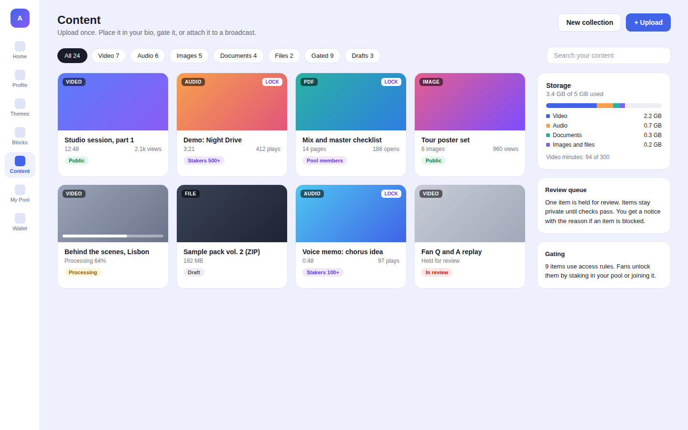
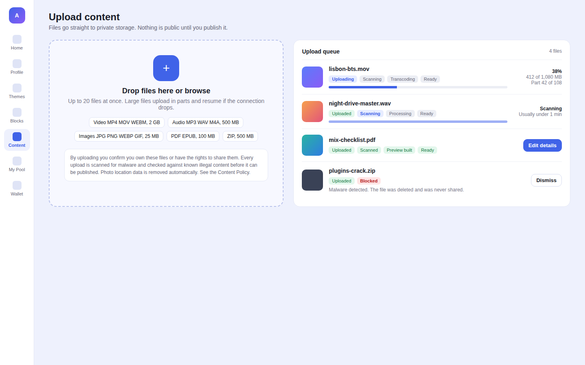
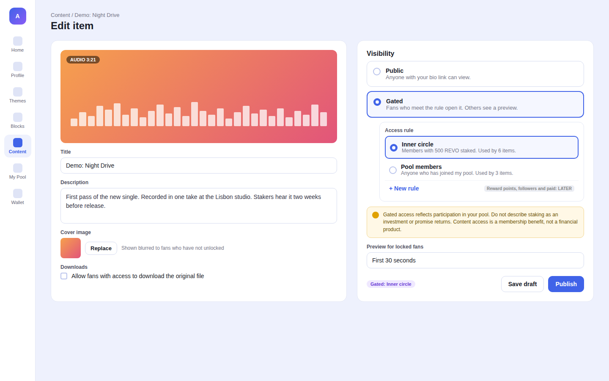
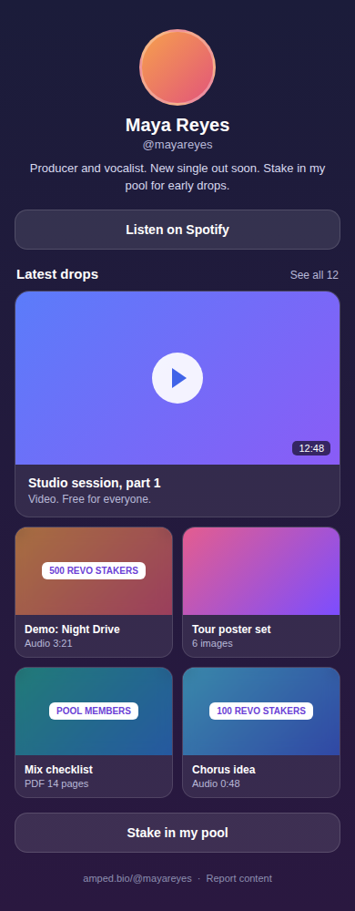
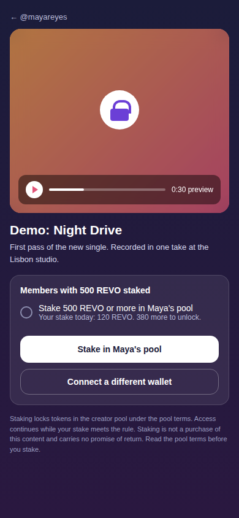

# Content System

Status: spec for review. Build Board item #20.
Owner: Rob Frasca. Drafted by Claude, 2026-09-26.
Business overview: [docs/overviews/content-system.md](../overviews/content-system.md)

Rob: "we'll need a content system where people can upload various forms of content."

This is the base layer for paid content (#18), stake-gated content (formerly #19, merged into this spec and #21) and broadcast attachments. Creator payments are on hold. Version 1 ships free and members-only content. Paid unlock plugs in later through the access gating engine with no change to this system.

## 1. Research

### 1.1 How uploads work today

- **Data model.** `UploadedFile` in `apps/server/prisma/schema.prisma` stores `s3_key`, `bucket`, `file_name`, `file_type`, `size`, `user_id` and `status` (`PENDING`, `COMPLETED`, `DELETED`). Rows cascade on user delete. S3 objects do not.
- **Upload flow.** `apps/server/src/trpc/upload.ts` exposes `requestAvatarPresignedUrl`, `requestThemeBackgroundUrl`, `confirmProfilePictureUpload`, `confirmThemeBackgroundUpload`, `getFileInfo` and `getLimits`. The client asks for a presigned PUT, uploads straight to S3, then calls confirm.
- **Signing.** `S3Service.getSignedUrl` in `apps/server/src/services/S3Service.ts` signs with AWS SDK v2 (`getSignedUrlPromise`, 300 seconds). SDK v2 is past end of support. Everything else in `S3Service` already uses SDK v3 (`@aws-sdk/client-s3`), and `@aws-sdk/s3-request-presigner` is already a dependency. Removing v2 is a small change.
- **Validation.** `S3Service.validateFile` checks MIME type against `packages/constants/src/upload.ts` and the declared size against `UPLOAD_LIMIT_PROFILE_PHOTO_MB`, `UPLOAD_LIMIT_BACKGROUND_MB` and `UPLOAD_LIMIT_POOL_IMAGE_MB`. Avatars allow JPEG, PNG and SVG. Backgrounds allow images plus MP4, QuickTime, AVI and WebM.
- **Delivery.** `S3Service.getFileUrl` and `apps/server/src/utils/fileUrlResolver.ts` return plain URLs on a public bucket (`amped-bio`, us-west-2). There is no CDN and no private storage.
- **Keys.** `generateUniqueFileKey` writes `{category}/{timestamp}-{random}-{userId}.{ext}`. The numeric user id appears in public URLs.
- **Blocks.** `packages/constants/src/blocks.ts` defines `link`, `media`, `text`, `pool` and `referral`. The `Block` model stores `type` as a string and `config` as JSON, so a new type needs no migration.
- **Hosting.** `apps/server/vercel.json` routes all traffic to one Express function. Vercel functions cap request bodies at 4.5 MB and limit duration. File bytes and media processing cannot run through that function. `apps/server/Dockerfile` also exists, and Redis (`ioredis`) is available.

### 1.2 Findings outside this item

1. **Uploads are not size or type checked after the fact.** The presigned PUT signs `Content-Type` but not length. `confirm*` calls `fileExists` (HeadObject) and marks the file `COMPLETED` without comparing the stored size or the file's real type to what was declared. A user can place any bytes of any size in the public bucket under an allowed extension. Fix: compare `ContentLength` on confirm, and use presigned POST with `content-length-range` for new flows.
2. **SVG avatars on a public bucket.** SVG can carry script. The public bucket serves it from an AWS domain, so it does not run on amped.bio, but the bucket can host active content. Content uploads in this spec do not accept SVG.
3. **No account deletion flow.** There is no server path that deletes a user and their stored files. GDPR erasure for content (section 3.10) depends on one.
4. **Email exposure (D1).** `handle.getHandle` returns the creator's email publicly. Content pages load creator data through the same path. The D1 fix must ship before content pages launch (3.13). Tracked separately.

### 1.3 Best in breed

| Product | What they do | Copy | Avoid |
|---|---|---|---|
| **Patreon** posts and media | Posts carry images, audio, video (up to 12 hours) and attachments (up to 5 GB). ZIP, EPUB, PDF and STL are attachment only. Locked posts show title and teaser to non members. | Separate "media" (streamed) from "attachments" (downloaded). Teaser plus unlock prompt on locked posts. | Attachments of any archive type with little scanning. |
| **Gumroad** | Stream only video and PDF. A recent change lets sellers disable downloads so buyers read PDFs and EPUBs in the browser. PDF stamping marks files with the buyer's identity. | Per item "allow download" toggle. In browser reader as the default for documents. Stamping as a later DRM light step. | Selling protection as security. Stamping deters. It does not prevent. |
| **Stan Store** | Digital downloads up to 5 GB, 500 MB recommended. Delivery by email link after checkout. Any file type. | Clear recommended size in the uploader. | "Any file type." That invites malware and unreviewable archives. |
| **Linktree** digital products | 100 MB per file, 1 GB and 24 files per product. Explicit format list. Access by one time login code. | Explicit allowlist shown in the uploader. Free or paid as a single product toggle. | Hard 100 MB cap. Creators want video. |
| **Substack** video | Up to 20 GB. Creator picks a free preview segment. Free viewers get an upgrade prompt at the end of the preview. | Creator chosen preview for audio and video. The unlock prompt appears where the preview ends. | 20 GB uploads. Cost without matching demand at our stage. |
| **Mux** signed playback | Assets carry a `signed` playback policy. Playback needs an RS256 JWT with `sub`, `aud`, `exp`. Thumbnails and storyboards need their own tokens. Referrer restrictions. DRM add on. | Per viewer JWT with short expiry. Separate thumbnail tokens. Referrer allowlist. | Setting token expiry shorter than the video. Mux warns this cuts playback mid stream. |
| **CloudFront** signed URLs and cookies | AWS: use signed URLs for individual files, signed cookies for many files such as HLS segments. Signed URLs take precedence if both are present. | Signed URLs for images and documents. Signed cookies only if we self host HLS. | Mixing both on the same path. |
| **Bunny Stream** | Free encoding, storage from $0.01 per GB, CDN from $0.005 per GB, token auth included. | Cost floor reference and fallback vendor. | Region based pricing surprises. We state the tier we assume. |

Sources are listed at the end.

### 1.4 Patterns we adopt

1. **Private by default.** Every content byte lands in a private bucket. Nothing is readable until scans pass and the creator publishes.
2. **Direct to storage uploads.** The browser uploads to S3 in parts. The API never touches file bytes. This avoids the Vercel body limit.
3. **Stream, do not download.** Video and audio play through a signed stream. Documents open in a viewer. Download is an opt in per item.
4. **Server made previews.** Locked fans get a blurred thumbnail and a short preview made on the server. The original never reaches a locked viewer.
5. **Short lived access.** Access is proven per request through the gating engine. Signed URLs live minutes, not days. Losing eligibility ends access at the next refresh.
6. **Separate user content domain.** Media is served from a domain that is not amped.bio, the same pattern as `googleusercontent.com`. A malicious file cannot read amped.bio cookies.
7. **Scan before publish.** Malware scanning and CSAM hash matching run before an item can be published. Failed items never become visible.

### 1.5 Monthly cost estimate

**Assumptions.** 30% of creators upload content in a month. Each active creator stores 20 video minutes and 0.3 GB of non video files. Fans watch 200 video minutes and pull 2 GB of images and documents per active creator per month. Each active creator uploads 1 GB per month, of which 20% is downloadable files that need malware scanning. 10 images per active creator go through an adult content classifier. Prices are US list prices on 2026-09-26. The recommended stack is S3 plus CloudFront for files, Mux for video and audio, GuardDuty for malware, PhotoDNA for CSAM.

| Line item | 1k creators (300 active) | 10k creators (3,000 active) | 100k creators (30,000 active) |
|---|---|---|---|
| Video minutes stored / delivered | 6k / 60k | 60k / 600k | 600k / 6M |
| **Mux** (storage $0.0024/min, delivery $0.0008/min after 100k free, basic encoding free) | $14 | $544 | $6,160 |
| S3 Standard for non video ($0.023/GB) | $2 | $21 | $207 |
| CloudFront egress (1 TB free, then $0.085 to $0.060/GB) | $0 | $435 | $4,670 |
| GuardDuty Malware Protection for S3 ($0.09/GB, $0.215 per 1k objects), downloadable files only | $6 | $56 | $560 |
| PhotoDNA Cloud Service (CSAM hash matching) | $0 | $0 | $0 |
| Rekognition image moderation ($0.001/image) | $3 | $30 | $300 |
| Processing workers (SQS plus Lambda) | $5 | $30 | $250 |
| **Total, recommended stack** | **about $30** | **about $1,120** | **about $12,150** |
| Alternative video: Cloudflare Stream ($5 per 1k min stored, $1 per 1k min delivered) | $90 | $900 | $9,000 |
| Alternative video: Bunny Stream (standard tier, about $0.01/GB delivery, 2 storage regions) | $20 | $195 | $1,950 |
| Alternative files: Cloudflare R2 in place of S3 plus CloudFront (no egress fee) | $1 | $14 | $140 |

Notes:

- Mux has a $20 monthly minimum on pay as you go. The 1k column is effectively $20.
- At 100k creators, CloudFront egress is the largest file line. Moving files to R2 saves about $4,700 per month at that scale. We revisit when egress passes 20 TB per month.
- Mux is not the cheapest video option. We pick it for signed playback, instant playback, audio support and the player. Bunny is about $4,000 cheaper per month at 100k creators. The video provider sits behind an adapter, so a switch is contained.
- Thorn Safer, if chosen over PhotoDNA, is priced by quote.

## 2. Overview

Creators upload video, audio, images, documents and files once, then place them in their bio, gate them behind their pool, or attach them to a broadcast. Fans see public content inline. Fans who do not meet a rule see a blurred preview and a clear way to unlock.

### Outcomes

- **Creator.** Uploads a 1 GB video from a phone on a weak connection and sees it ready to publish within minutes. Chooses Public or Members only per item. Sees storage used at a glance.
- **Fan.** Plays public content on the bio with no login. Sees what a locked item is and exactly what unlocks it.
- **Amped.** No content is served before malware and CSAM checks pass. Every served byte of gated content is authorized by the gating engine. Storage cost scales with use and is capped per creator.

### In scope (v1)

1. Content library, upload flow and item editor in `apps/client`.
2. Content kinds: video, audio, image, document (PDF, EPUB), file (ZIP).
3. Private bucket, CDN with signed URLs, and a video provider with signed playback.
4. Processing pipeline: multipart upload, type check, malware scan, CSAM hash match, image normalization, transcoding, thumbnails and previews.
5. `content` block type for bios, and a standalone content page on the public site.
6. Visibility: Public or Members only. A members-only (gated) item points at one named `AccessRule` from the gating engine. v1 creates `stake_min` and `pool_member` rules, the engine's `LIVE_ACCESS_RULE_KINDS`. `reward_points`, `follower` and `paid` switch on when the engine enables them.
7. Storage and video minute quotas with a storage meter.
8. Report button, review queue, DMCA workflow and repeat infringer tracking.
9. Content retention and deletion, including on account delete.

### Out of scope

- Paid unlock (`paid` rule). Payments are on hold. The editor shows it as "Later."
- Live streaming.
- Full DRM (Widevine, FairPlay). Mux offers it as an add on if a creator segment needs it.
- PDF stamping and video watermarking. Phase 3.
- Collections and playlists. Phase 3. The "New collection" button in the library mockup is a Phase 3 placeholder.
- Comments and likes on content.
- Moving existing avatars and backgrounds off the public bucket. Tracked as a Phase 3 follow up.

### Decisions for Rob

1. **Storage and CDN vendor.** Recommended: AWS S3 private bucket plus CloudFront. It keeps one cloud, reuses existing IAM and code, and gets native GuardDuty scanning. Alternative: Cloudflare R2 plus Workers. It has no egress fee and becomes cheaper above about 20 TB per month.
2. **Video and audio vendor.** Recommended: Mux. Best signed playback model, audio support, a player with preview support, and 100k free delivery minutes per month. Alternatives: Bunny Stream for lowest cost, Cloudflare Stream for simplest pricing. Self hosted MediaConvert plus HLS is not recommended. It adds encoding jobs, packaging and signed cookie logic we do not need to own.
3. **Adult content policy.** Recommended: no sexually explicit content in v1. Reasons: app store rules, card network rules for adult merchants once payments return, and US state age verification laws that the Supreme Court upheld in 2025 (Free Speech Coalition v. Paxton). Images and video thumbnails run through a classifier. Likely explicit items are held for human review. The alternative is to allow adult content behind age verification. That is a separate project.
4. **CSAM detection vendor.** Recommended: apply for Microsoft PhotoDNA Cloud Service now. It is free for vetted organizations, but vetting takes time. Thorn Safer is the paid alternative and adds video hashing and a direct NCMEC reporting integration. The Cloudflare CSAM Scanning Tool is not sufficient on its own. It only scans content cached through Cloudflare, which private signed content is not. Launch is blocked until one of these is live.
5. **Default quotas.** Recommended: 5 GB storage and 300 video minutes per creator. 2 GB per video file, 500 MB per audio or ZIP file, 100 MB per document, 25 MB per image. All values are environment configurable, the same pattern as today's `UPLOAD_LIMIT_*` variables.
6. **Members-only content review.** Gating content on a token stake ties a benefit to holding a crypto asset. Securities counsel must review it before Phase 2 ships or is marketed. The spec keeps all copy access focused: staking unlocks membership benefits, never returns.

## 3. Detailed spec

### 3.1 Screens

#### Content library (creator, desktop)



- New sidebar entry "Content" in `apps/client` between Blocks and My Pool.
- Grid of items with kind badge, lock badge when gated, title, duration or page count, one stat (views, plays or opens) and a status pill: Public, Members only with the rule summary, Processing, Draft, In review.
- Filters by kind, members only and drafts. Search by title.
- Storage meter shows bytes used against quota by kind, and video minutes against quota.
- Review queue card appears only when an item is held or blocked.

#### Upload flow (creator, desktop)



- Drop zone lists accepted formats and per kind size limits from `packages/constants`.
- Rights statement and scanning notice above the fold. Uploading counts as acceptance.
- Each file shows its stage: Uploading, Scanning, Transcoding or Processing, Ready, or Blocked with a reason.
- Large files upload in 10 MB parts, 4 in parallel. A dropped connection resumes from the last complete part.
- Files over quota are rejected before upload starts, with the remaining space shown.

#### Item editor (creator, desktop)



- Title (required, 140 characters), description (2,000 characters), cover image, allow download toggle.
- Visibility: Public or Members only. Members only opens the rule picker. The picker is a component owned by the gating engine spec. It lists the creator's named rules with usage counts and a "New rule" action. Kinds the engine has not enabled show as "Later."
- One rule per item, per the engine contract. The engine reserves `any` and `all` composite rules for its v2.
- Preview for locked fans: first 30 seconds for audio and video (range 0 to 60), first page for documents, blurred cover for images and files.
- A compliance notice appears when a stake rule is selected. It shows `CONTENT_LOCKED_DISCLOSURE` and `ACCESS_STAKE_DISCLOSURE` (3.9). The wording is fixed and reviewed by counsel.
- Publish is disabled until the item status is Ready.

#### Bio content block (fan, mobile)



- Layouts: featured (one large item), grid (2 columns), list.
- Public items play inline. Members-only items show a blurred thumbnail and the rule label.
- Every item and the bio footer have "Report content."

#### Locked preview (fan, mobile)



- Standalone content page at `amped.bio/@{handle}/c/{publicId}`.
- Blurred cover, the preview player, the title and description.
- The unlock box shows the rule `summary` and the fan's current status, from the engine's `AccessDecision.unlockHint`.
- The primary action goes to the pool page. It never starts a stake transaction in one tap, per the gating engine placement rule. After the fan stakes and returns, the page re-checks access and opens the item without a reload.
- Fixed disclosure under the actions: `CONTENT_LOCKED_DISCLOSURE` and `ACCESS_STAKE_DISCLOSURE` (3.9).
- No APY, yield or pool performance figures on the locked page.

### 3.2 Shared constants (`packages/constants/src/content.ts`)

```ts
export const CONTENT_KINDS = ["video", "audio", "image", "document", "file"] as const;

export const CONTENT_ALLOWED_TYPES = {
  video: { mimes: ["video/mp4", "video/quicktime", "video/webm"], exts: ["mp4", "mov", "webm"] },
  audio: {
    mimes: ["audio/mpeg", "audio/wav", "audio/x-wav", "audio/mp4", "audio/x-m4a", "audio/aac"],
    exts: ["mp3", "wav", "m4a", "aac"],
  },
  image: { mimes: ["image/jpeg", "image/png", "image/webp", "image/gif"], exts: ["jpg", "jpeg", "png", "webp", "gif"] },
  document: { mimes: ["application/pdf", "application/epub+zip"], exts: ["pdf", "epub"] },
  file: { mimes: ["application/zip"], exts: ["zip"] },
} as const;
```

- Not accepted: SVG, HTML, executables, scripts, Office files with macros, RAR and 7z, AVI.
- Zod schemas for all procedure inputs live next to these constants.
- Size limits come from env: `UPLOAD_LIMIT_CONTENT_VIDEO_MB`, `UPLOAD_LIMIT_CONTENT_AUDIO_MB`, `UPLOAD_LIMIT_CONTENT_IMAGE_MB`, `UPLOAD_LIMIT_CONTENT_DOCUMENT_MB`, `UPLOAD_LIMIT_CONTENT_FILE_MB`, `CONTENT_QUOTA_DEFAULT_MB`, `CONTENT_QUOTA_VIDEO_MINUTES`.

### 3.3 Data model (Prisma)

```prisma
enum ContentKind {
  VIDEO
  AUDIO
  IMAGE
  DOCUMENT
  FILE
}

enum ContentStatus {
  UPLOADING
  PROCESSING
  READY
  FAILED
  BLOCKED
  DELETED
}

enum ContentPublishState {
  DRAFT
  PUBLISHED
  ARCHIVED
}

enum ModerationState {
  PENDING
  CLEAR
  HELD
  BLOCKED
}

enum ContentAssetRole {
  ORIGINAL
  THUMBNAIL
  COVER
  BLUR_PREVIEW
  IMAGE_RENDITION
  PAGE_PREVIEW
  WAVEFORM
  STREAM
}

enum ContentAssetStorage {
  S3_PRIVATE
  VIDEO_PROVIDER
}

enum ScanStatus {
  PENDING
  CLEAN
  INFECTED
  SKIPPED
  ERROR
}

model ContentItem {
  id                Int                 @id @default(autoincrement())
  public_id         String              @unique @db.VarChar(24) // random, used in URLs and keys
  user_id           Int
  kind              ContentKind
  title             String              @db.VarChar(140)
  description       String?             @db.Text
  status            ContentStatus       @default(UPLOADING)
  processing_step   String?             @db.VarChar(40) // uploading, scanning, transcoding, preview
  failure_reason    String?             @db.VarChar(255)
  publish_state     ContentPublishState @default(DRAFT)
  accessRuleId      Int?                @map("access_rule_id") // null means public. Gating engine contract 3.1.1
  preview_config    Json? // { seconds: 30 } | { pages: 1 } | { blur: true }
  allow_download    Boolean             @default(false)
  moderation_state  ModerationState     @default(PENDING)
  moderation_reason String?             @db.VarChar(255)
  duration_ms       Int?
  page_count        Int?
  width             Int?
  height            Int?
  total_bytes       BigInt              @default(0)
  sha256            String?             @db.Char(64)
  published_at      DateTime?
  deleted_at        DateTime?
  purge_after       DateTime?
  created_at        DateTime            @default(now())
  updated_at        DateTime?           @updatedAt

  user       User           @relation(fields: [user_id], references: [id], onDelete: Cascade)
  accessRule AccessRule?    @relation(fields: [accessRuleId], references: [id], onDelete: Restrict)
  assets     ContentAsset[]
  reports ContentReport[]

  @@index([user_id, status])
  @@index([user_id, publish_state])
  @@index([accessRuleId])
  @@map("content_items")
}

model ContentAsset {
  id                   Int                 @id @default(autoincrement())
  content_item_id      Int
  role                 ContentAssetRole
  storage              ContentAssetStorage
  uploaded_file_id     Int? // set for ORIGINAL, so all user bytes are counted in one table
  s3_key               String?             @db.VarChar(255)
  provider             String?             @db.VarChar(20) // "mux"
  provider_asset_id    String?             @db.VarChar(100)
  provider_playback_id String?             @db.VarChar(100)
  mime_type            String?             @db.VarChar(100)
  size                 BigInt?
  width                Int?
  height               Int?
  duration_ms          Int?
  scan_status          ScanStatus          @default(PENDING)
  created_at           DateTime            @default(now())

  content_item  ContentItem   @relation(fields: [content_item_id], references: [id], onDelete: Cascade)
  uploaded_file UploadedFile? @relation(fields: [uploaded_file_id], references: [id])

  @@index([content_item_id, role])
  @@map("content_assets")
}

model UserStorageQuota {
  user_id             Int      @id
  bytes_limit         BigInt
  bytes_used          BigInt   @default(0)
  bytes_reserved      BigInt   @default(0) // in flight uploads
  video_minutes_limit Int
  video_minutes_used  Int      @default(0)
  updated_at          DateTime @updatedAt

  user User @relation(fields: [user_id], references: [id], onDelete: Cascade)

  @@map("user_storage_quotas")
}

model ContentReport {
  id               Int      @id @default(autoincrement())
  content_item_id  Int
  reporter_user_id Int?
  reason           String   @db.VarChar(20) // copyright, csam, adult, harassment, malware, other
  details          String?  @db.Text
  status           String   @db.VarChar(20) @default("open") // open, actioned, dismissed
  created_at       DateTime @default(now())

  content_item ContentItem @relation(fields: [content_item_id], references: [id], onDelete: Cascade)

  @@index([status, created_at])
  @@map("content_reports")
}

model CopyrightNotice {
  id                Int       @id @default(autoincrement())
  content_item_id   Int?
  target_user_id    Int
  claimant_name     String    @db.VarChar(255)
  claimant_contact  String    @db.Text // encrypted at rest, admin only
  work_described    String    @db.Text
  sworn_statement   Boolean
  valid             Boolean? // null until an admin reviews the notice
  validated_at      DateTime?
  signature         String    @db.VarChar(255)
  received_at       DateTime  @default(now())
  actioned_at       DateTime?
  counter_notice_at DateTime?
  restored_at       DateTime?
  is_strike         Boolean   @default(true)

  @@index([target_user_id, received_at])
  @@map("copyright_notices")
}

model BlockedContentHash {
  sha256     String   @id @db.Char(64)
  reason     String   @db.VarChar(20) // dmca, malware, policy
  created_at DateTime @default(now())

  @@map("blocked_content_hashes")
}
```

- `UploadedFile` gains the category `content` and the `bucket` column already present points at the private bucket. The storage meter sums all non deleted `UploadedFile.size` for the user, so avatars and backgrounds count too.
- The gate is the `accessRuleId` column, exactly as the gating engine contract requires. The name keeps the engine's camelCase with a snake_case column. `AccessRule` gains the back relation `contentItems ContentItem[]`.
- The server checks that the rule's `ownerUserId` equals the item owner on attach. A rule in use cannot be deleted. The engine returns `CONFLICT`.
- The engine resource id is `ContentItem.id`, for example `content:812`. Public URLs and storage keys use `public_id`.
- The content system registers a resolver: `registerAccessResourceResolver("content", { getGate })`, which returns `{ ownerUserId, accessRuleId }` for an item.
- CSAM matches are not stored in these tables. They go to a restricted evidence store (3.9).
- `CopyrightNotice.valid` is null until an admin reviews the notice. The DMCA KPI (3.11) counts only valid notices.
- After changing the schema, run `pnpm run --filter server run prisma:generate`.

### 3.4 Storage layout

**New private bucket** `amped-bio-content` in us-west-2.

- Block Public Access on. Bucket policy allows reads only from the CloudFront distribution (Origin Access Control) and the processing role.
- Server side encryption (SSE-S3). TLS only policy.
- CORS allows `PUT` and `POST` from `app.amped.bio` only, exposing `ETag` for multipart.

| Prefix | Contents | Who reads | Lifecycle |
|---|---|---|---|
| `incoming/{publicId}/original.{ext}` | Raw upload | Processing role only | Deleted when processing ends. Incomplete multipart aborted after 1 day |
| `originals/{publicId}/original.{ext}` | Clean original, kept only for downloadable items and documents | CloudFront (signed) | Deleted with the item |
| `derived/{publicId}/{role}/{name}` | Thumbnails, blur previews, image renditions, page previews, waveforms | CloudFront (signed) | Deleted with the item |
| `quarantine/{publicId}/...` | Malware positives, for review | Trust and safety role | Expire after 30 days |

- Keys use `publicId`, never the numeric user id.
- Video and audio originals go to Mux and are deleted from `incoming/` once Mux reports the asset ready, unless download is allowed.
- The existing public bucket `amped-bio` is unchanged in v1.

### 3.5 Upload pipeline

```
client                    server (tRPC)                  S3 / queue / worker                 Mux
  | createUpload --------> | allowlist, quota reserve    |                                   |
  |                        | ContentItem UPLOADING       |                                   |
  |<-- uploadId, parts ----| CreateMultipartUpload ----->|                                   |
  | PUT parts (10 MB) ----------------------------------->| incoming/{publicId}/original       |
  | completeUpload ------> | CompleteMultipartUpload     |                                   |
  |                        | HeadObject size check       |                                   |
  |                        | magic byte check (4 KB GET) |                                   |
  |                        | status PROCESSING, enqueue ->| SQS content-processing             |
  |                        |                             | worker: hash, blocklist, CSAM,     |
  |                        |                             | malware, normalize, previews ----->| create asset (signed policy)
  |                        |<----------------------------| webhook video.asset.ready <--------|
  |<-- status READY -------|                             |                                   |
```

1. **createUpload** `{ kind, fileName, mimeType, size }`. Validates kind, MIME, extension and size against constants and env limits. Reserves bytes in `UserStorageQuota` inside a transaction and rejects when `bytes_used + bytes_reserved + size > bytes_limit`. Creates `ContentItem` (UPLOADING, DRAFT) and `UploadedFile` (PENDING, category `content`).
   - Files under 100 MB: returns a presigned POST with a `content-length-range` condition equal to the declared size and a fixed `Content-Type`.
   - Files 100 MB and over: starts a multipart upload and returns `uploadId` and part count.
2. **signParts** `{ publicId, partNumbers[] }`. Returns presigned `UploadPart` URLs, 15 minute expiry, at most 50 per call. The client re-requests on resume and uses `ListParts` through the server to skip completed parts.
3. **completeUpload** `{ publicId, parts[] }`. Completes the multipart upload. Calls HeadObject and rejects when `ContentLength` differs from the declared size. Reads the first 4 KB and checks the file signature matches the declared kind. A mismatch deletes the object and sets FAILED. Success sets PROCESSING and sends a job to SQS.
4. **Worker** (Lambda on SQS, Node 20, sharp and pdfium in a layer). Steps run in order and each writes `processing_step`:
   1. Compute SHA-256. Reject when the hash is in `BlockedContentHash`.
   2. **CSAM hash match** on images, GIF frames, video keyframes (1 per 5 seconds, max 60) and document page renders. A match stops all processing (3.9).
   3. **Malware scan** for documents, files and any item with `allow_download`. GuardDuty Malware Protection for S3 is enabled on the `incoming/` prefix and tags the object. EventBridge delivers the result to the queue. INFECTED moves the object to `quarantine/`, sets BLOCKED and adds the hash to `BlockedContentHash`. ZIP archives also fail when the uncompressed size exceeds 10 times the compressed size or 2 GB.
   4. **Normalize.**
      - Images: re-encode with sharp. EXIF, GPS and XMP removed. Longest side capped at 4096 px. Output WebP and JPEG renditions at 320, 640, 1280 and full. The original is not kept.
      - Documents: render page 1 to 3 previews, remove document metadata, keep the original in `originals/`.
      - Video and audio: create a Mux asset from a 1 hour presigned GET of the original with `playback_policy: ["signed"]` and basic quality. Transcoding strips container metadata.
   5. **Previews.** A 32 px blurred cover for locked cards. Audio waveform JSON. Poster frame for video from Mux.
   6. **Moderation classifier** (v1 default, per Decision 3). Images and 5 video thumbnails go to Rekognition `DetectModerationLabels`. Explicit nudity above 80% confidence sets `moderation_state = HELD`. Held items cannot be published until a reviewer clears them.
   7. Set READY. Move reserved bytes to used. Add video minutes. Send an in app notice.
5. **Failure handling.** Any step error retries 3 times with backoff, then sets FAILED with a creator safe reason. Items in UPLOADING for 24 hours or PROCESSING for 2 hours are failed by a sweep job and their reserved bytes released.
6. **Mux webhook** `POST /webhooks/mux` on the Express app. Verifies the `mux-signature` header. Handles `video.asset.ready` and `video.asset.errored`.

### 3.6 Delivery

- **CloudFront distribution** on a separate registrable domain, for example `ampedusercontent.com`. Origin is the private bucket through OAC. The behavior requires a trusted key group. The cache policy excludes query strings from the cache key, so signed URLs still hit cache.
- **Response headers policy:** `X-Content-Type-Options: nosniff`, `Content-Security-Policy: sandbox; default-src 'none'`, `Cross-Origin-Resource-Policy: cross-origin`, and `Cache-Control: private, max-age=300` for signed responses. Downloadable originals are stored with `Content-Disposition: attachment`.
- **Signing key** lives in AWS Secrets Manager. The server signs with `@aws-sdk/cloudfront-signer`. Keys rotate yearly with two keys active in the key group during rotation.
- **Video and audio** play through Mux Player with a playback JWT signed by our Mux signing key. Thumbnail and storyboard tokens are issued separately. Playback restrictions allow referrers `amped.bio` and `app.amped.bio` only.

| Asset | Public item TTL | Gated item TTL |
|---|---|---|
| Thumbnails, image renditions | 24 hours, expiry rounded to the hour so SSR HTML stays cacheable | 5 minutes |
| Blur preview | 24 hours, served to everyone | 24 hours, served to everyone |
| Document viewer (PDF) | 1 hour | 5 minutes |
| Download (original) | 5 minutes | 2 minutes, single use |
| Mux playback token | duration plus 30 minutes, max 6 hours | duration plus 10 minutes, max 4 hours |
| Mux preview token (clip to preview seconds) | not used | 1 hour |

- **Access check.** Follows the engine contract (3.1.4). The client calls `access.check({ resource: { type: "content", id } })` to render the locked or open state. To open, it calls `access.issueGrant`, then `content.getReadUrl({ contentItemId, grant })`. `getReadUrl` calls `verifyAccessGrant` and signs URLs whose expiry is `min(TTL in the table, grant exp minus now)`. Public items need no grant. Locked viewers get only the blur preview and the preview clip from `content.getPreview`.
- **Downloads** are single use. `getReadUrl` records the grant `jti` in Redis with `SET NX EX 600` for download requests.
- **Contract note.** This spec signs CloudFront URLs over the private bucket with the engine's 5 minute ceiling, and Mux tokens for streams. The gating engine spec 3.1.4 records this.
- **Preview clips.** Mux supports clipping by `asset_start_time` and `asset_end_time` in the playback token for signed assets. The preview token carries `0` and `preview_config.seconds`, so a locked fan cannot request the full stream.
- **Revocation.** When a fan unstakes, access ends at the next URL refresh. Files: at most 5 minutes. The client refreshes the grant and URLs 60 seconds before expiry.
- **Stream exception.** Mux checks the token on every segment and cuts playback when it expires. A stream token therefore lives for the item duration plus 10 minutes, capped at 4 hours, even though the grant lives 10 minutes. A fan who unstakes mid video finishes that play session and is blocked on the next one. The gating engine spec accepts this exception (3.1.4 and 3.6).
- **SSR rule.** The Next.js bio and content pages render gated items in the locked state with blur previews only. Full URLs for gated items are fetched by the browser after hydration. They never appear in server HTML or in page caches.
- **Broadcast attachments.** A broadcast references items by `ContentItem.id`. `getReadUrl` accepts a grant for `{ type: "broadcast", id }` in place of a content grant. The server confirms the item is attached to that broadcast before signing. Email and push never carry media URLs, only a link back to Amped.

### 3.7 Content block for bios

- Add `"content"` to `BaseBlockType` in `packages/constants/src/blocks.ts`.

```ts
export type ContentBlock = BaseBlock<
  "content",
  { label?: string; layout: "featured" | "grid" | "list"; contentIds: string[] }
>;

export const contentConfigSchema = z.object({
  label: z.string().max(60).optional(),
  layout: z.enum(["featured", "grid", "list"]),
  contentIds: z.array(z.string().length(24)).min(1).max(12),
});
```

- On save, the server confirms every `contentId` belongs to the block owner and is PUBLISHED.
- Deleted or unpublished items are skipped at render. The block hides itself when no items remain.
- The block editor in `apps/client/src/components/blocks` picks items from the library.
- The landingpage renders the block server side from `content.listForBio`.

### 3.8 tRPC procedures (`apps/server/src/trpc/content.ts`)

| Procedure | Type | Auth | Purpose |
|---|---|---|---|
| `createUpload` | mutation | private | Validate, reserve quota, start upload |
| `signParts` | mutation | private, owner | Presign part URLs |
| `completeUpload` | mutation | private, owner | Finish upload, verify, enqueue |
| `abortUpload` | mutation | private, owner | Abort and release quota |
| `retryProcessing` | mutation | private, owner | Retry a FAILED item once per hour |
| `list` | query | private | Library with filters and cursor pagination |
| `get` | query | private, owner | Item with assets and rule bindings |
| `update` | mutation | private, owner | Title, description, cover, download, preview, `accessRuleId` |
| `publish` / `unpublish` | mutation | private, owner | Requires READY and moderation CLEAR |
| `delete` | mutation | private, owner | Soft delete, purge in 30 days |
| `restore` | mutation | private, owner | Undo delete within 30 days |
| `getStorage` | query | private | Quota and usage by kind |
| `listForBio` | query | public | Card data for a content block |
| `getPublic` | query | public | Metadata for the content page |
| `getPreview` | query | public | Blur preview URL and preview clip token for locked viewers |
| `getReadUrl` | mutation | public for public items, private with grant for gated | Signed URLs and stream tokens (engine contract 3.1.4) |
| `report` | mutation | public, rate limited | Report an item |
| `admin.content.queue` | query | admin | Held items and open reports |
| `admin.content.decide` | mutation | admin | Clear, block or restore |
| `admin.copyright.*` | mutation | admin | Record notice, act, counter notice, restore |

- Public outputs select explicit fields. They include handle, display name and avatar. They never include email or numeric user ids.
- `getReadUrl`, `getPreview` and `report` are rate limited per IP and per user with Redis, at the engine's 30 per minute.
- `getReadUrl` refuses to sign any URL or token unless the item is READY, `moderation_state` is CLEAR and every served asset has `scan_status` CLEAN or SKIPPED. SKIPPED applies only to assets that are re-encoded or transcoded and never served as the original bytes.
- The router registers in `apps/server/src/trpc/router.ts`.

### 3.9 Security and compliance

**Legal and trust.**

- **DMCA.** Register a designated agent with the US Copyright Office ($6, renew every 3 years). Publish a copyright policy page with the agent's contact and a notice form. Valid notices disable the item within 1 business day and notify the creator. Counter notices restore the item after 10 to 14 business days unless the claimant files suit, per 17 U.S.C. 512(g). The creator is told before filing that a counter notice is sent to the claimant with the creator's name and address. No other contact data is shared.
- **Repeat infringer policy.** Three valid strikes in 12 months terminates the account. Strikes are recorded in `CopyrightNotice`. The policy is stated in the Terms of Service.
- **Hash blocklist.** Items removed for copyright or malware add their SHA-256 to `BlockedContentHash`. Re-uploads of the same file are rejected.
- **CSAM.** Hash matching is a launch requirement. A match blocks the item, suspends the account and removes all of the user's content from delivery. The file and required metadata move to a separate evidence bucket with its own IAM role and object lock. A report goes to the NCMEC CyberTipline as 18 U.S.C. 2258A requires. Evidence is preserved for 1 year as the REPORT Act (2024) requires. Staff do not open matched files. Written procedures are prepared with counsel before launch.
- **Adult content.** Per Decision 3. Default is no sexually explicit content, enforced by classifier plus human review.
- **Terms and content policy.** Update Terms of Service and add a Content Policy covering prohibited content, rights warranty, license to host and display, and enforcement.

**Technical.**

- File type allowlist enforced three times: at `createUpload` (declared type), at `completeUpload` (magic bytes), and by re-encoding or transcoding.
- EXIF and location data removed from all images. Container metadata removed by transcoding. Document metadata removed.
- Malware scanning before any file is downloadable.
- User content on a separate domain with a sandbox CSP and `nosniff`.
- No SVG, HTML or script types.
- Signed URLs only. No public ACLs on the content bucket.
- Presigned upload URLs bind length and type.
- Storage quotas per user. Global kill switch env `CONTENT_UPLOADS_ENABLED` stops new uploads during an incident.
- The Mux signing key and CloudFront private key live in Secrets Manager, not in env files.
- Logs never include full signed URLs.

**Copy and marketing guardrails.** One list covers product copy (library, upload flow, item editor, content block, content page) and content marketing. It matches the business overview's "Compliance guardrails for marketing".

- **Securities.** Members-only content is tied to staking, which is under securities counsel review. Never promise returns, yield, earnings or price movement. Members-only content cannot be marketed until counsel signs off. Creator facing copy never describes a stake as an investment.
- **Banned words** in content marketing and item copy: earn, yield, returns, profit, invest, investment, passive income, income on autopilot, price, gains. The list lives in `packages/constants/src/compliance.ts` as `CONTENT_BANNED_TERMS`. Locked states sit next to a gate, so they also follow the gating engine list `ACCESS_BANNED_TERMS`.
- **Approved alternatives:** members only, membership, access, join, support, library, drop, "for my members".
- **Required disclosure.** The locked page states that staking unlocks membership benefits, is not a purchase of content and carries no promise of return. Fixed text, the constant `CONTENT_LOCKED_DISCLOSURE`: "Staking unlocks membership benefits. It is not a purchase of content and carries no promise of return." The engine's `ACCESS_STAKE_DISCLOSURE` shows with it. Keep both in screenshots.
- **CSAM.** Known-CSAM hash matching is a launch requirement. Matches are reported to NCMEC. Say "every upload is scanned before it goes live". Never claim "100% safe".
- **DMCA.** Register the designated agent and publish a copyright policy before launch. Do not use phrases like "share anything" that suggest creators can post work they do not own. Three valid strikes in 12 months ends an account.
- **Adult content.** v1 does not allow sexually explicit content. Do not recruit adult creators or imply it is allowed.
- **Protection claims.** Say "streams through a protected player". Never claim files "cannot be copied" or use the word DRM.
- **Privacy.** Location data is stripped from images. Creator emails never appear on content pages, and the D1 fix must ship first.
- **Deletion.** Say "delete anytime, removed within 30 days". This matches the GDPR commitment in 3.10.
- **Paid content.** Describe as "later". Do not collect sign-ups that show prices.
- **FTC.** Creators featured in launch content who received early access or perks must disclose it.

**Automated check.** `scripts/check-compliance-copy.ts` runs in every build and in CI. It scans string literals and JSX text in the content components of `apps/client` and `apps/landingpage`, plus any content marketing copy stored in the repo. It matches `CONTENT_BANNED_TERMS` and the phrases "100% safe", "share anything", "cannot be copied" and "DRM", case insensitive on word boundaries. Locked state components are also checked against `ACCESS_BANNED_TERMS`. Any match, em dash or en dash fails the build. The only exemptions are `CONTENT_LOCKED_DISCLOSURE` and `ACCESS_STAKE_DISCLOSURE`. Content marketing copy kept outside the repo is checked against the same exported lists before publishing.

### 3.10 Retention and deletion

- **Item delete.** Soft delete sets DELETED and `purge_after = now + 30 days`. The item stops serving at once. A daily job hard deletes S3 objects, the Mux asset, `ContentAsset` rows and releases quota.
- **Account delete.** All items stop serving at once. Hard deletion of every object and Mux asset completes within 30 days, which meets the GDPR one month response window. This depends on the account deletion flow noted in 1.2.
- **Legal holds.** CSAM evidence (1 year) and DMCA records (3 years) are kept outside user tables and are exempt from erasure.
- **Data export.** A user export includes item metadata and download links for originals that still exist.
- **Backups.** Bucket versioning stays off for the content bucket. Database backups age out on the existing schedule, so deleted rows leave backups within that window.

### 3.11 Analytics events

Events follow the event schema from Build Board #11. Properties never include email. Viewer identity is a hashed id. Creator events carry `creator_id_hash`. `upload_id` and `item_id` are the item's `public_id`.

| Event | Properties |
|---|---|
| `content_upload_started` | kind, size_bucket, upload_id, creator_id_hash |
| `content_upload_completed` | kind, duration_ms, resumed, upload_id, creator_id_hash |
| `content_upload_failed` | kind, upload_id, reason_code (size_mismatch, type_mismatch, sweep_timeout) |
| `content_upload_aborted` | kind, upload_id, by (user, sweep) |
| `content_processing_failed` | kind, step, reason_code |
| `content_ready` | kind, item_id, size_mb, seconds_to_ready (from `completeUpload` to READY) |
| `content_blocked` | kind, reason_code (malware, policy; CSAM is logged only in the restricted system) |
| `content_unsafe_served` | kind, item_id, reason_code (malware, adult, policy). Emitted when an item that ever had a URL issued for a non preview asset is later set BLOCKED |
| `content_published` | kind, gated, rule_kind, item_id, creator_id_hash |
| `content_viewed` | kind, gated, surface (bio, page, broadcast) |
| `content_url_issued` | kind, item_id, asset_role, ttl_seconds (engine server event) |
| `content_locked_impression` | kind, rule_kind. The server also writes the engine `locked_view` event for resource type `content` |
| `content_unlock_clicked` | rule_kind |
| `content_unlocked` | rule_kind, seconds_since_impression |
| `content_downloaded` | kind |
| `content_reported` | reason |
| `dmca_notice_received` | notice_id |
| `dmca_notice_actioned` | notice_id, valid, within_one_business_day |
| `content_adoption_snapshot` | creators, uploading_creators_month, uploading_creators_all_time, published_items_all_time (daily job) |

Creator stats shown in the library (views, plays, opens) come from `content_viewed` counts per item.

**KPI to event.** Each 90-day target in the business overview maps to one measurement.

| KPI (90-day target, proposed) | Measurement |
|---|---|
| Active creators who upload in a month (30%) | `uploading_creators_month` divided by `creators` from the latest `content_adoption_snapshot`. `uploading_creators_month` counts creators with a `content_upload_completed` in the trailing 30 days. `creators` counts all creators with a bio, the same base as the cost model (1.5) |
| Published items per uploading creator (5) | `published_items_all_time` divided by `uploading_creators_all_time` from the latest snapshot |
| Upload success rate (98%) | Distinct `upload_id` on `content_upload_completed` divided by distinct `upload_id` on `content_upload_started`, excluding uploads with `content_upload_aborted` where `by = user` |
| Time to Ready for a 1 GB video (under 5 minutes) | p95 of `seconds_to_ready` on `content_ready` for kind video with `size_mb` from 750 to 1,250. Target is under 300 |
| Valid DMCA notices actioned within 1 business day (100%) | `dmca_notice_actioned` with `valid = true` and `within_one_business_day = true`, divided by all valid notices. A daily check also counts valid notices still open past 1 business day as misses |
| Unsafe files served to any viewer (0) | Count of `content_unsafe_served`, plus the count of CSAM items with any issued URL from the restricted system. The `getReadUrl` guard in 3.8 makes a nonzero value a defect |

### 3.12 Acceptance criteria

1. A 1 GB MP4 uploads from the app, survives a network drop mid upload, resumes, and plays within 5 minutes of completion.
2. A PNG with GPS EXIF uploads. The served renditions contain no EXIF.
3. A file renamed from `.exe` to `.pdf` fails at `completeUpload` and never becomes readable.
4. The EICAR test file inside a ZIP is blocked, moved to quarantine, and its hash blocks a re-upload.
5. A PhotoDNA test image in the vendor's test set blocks the item and raises the trust and safety alert. No URL for it is ever issued.
6. Uploading past quota is rejected before any bytes are sent.
7. A direct request to the S3 bucket for any content key returns 403.
8. A gated item's page HTML contains no full media URL.
9. A fan without the rule gets `allowed: false`, the blur preview and the preview clip only. Requesting the full stream with a preview token fails.
10. A fan who stakes the minimum gets access on the next `issueGrant` and `getReadUrl` call without reloading the page.
11. A fan who unstakes loses access no later than the gated TTL.
12. Deleting an item stops delivery at once. Objects and the Mux asset are gone after the purge job.
13. No content procedure returns an email address or numeric user id.
14. `pnpm run typecheck` and `pnpm run build` pass.
15. No part of the upload path sends file bytes through the Vercel function.
16. On the locked page the primary action opens the pool page and never starts a stake transaction. `CONTENT_LOCKED_DISCLOSURE` and `ACCESS_STAKE_DISCLOSURE` show under the actions. No APY, yield or pool performance figure appears on the page.
17. `scripts/check-compliance-copy.ts` finds no term from `CONTENT_BANNED_TERMS`, no banned phrase and no em or en dash on content surfaces. Locked states also pass `ACCESS_BANNED_TERMS`. Any match fails the build.
18. `handle.getHandle` and every content page return no creator email (D1 fix) before Phase 1 launches.
19. `getReadUrl` refuses items that are not READY, not moderation CLEAR, or have an asset whose scan is not CLEAN or an allowed SKIPPED.
20. A valid DMCA notice recorded in the admin tool disables the item, notifies the creator and writes `dmca_notice_actioned` with `within_one_business_day`.
21. An image the classifier flags as explicit is HELD and cannot be published until a reviewer clears it.
22. On staging, every event in 3.11 fires, and each KPI in the KPI to event table computes from those events.

### 3.13 Phased rollout

Timings follow the business overview launch plan. All dates are proposed.

**Phase 0. Prerequisites (October to November 2026, proposed).** Engineering work takes about 1 week. Vendor vetting and legal work run in parallel through the period.
- Replace SDK v2 `getSignedUrlPromise` in `S3Service.getSignedUrl` with `@aws-sdk/s3-request-presigner`, and remove `aws-sdk` from `apps/server/package.json`.
- Add the size check to existing `confirm*` procedures (finding 1).
- Fix the creator email exposure (D1) in `handle.getHandle`.
- Create the private bucket, CloudFront distribution, user content domain, key group and Secrets Manager entries.
- Register the DMCA agent. Apply for PhotoDNA now, since vetting takes time. Prepare the Content Policy and ToS updates with counsel.
- Sign the Mux account and create the signing key.
- Recruit 25 pilot creators.

**Phase 1. Free content (December 2026, once CSAM matching is live, proposed; 3 to 4 weeks of build).**
- Schema, constants, `content` router, worker and webhooks.
- Library, upload flow and item editor with Public visibility only.
- Content block and content page on the landingpage.
- Malware, CSAM and classifier checks live. Report flow, admin queue and DMCA admin tools.
- Analytics events from 3.11 and the compliance copy check, so 90-day KPIs start at launch.
- The 25 pilot creators onboard first.
- Launch gate: CSAM matching live, DMCA agent registered, copyright policy, Content Policy and Terms updates published, D1 fix live.

**Phase 2. Members-only content (first quarter 2027, proposed).**
- Starts no earlier than 2 weeks after the gating engine ships (engine Phase 1). Ships with engine Phase 2, which adds `issueGrant` for content.
- Rule picker in the editor, locked cards and locked preview page.
- `access.issueGrant` and `content.getReadUrl` wired with `verifyAccessGrant`. Resolver registered for `"content"`.
- Broadcast attachments.
- Launch gate: securities counsel sign off on gating copy and mechanics. Members-only content is not marketed before that sign off.

**Phase 3. Later, no date.**
- Paid unlock through the `paid` rule when payments resume.
- Collections, PDF stamping, visible viewer watermark on video.
- Move avatars and backgrounds behind CloudFront and close the public bucket.
- Revisit R2 or Bunny if egress passes 20 TB per month.

## Sources

- Patreon supported file formats: https://support.patreon.com/hc/en-us/articles/204606055-What-file-formats-are-supported-for-posts
- Gumroad download free delivery for PDFs and EPUBs: https://github.com/antiwork/gumroad/pull/7795
- Stan Store digital downloads: https://help.stan.store/article/14-sell-a-digital-download-product
- Linktree digital products: https://linktr.ee/help/en/articles/10631437-how-to-share-and-sell-digital-products-on-your-linktree
- Substack video posts: https://support.substack.com/hc/en-us/articles/21093671091220-Guide-to-video-posts-on-Substack
- Mux secure video playback: https://www.mux.com/docs/guides/secure-video-playback
- Mux pricing: https://www.mux.com/pricing
- Mux DRM: https://www.mux.com/docs/guides/protect-videos-with-drm
- Cloudflare Stream pricing: https://developers.cloudflare.com/stream/pricing/
- Bunny Stream pricing: https://bunny.net/pricing/stream/
- CloudFront signed URLs or signed cookies: https://docs.aws.amazon.com/AmazonCloudFront/latest/DeveloperGuide/private-content-choosing-signed-urls-cookies.html
- CloudFront private content: https://docs.aws.amazon.com/AmazonCloudFront/latest/DeveloperGuide/PrivateContent.html
- GuardDuty pricing (Malware Protection for S3): https://aws.amazon.com/guardduty/pricing/
- GuardDuty Malware Protection for S3 usage cost: https://docs.aws.amazon.com/guardduty/latest/ug/pricing-malware-protection-for-s3-guardduty.html
- Cloudflare CSAM Scanning Tool: https://developers.cloudflare.com/cache/reference/csam-scanning/
- Cloudflare CSAM tool update: https://blog.cloudflare.com/a-simpler-path-to-a-safer-internet-an-update-to-our-csam-scanning-tool/
- Microsoft PhotoDNA Cloud Service: https://www.microsoft.com/en-us/photodna/cloudservice
- Thorn Safer: https://safer.io/how-it-works/
- US Copyright Office DMCA Directory FAQ: https://www.copyright.gov/dmca-directory/faq.html

## Revision log

2026-09-26: aligned with business overview (added overview link; "gated" visibility renamed Members only in product copy and phase names; D1 named and made a Phase 1 launch gate; locked page action changed from a one-tap stake flow to the pool page, matching the gating engine; locked page disclosure fixed as a constant shown with the engine disclosure; adult content classifier made the v1 default; stream exception and CloudFront wording marked as accepted by the gating engine spec; `getReadUrl` safety guard added; `CopyrightNotice.valid` added; banned words, approved alternatives, disclosure and CSAM, DMCA, adult, protection, privacy, deletion, paid and FTC rules matched to the overview as one product plus marketing list; build-time copy check added; upload id, ready time, unsafe served, DMCA and adoption snapshot events plus a KPI to event table added; phases given proposed timings, 25 pilot creators, the D1 and CSAM gates and the gating before members-only content dependency; acceptance criteria 16 to 22 added).
