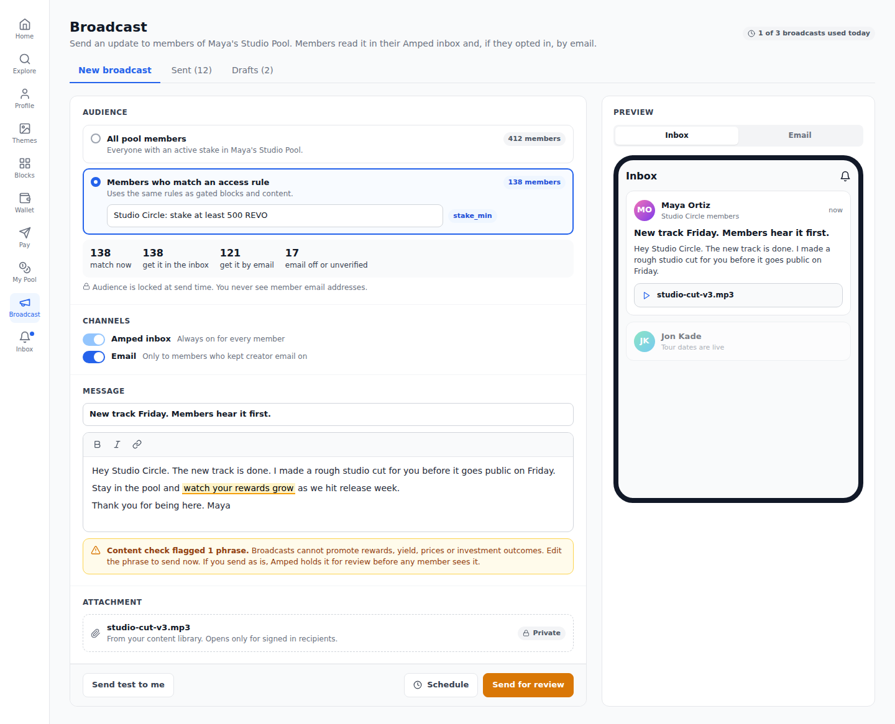
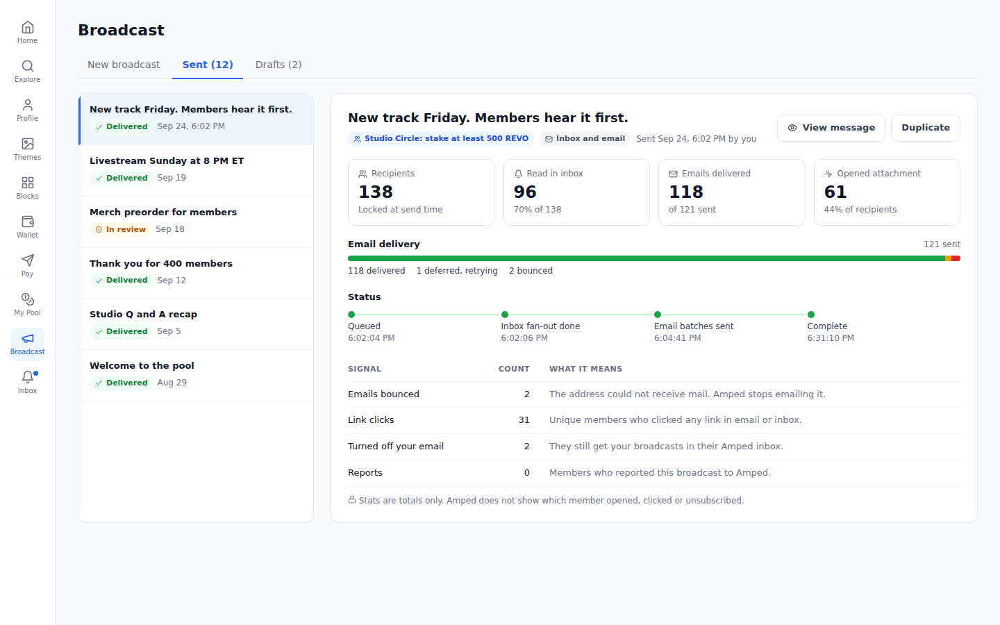
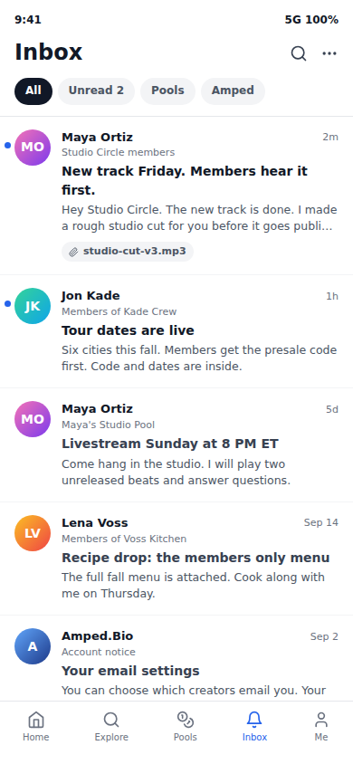
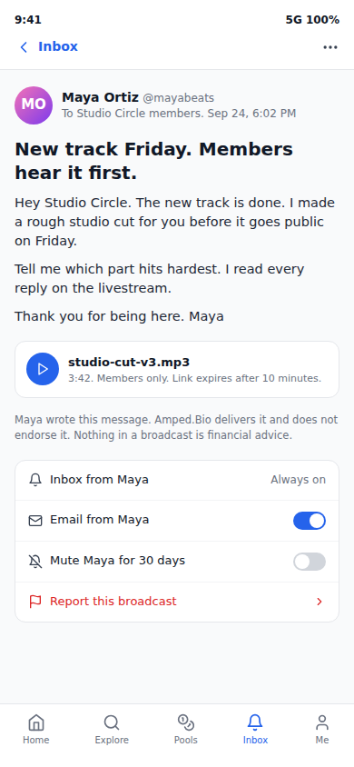
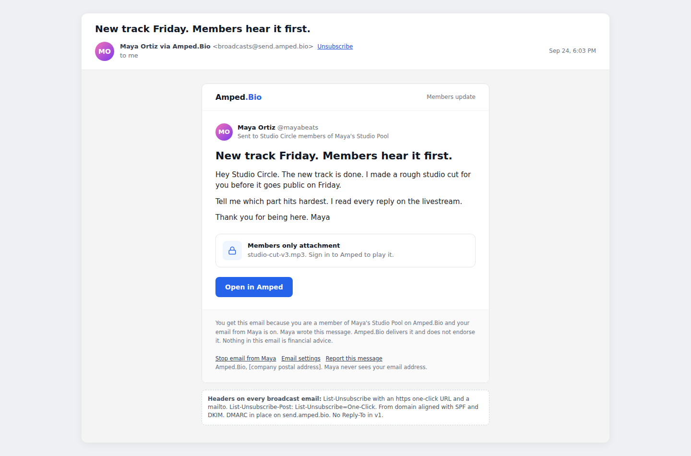

# Creator Pool Broadcast

Status: spec for review. Build Board item #1.
Owner: Rob Frasca. Drafted by Claude, 2026-09-26.
Business overview: [docs/overviews/creator-pool-broadcast.md](../overviews/creator-pool-broadcast.md)

## 1. Research

### Current code

- **Pools and members.** `CreatorPool` belongs to a `UserWallet` (`walletId`), one pool per wallet per chain (`@@unique([walletId, chainId])`). `StakedPool` holds one row per wallet per pool with `stakeAmount` as a wei string. `StakeEvent` logs each stake and unstake with its transaction hash. Schema: `apps/server/prisma/schema.prisma`.
- **Who a staker is.** `UserWallet.userId` is unique, so every wallet Amped tracks belongs to exactly one Amped user. `User.email` is required and unique. There is no wallet-only sign in (no SIWE). Every staker Amped knows about therefore has an account and an email address, verified or not (`email_verified`).
- **How stakes reach the database.** `StakedPool` is written by `fan.confirmStake`, `fan.confirmUnstake` and the claim flow in `apps/server/src/trpc/pools/fan.ts`, and by admin sync procedures in `apps/server/src/trpc/admin/pools.ts`. All of them resolve an existing Amped `UserWallet`. A wallet that stakes directly on chain without an Amped account never appears in `StakedPool`.
- **Listing members.** `pools.creator.getFans` in `apps/server/src/trpc/pools/creator.ts` checks that the caller owns the pool, then pages through `StakedPool` where `stakeAmount > 0`. It orders by `CAST(stakeAmount AS DECIMAL(65,0))` for amount sorting. It returns handles and profile images, not emails. The same query shape can resolve a broadcast audience.
- **Followers.** There is no follow model in the schema. The UI and `CreatorPool.fans` call stakers "fans". "Followers" do not exist today.
- **Email.** `apps/server/src/utils/email/email.ts` uses one nodemailer SMTP transporter and react-email templates (`VerifyEmailTemplate`, `ResetPasswordTemplate`, `EmailChangeTemplate`, `WelcomeEmailTemplate`). It is transactional only. Two problems matter for broadcast:
  1. `sendEmail` accepts an array and joins all recipients into one `To:` header. Used for a broadcast, every member would see every other member's address. Broadcast must send one message per recipient.
  2. It logs recipient addresses to the console on every send. Broadcast volume would put member emails in logs.
- **Queue and realtime.** `ioredis` is installed and used by `apps/server/src/utils/cache.ts`. Redis runs in `compose.yaml`. There is no job queue. `socket.io` is installed on the server and `socket.io-client` in both apps, but nothing uses them.
- **Notifications.** There is no notification, inbox or preference model.
- **Telegram.** Today it is only a community link and a static block. There is no bot and no link between an Amped user and a Telegram chat.
- **Editor shell.** `apps/client/src/components/Sidebar.tsx` lists panels by `EditorPanelType` with lucide icons and supports `environmentFlag` (for example `VITE_SHOW_RNS`). The pool owner tools live in the "My Pool" panel (`components/panels/createrewardpool`). Visual language: white surfaces, gray 200 borders, blue 600 accents, Inter.
- **Known privacy issue (D1).** `handle.getHandle` returns the creator's email publicly (`apps/server/src/trpc/handle.ts`). Broadcast does not depend on it. It should be fixed before broadcast ships, because broadcast raises the value of knowing who a creator is.

### Best in breed

| Product | What it does | Copy | Avoid |
|---|---|---|---|
| **Patreon** posts to tiers ([post access](https://support.patreon.com/hc/en-us/articles/37807653033997-Setting-post-access-for-your-Patreon-audience), [member email settings](https://support.patreon.com/hc/en-us/articles/115002984566-Manage-my-email-notifications)) | A post targets free members, paid members, or specific tiers. Members are notified in app and by email. Members control email per creator. | Audience is a membership level, picked at compose time. The post lives in the app. Email is a notification of it. Per creator email control. | Tier logic tied to payment. Payments are on hold for Amped. |
| **Substack** segments ([segments](https://support.substack.com/hc/en-us/articles/52113249525140-What-are-subscriber-segments-on-Substack)) | Saved, dynamic filters (paid status, start date, activity) used to limit a send. | Saved audience definitions that re-evaluate at send time. Show the recipient count before send. | Activity based segments. They need open tracking, which we do not want in v1. |
| **Ghost** newsletters ([delivering emails](https://ghost.org/help/delivering-emails/), [segmented newsletters](https://ghost.org/changelog/segmented-email-newsletters/)) | Send to free, paid, a tier or a label. "Email only" posts. Unsubscribing stops email but keeps membership. | Unsubscribe from email never removes membership or inbox access. That is our rule too. | Email only posts. Every broadcast should also live in the Amped inbox so wallet holders with dead inboxes still get it. |
| **Discord** announcement channels ([FAQ](https://support.discord.com/hc/en-us/articles/360032008192-Announcement-Channel-FAQ)) | One way channel. Publishing is limited to 10 per hour per channel. | A hard publish rate limit. One way by design, with conversation elsewhere. | Relying on @everyone pings for reach. |
| **Telegram** channels and bots ([bot FAQ](https://core.telegram.org/bots/faq), [silent messages](https://telegram.org/blog/silent-messages-slow-mode)) | Unlimited subscribers, one way posting, silent sends. Bots can bulk send about 30 messages per second, and more with paid broadcasts. | Silent option for low priority posts (later). Channel adapters with per channel rate limits. | Building a Telegram bot inside broadcast. That belongs to messaging item #2. |
| **Farcaster** channels ([docs](https://docs.farcaster.xyz/learn/what-is-farcaster/channels)) | Topic spaces that users follow. Hosts can pin, hide and block. | Host moderation tools. Follow as a separate, free relationship from membership. | Open posting by anyone. Broadcast is owner only. |
| **XMTP** wallet messaging ([user consent](https://docs.xmtp.org/chat-apps/user-consent/user-consent), [funding](https://docs.xmtp.org/fund-agents-apps/fund-your-app)) | Messages address a wallet. Unknown senders land in a requests area until the user accepts. Apps pay per message fees. | The consent model: allowed, denied, unknown. We mirror it with per creator email preferences and mute. | Adding XMTP in v1. All tracked stakers already have Amped accounts, so the inbox reaches them at no cost. |
| **Collab.Land** token gating ([token gating rules](https://dev.collab.land/help-docs/key-features/token-gate-communities/)) | Balance rules grant roles. Periodic re-checks remove roles when balance drops. | Balance threshold audiences, re-checked at send time and again when an attachment is opened. | Relying on a snapshot for access to gated attachments. |

### Deliverability and law

- **Bulk sender rules.** Gmail and Yahoo since February 2024, and Outlook since May 2025, require SPF and DKIM on the sending domain with at least one aligned to the From domain, a DMARC record (at least `p=none`), valid reverse DNS, TLS, and RFC 8058 one click unsubscribe (`List-Unsubscribe` plus `List-Unsubscribe-Post: List-Unsubscribe=One-Click`) honored within 2 days. Spam complaint rate must stay under 0.3% and should stay under 0.1%. Threshold is 5,000 messages a day to consumer mailboxes, which a few mid sized pools will reach. ([Red Sift guide](https://redsift.com/guides/bulk-email-sender-requirements), [Mailgun](https://www.mailgun.com/state-of-email-deliverability/chapter/yahoogle-bulk-senders/))
- **Separate the streams.** Broadcast mail goes from a subdomain (`send.amped.bio`) through a provider stream or IP pool separate from transactional mail. A spike in complaints must not block password resets.
- **CAN-SPAM** ([FTC guide](https://www.ftc.gov/business-guidance/resources/can-spam-act-compliance-guide-business)). No misleading headers or subjects. Identify the sender. Include a valid postal address. Offer an opt out that works for 30 days after send and honor it within 10 business days. We honor it immediately.
- **GDPR and ePrivacy.** Creator updates by email to EU and UK members need a lawful basis. Consent must be freely given and not pre ticked. We record when and how each member opted in. Tracking pixels are treated as needing consent by several EU regulators, so v1 does not track opens.
- **Wallet holders with no email.** Every staker in our database has an Amped account and an email. Wallets that stake on chain without an Amped account are invisible to us and cannot be reached in v1. Members with an unverified email get the inbox only. A future wallet channel (XMTP or Push) can reach unlinked holders. That work belongs with messaging item #2.

### Patterns to adopt

1. The broadcast lives in the Amped inbox. Email is a notification of it. Every member gets the inbox copy.
2. Audience is a pool plus an optional `AccessRule`, evaluated at send time and frozen into delivery rows.
3. One way only. No replies, threads or direct messages.
4. Per creator email control, global email control, and mute. Unsubscribing never touches membership.
5. Hard rate limits per pool, and automatic pause on complaints or reports.
6. Aggregate stats only. No per member tracking shown to creators.

### Patterns to avoid

1. Sending one email to many recipients in a single message.
2. Open tracking pixels.
3. Letting creators write raw HTML.
4. Letting broadcast become a chat product.

## 2. Overview

A pool owner sends a one way update to the members of their creator pool. Members read it in their Amped inbox and, if they opted in, by email.

**Outcome for creators.** A direct line to their members that no algorithm filters. They choose all members or a subset defined by an access rule, see the count before sending, and see delivery totals after.

**Outcome for fans.** One inbox for updates from every creator they back. Clear control over email per creator. A report button on every message.

**Outcome for Amped.** A reason for fans to return to the app, and a reason for creators to grow their pools. A delivery pipeline and inbox that messaging item #2 can extend. A content policy that keeps staking language out of creator messages.

### Terms

- **Member.** A user whose wallet has `stakeAmount > 0` in `StakedPool` for the pool.
- **Pool owner.** The user whose `UserWallet` owns the `CreatorPool`.
- **Follower.** Not a concept today. See decision 1.

### In scope

1. Composer in the editor for pool owners, with audience picker, recipient estimate, content check, attachment, preview, test send and schedule.
2. Audience: all members of one pool, or members matching an `AccessRule` from the gating engine.
3. Channels: Amped inbox (always) and email (opt in).
4. Fan inbox in `apps/client`, desktop and mobile, with unread badge.
5. Email template, one click unsubscribe, bounce and complaint handling, suppression list.
6. Notification preferences: global email, per creator email, per creator mute.
7. Content check with keyword flags, admin review queue, and member report button.
8. Rate limits and automatic pause.
9. Aggregate delivery stats for the creator.
10. Attaching one `ContentItem` from the content system.

### Out of scope

- **Messaging (Build Board item #2).** Replies, conversations, direct messages, group chat, Telegram bot, XMTP or Push. Broadcast is one to many and one way. #2 owns every two way surface and every external chat channel. Section 3.12 defines the seam.
- **Paid broadcasts** or pay to unlock messages. Creator payments are on hold.
- **Followers** as an audience (decision 1).
- **Web push and mobile push.** Planned for phase 3.
- **Open tracking** and per member analytics.
- **Broadcasting to people who are not Amped users**, including on chain holders without an account.
- **Rich layouts.** Title, formatted text, links, one attachment.

### Decisions for Rob

1. **Audience in v1.** Recommended: pool members only. Followers do not exist. When a follow model ships, the gating engine's `follower` rule kind plugs in with no broadcast schema change.
2. **Email consent.** Recommended: explicit opt in. The stake confirmation shows an unticked "Email me updates from {creator}" box, and the inbox offers the same toggle. Existing members get the inbox only until they opt in. The alternative is email on by default with opt out for non EU members. That reaches more people and needs country detection we do not have.
3. **Flagged content.** Recommended: a flagged broadcast is held for admin review before anyone receives it. The creator can edit the phrase and send at once instead. The alternative is warn only, which leaves staking language in members' inboxes.
4. **Rate limits.** Recommended: 3 broadcasts per pool per 24 hours, 10 per 7 days. Each creator's first broadcast is reviewed by an admin.
5. **Access after unstaking.** Recommended: a member who unstakes keeps the text of messages already delivered. Attachments re-check access when opened, so they lock once the member no longer qualifies.
6. **Email provider.** Recommended: Amazon SES or Postmark with a dedicated broadcast stream on `send.amped.bio`, with bounce and complaint webhooks. Current SMTP has no event feedback.
7. **Stats detail.** Recommended: totals only. Creators already see member handles through `getFans`. They do not see who read, clicked or unsubscribed.
8. **Content check word list owner.** Recommended: securities counsel approves the initial list and any changes. It lives in `packages/constants` so client and server flag the same phrases.

## 3. Detailed spec

### 3.1 Screens

**Composer (desktop, editor panel "Broadcast").**



The owner picks all members or an access rule and sees how many members match and how many get email. The inbox channel is always on. The content check highlights a flagged phrase and switches the primary button to "Send for review". The preview toggles between inbox and email.

**Sent broadcasts and delivery stats.**



A list of sent, scheduled and in review broadcasts on the left. The detail shows recipients, inbox reads, email delivery, attachment opens, bounces, email opt outs and reports. Totals only.

**Fan inbox (mobile, 390 wide).**



All broadcasts from every pool the member belongs to, newest first, with unread dots and filters. The "Amped" filter holds platform notices sent through the same inbox.

**Broadcast detail with preferences and report (mobile).**



The full message, the attachment player, the fixed Amped disclaimer, per creator email toggle, 30 day mute and the report entry.

**Email rendering.**



From "{Creator} via Amped.Bio". The attachment is never in the email. The member signs in to open it. The footer states why they got it, carries the disclaimer, per creator and global unsubscribe links, a report link and the postal address.

Mockup sources: `docs/features/mockups/creator-pool-broadcast-*.html`.

### 3.2 Where the UI lives

- **Composer and Sent.** New editor panel `broadcast` in `apps/client`, icon `Megaphone`, label "Broadcast". Shown only to users who own a pool, like "My Pool". Behind `VITE_SHOW_BROADCAST` using the existing `environmentFlag` pattern. The env flag is build-wide, so the invite-only pilot also needs a server check: while `BROADCAST_INVITE_ONLY` is true, the panel shows and `send` succeeds only for owners with `BroadcastSenderStatus.invitedAt` set. The composer states email reach as "members who opt in get email", never as "email all your fans". The "My Pool" dashboard gets a "Send a broadcast" shortcut.
- **Inbox.** New panel `inbox`, icon `Bell`, label "Inbox", shown to every signed in user, with an unread dot. Deep link: `app.amped.bio/inbox/{broadcastId}`. Unread count polls every 60 seconds and on window focus in v1.
- **Stake flow opt in.** The stake confirmation adds the unticked email box from decision 2.
- **Admin.** A "Broadcast review" view in the existing admin area.
- **Unsubscribe pages.** Public pages on `amped.bio` (landingpage) for "You will no longer get email from {creator}" with an undo button.

### 3.3 Data model

New models in `apps/server/prisma/schema.prisma`. Back relations on `User`, `CreatorPool` and `ContentItem` are added as needed. `AccessRule` and `ContentItem` come from the gating and content specs.

```prisma
enum BroadcastStatus {
  DRAFT
  SCHEDULED
  IN_REVIEW
  QUEUED
  SENDING
  SENT
  REJECTED
  CANCELED
  FAILED
}

enum BroadcastAudienceKind {
  ALL_MEMBERS
  ACCESS_RULE
}

model Broadcast {
  id             Int                   @id @default(autoincrement())
  creatorUserId  Int
  poolId         Int
  audienceKind   BroadcastAudienceKind @default(ALL_MEMBERS)
  accessRuleId   Int?                  // AccessRule owned by creatorUserId
  title          String                @db.VarChar(120)
  body           String                @db.Text  // sanitized Markdown subset
  contentItemId  Int?                  // optional ContentItem attachment
  sendEmail      Boolean               @default(true)
  status         BroadcastStatus       @default(DRAFT)
  idempotencyKey String?               @db.VarChar(64)
  flaggedTerms   Json?                 // phrases matched by the content check
  reviewNote     String?               @db.Text
  reviewedById   Int?
  scheduledFor   DateTime?
  queuedAt       DateTime?
  completedAt    DateTime?
  recipientCount Int                   @default(0)
  emailCount     Int                   @default(0)
  createdAt      DateTime              @default(now())
  updatedAt      DateTime?             @updatedAt

  creator    User                @relation("BroadcastCreator", fields: [creatorUserId], references: [id], onDelete: Cascade)
  pool       CreatorPool         @relation(fields: [poolId], references: [id], onDelete: Cascade)
  deliveries BroadcastDelivery[]
  reports    BroadcastReport[]

  @@unique([creatorUserId, idempotencyKey])
  @@index([poolId, createdAt])
  @@index([status, scheduledFor])
  @@map("broadcasts")
}

enum BroadcastEmailStatus {
  NOT_ELIGIBLE // email off, unverified, muted or suppressed
  PENDING
  SENT
  DELIVERED
  DEFERRED
  BOUNCED
  COMPLAINED
  FAILED
}

model BroadcastDelivery {
  id             Int                  @id @default(autoincrement())
  broadcastId    Int
  userId         Int
  emailStatus    BroadcastEmailStatus @default(NOT_ELIGIBLE)
  emailSkipReason String?             @db.VarChar(32)
  emailAttempts  Int                  @default(0)
  providerMessageId String?           @db.VarChar(255)
  emailSentAt    DateTime?
  readAt         DateTime?
  firstClickAt   DateTime?
  attachmentOpenedAt DateTime?
  archivedAt     DateTime?
  createdAt      DateTime             @default(now())

  broadcast Broadcast @relation(fields: [broadcastId], references: [id], onDelete: Cascade)
  user      User      @relation(fields: [userId], references: [id], onDelete: Cascade)

  @@unique([broadcastId, userId])
  @@index([userId, createdAt])
  @@index([broadcastId, emailStatus])
  @@map("broadcast_deliveries")
}

model NotificationPreference {
  id            Int       @id @default(autoincrement())
  userId        Int
  creatorUserId Int       @default(0) // 0 means the global row. MySQL unique keys ignore NULLs.
  emailEnabled  Boolean   @default(false)
  mutedUntil    DateTime?
  updatedAt     DateTime  @updatedAt

  user User @relation(fields: [userId], references: [id], onDelete: Cascade)

  @@unique([userId, creatorUserId])
  @@map("notification_preferences")
}

model NotificationConsentEvent {
  id            Int      @id @default(autoincrement())
  userId        Int
  creatorUserId Int      @default(0)
  emailEnabled  Boolean
  source        String   @db.VarChar(32) // stake_checkbox | inbox_toggle | settings | unsubscribe_link | list_unsubscribe | complaint
  createdAt     DateTime @default(now())

  @@index([userId, createdAt])
  @@map("notification_consent_events")
}

model EmailSuppression {
  id        Int      @id @default(autoincrement())
  email     String   @unique
  reason    String   @db.VarChar(16) // hard_bounce | complaint | manual
  createdAt DateTime @default(now())

  @@map("email_suppressions")
}

enum BroadcastReportReason {
  FINANCIAL_PROMISE
  SPAM
  HARASSMENT
  OTHER
}

model BroadcastReport {
  id             Int                   @id @default(autoincrement())
  broadcastId    Int
  reporterUserId Int
  reason         BroadcastReportReason
  note           String?               @db.VarChar(500)
  createdAt      DateTime              @default(now())

  broadcast Broadcast @relation(fields: [broadcastId], references: [id], onDelete: Cascade)

  @@unique([broadcastId, reporterUserId])
  @@map("broadcast_reports")
}

model BroadcastSenderStatus {
  userId      Int       @id
  pausedAt    DateTime?
  pausedReason String?  @db.VarChar(255)
  firstApprovedAt DateTime? // set when the first broadcast passes review
  invitedAt   DateTime? // set by admin for invite-only pilot creators

  @@map("broadcast_sender_status")
}
```

Notes:

- A member gets email only when all of these hold: global row `emailEnabled`, creator row `emailEnabled`, `mutedUntil` is null or past, `email_verified` is true, and the address is not in `EmailSuppression`.
- `NotificationConsentEvent` is append only. It is the GDPR record of consent.
- Platform notices ("Amped" filter in the inbox) reuse `Broadcast` with a system sender later. Out of scope for v1 data.

### 3.4 tRPC procedures

New `broadcast` router in `apps/server/src/trpc/broadcast/`, merged in `apps/server/src/trpc/index.ts`. Input schemas use zod and live in `packages/constants` where the client needs them (limits, word list, audience shape).

**`broadcast.creator`** (all `privateProcedure`, all check pool ownership through `UserWallet.userId`):

| Procedure | Input | Output |
|---|---|---|
| `getQuota` | `{ poolId }` | used and remaining sends for 24 hours and 7 days, paused flag |
| `estimateAudience` | `{ poolId, audience: { kind, accessRuleId? } }` | `{ members, inbox, email, emailOffOrUnverified }` counts only |
| `checkContent` | `{ title, body }` | `{ flagged: [{ phrase, start, end, category }] }` |
| `saveDraft` | `{ id?, poolId, audience, title, body, contentItemId?, sendEmail }` | draft |
| `sendTest` | `{ id }` | sends the email to the owner's own address only. Limited to 5 per hour. |
| `send` | `{ id, idempotencyKey, scheduledFor? }` | broadcast with status `QUEUED`, `SCHEDULED` or `IN_REVIEW` |
| `cancel` | `{ id }` | allowed in `SCHEDULED` or `IN_REVIEW` |
| `list` | `{ poolId, cursor? }` | broadcasts with status and counts |
| `getStats` | `{ id }` | aggregate totals from `BroadcastDelivery` and `BroadcastReport` |

**`broadcast.inbox`** (`privateProcedure`, scoped to `ctx.user.sub`):

| Procedure | Input | Output |
|---|---|---|
| `list` | `{ cursor?, filter: "all" \| "unread" \| "pools" }` | deliveries joined to broadcast, creator name, handle, avatar |
| `get` | `{ broadcastId }` | full message. Sets `readAt`. Attachment metadata only. |
| `unreadCount` | none | number |
| `archive` | `{ broadcastId }` | ok |
| `getAttachmentUrl` | `{ broadcastId }` | calls `checkAccess(userId, { type: "broadcast", id })`, then the content system's signed URL |
| `report` | `{ broadcastId, reason, note? }` | ok |

**`notifications`** (`privateProcedure`): `getPreferences`, `setGlobalEmail({ enabled })`, `setCreatorEmail({ creatorUserId, enabled, source })`, `muteCreator({ creatorUserId, days: 7 | 30 })`, `unmuteCreator`.

**`admin.broadcasts`** (admin procedures): `reviewQueue`, `approve({ id })`, `reject({ id, note })`, `listReports`, `pauseSender({ userId, reason })`, `resumeSender({ userId })`, `inviteSender({ userId })`, `revokeInvite({ userId })`.

**Express routes** (not tRPC, because mail clients call them directly):

- `GET /email/u/:token` renders the landingpage unsubscribe confirmation.
- `POST /email/u/:token` handles RFC 8058 one click. It applies immediately and returns 200 with no sign in.
- `POST /webhooks/email` receives provider delivery, bounce and complaint events. It verifies the provider signature.
- `GET /r/:token` records a click and redirects. Tokens are HMAC signed and carry `deliveryId` and link index. Unknown or tampered tokens redirect to `amped.bio`.

Unsubscribe tokens are HMAC signed over `{ userId, creatorUserId | 0, scope }` with a server secret. They do not expire, so links in old mail keep working.

### 3.5 Audience resolution

- `ALL_MEMBERS`: `StakedPool` rows for the pool with `CAST(stakeAmount AS DECIMAL(65,0)) > 0`, joined to `UserWallet.userId`. Same shape as `getFans`.
- `ACCESS_RULE`: the gating engine resolves the rule to a set of user ids for the pool. For `stake_min`, that is the query above with `>= params.minWei`. For `pool_member`, it equals `ALL_MEMBERS`. `paid` and `reward_points` are rejected in v1. `follower` is rejected until follows exist.
- **Dependency on the gating spec.** Broadcast needs a batch resolver, `listEligibleUserIds(ruleId, { poolId })`, in addition to `checkAccess`. Checking members one by one does not scale.
- Resolution excludes the owner, users with `block` set to suspended, and duplicate users.
- Membership comes from the `StakedPool` mirror. A stake changed on chain outside Amped shows up only after the admin sync runs. This is accepted for v1.
- The audience is frozen at queue time into `BroadcastDelivery` rows. `recipientCount` is written then.

### 3.6 Delivery pipeline

**Queue.** BullMQ on the existing Redis. New dependency `bullmq` in `apps/server`. A worker entry point in `apps/server/src/workers/broadcast.ts` runs as its own process in production so web requests never share CPU with fan out.

**Flow.**

1. `send` validates ownership, quota, pause state and limits. It runs the content check on the server. A flagged broadcast, or the creator's first broadcast, goes to `IN_REVIEW`. A scheduled one goes to `SCHEDULED`. Otherwise `QUEUED`.
2. A scheduler job moves `SCHEDULED` rows to `QUEUED` when due. An admin approval moves `IN_REVIEW` to `QUEUED`.
3. **Fan out job** (`broadcast:fanout`, job id `fanout:{broadcastId}`). It resolves the audience and inserts `BroadcastDelivery` rows in chunks of 1,000 with `createMany({ skipDuplicates: true })`. It computes email eligibility per row and sets `PENDING` or `NOT_ELIGIBLE` with a reason. The inbox copy is live as soon as rows exist. Status moves to `SENDING`.
4. **Email jobs** (`broadcast:email`, job id `email:{deliveryId}`). One job per recipient, added in bulk. One message per recipient. A global limiter caps throughput to the provider's rate (config `BROADCAST_EMAIL_RATE`, default 10 per second). A per creator limiter keeps one large pool from starving others.
5. Before sending, the worker re-reads the delivery. If `emailStatus` is not `PENDING`, it stops. It re-checks suppression and preferences, so an unsubscribe during a send is honored.
6. When no `PENDING` or `DEFERRED` rows remain, status moves to `SENT` and `completedAt` is set.

**Retries.** Temporary failures (connection errors, 4xx SMTP, provider 429) retry with exponential backoff: 1, 5, 15, 60 and 240 minutes, 5 attempts. Permanent failures (5xx, invalid address) set `FAILED` or `BOUNCED` with no retry. Hard bounces and complaints add the address to `EmailSuppression`. A complaint also turns off that member's email for the creator and writes a consent event with source `complaint`.

**Idempotency.**

- `send` requires a client generated `idempotencyKey`. A repeat call with the same key returns the existing broadcast.
- `@@unique([broadcastId, userId])` prevents double deliveries.
- Job ids are deterministic, so a re-queued job is dropped by BullMQ.
- The email `Message-ID` is derived from `deliveryId`.
- The status check in step 5 guards against a job running twice after a worker crash.

**Email construction.** A new react-email template, `BroadcastEmailTemplate.tsx`, in `apps/server/src/utils/email/`. A new `sendBroadcastEmail` function uses the broadcast provider transport. It never logs addresses, only `deliveryId`. Headers:

- `From: "{Creator name} via Amped.Bio" <broadcasts@send.amped.bio>`
- `List-Unsubscribe: <https://api.amped.bio/email/u/{token}>, <mailto:unsubscribe@send.amped.bio?subject={token}>`
- `List-Unsubscribe-Post: List-Unsubscribe=One-Click`
- No `Reply-To` in v1.
- A plain text part generated from the Markdown.

**Realtime.** v1 polls. Phase 3 emits `inbox:new` over socket.io to connected recipients after fan out.

### 3.7 Permissions

- Only the pool owner can compose, send, cancel or view stats for a pool's broadcasts. Every creator procedure resolves `CreatorPool.wallet.userId` and compares it to `ctx.user.sub`.
- The sender must have a verified email and must not be suspended or paused.
- The `accessRuleId` must belong to the sender. The `contentItemId` must belong to the sender.
- A member can read only broadcasts with a `BroadcastDelivery` row for them.
- No procedure returns any user's email. Stats return counts only. Test sends go only to the caller's own address.
- Admin procedures use the existing admin guard.

### 3.8 Content policy and compliance

Staking is flagged for securities counsel. Broadcast must not become a channel for promoting returns.

**Policy (shown in the composer and linked from the report flow).**

> Broadcasts are for updates about your work and your community. Do not promote rewards, yield, returns, prices or price predictions. Do not describe staking or REVO as an investment. Do not tell members to buy, hold or stake more. Amped holds or removes broadcasts that break this policy and can pause your broadcasting.

**Keyword check.**

- One banned list covers product copy, templates, creator broadcasts and marketing. It lives in `packages/constants/src/broadcast.ts` as `BROADCAST_BANNED_TERMS`, grouped by category: yield (`apy`, `apr`, `yield`, `passive income`, `rewards grow`), returns (`roi`, `returns`, `profit`, `earn`, `guaranteed`, `double your`), price (`price target`, `moon`, `10x`, `pump`, `going up`), investment (`invest`, `investment`, `investors`, `dividend`), solicitation (`buy revo`, `stake more`, `add to your stake`).
- Approved alternatives, shown next to a flag in the composer: member, membership, join, back, support, community update, member access, "members of my pool".
- Matching is case insensitive on word boundaries after Unicode normalization. It runs in the composer as the creator types and again on the server at send.
- A match holds the broadcast for admin review (decision 3). The creator can edit and send instead.
- Counsel approves the list (decision 8).

**Report button.** On every inbox message and in every email footer. Reasons: financial promise, spam, harassment, other. Reports go to the admin queue.

**Automatic pause.** Broadcasting pauses for a sender, pending admin review, when any of these happen on a single broadcast: reports reach 1% of recipients (minimum 3 reports), email complaints exceed 0.3% of emails sent, or an admin rejects 2 broadcasts within 30 days.

**Fixed copy.** Templates and UI never mention rewards, returns or yield. The inbox and email footer carry fixed text the creator cannot edit: "{Creator} wrote this message. Amped.Bio delivers it and does not endorse it. Nothing in a broadcast is financial advice." It is stored as `BROADCAST_FOOTER` in `packages/constants/src/broadcast.ts`. Screenshots and demos keep it visible.

**Automated check.** A script, `scripts/check-compliance-copy.ts`, runs in every build and in CI. It scans string literals and JSX text in the broadcast, inbox and notification components of `apps/client` and `apps/landingpage`, the email templates in `apps/server/src/utils/email/`, and any Broadcast marketing copy stored in the repo. It matches `BROADCAST_BANNED_TERMS` with the same rules as the composer check. Any match fails the build. The only exemptions are the policy text above and the word list itself.

**Marketing and disclosure rules.** These apply to all Broadcast marketing, demos and pilot material.

- Describe joining a pool as membership in, and support for, a creator's community. Never promise returns, yield, earnings or price movement.
- Say "members who opt in get email". Never say "email all your fans".
- Creators never see member emails. Demo screenshots use test accounts only.
- Do not promote Broadcast publicly until the D1 fix is live.
- Do not claim open-rate analytics. v1 has no open tracking.
- Subject lines must not mislead. Every email names the sender, carries a postal address and a working one-click unsubscribe.
- Pilot creators who post about Broadcast for early access or any perk must disclose it, for example "#ad" or "Amped partner". The pilot invitation states this requirement.

**Limits.**

| Limit | Value |
|---|---|
| Title | 120 characters |
| Body | 5,000 characters, Markdown subset: bold, italic, links, line breaks |
| Links | 5 per broadcast, `https` only, checked against a blocklist |
| Attachments | 1 `ContentItem` |
| Sends | 3 per pool per 24 hours, 10 per 7 days |
| Test sends | 5 per hour |
| Scheduling | up to 30 days ahead |

**Sanitizing.** The body is stored as Markdown and rendered with a strict allowlist in both the client and the email template. No raw HTML, images or scripts.

**Security.**

- Signed tokens for unsubscribe and click links, verified with a constant time compare.
- Provider webhooks are verified by signature and replay window.
- Attachment URLs come from the content system at read time and are short lived. They are never placed in email.
- The unsubscribe endpoint shows no personal data. It shows the creator's name only.

**Data rights.** Deleting a user cascades their deliveries, preferences and reports. Consent events are kept for the legal retention period, then purged.

### 3.9 Analytics events

Events carry ids and counts only, never email or wallet address. Event names follow the analytics plan in Build Board item #11.

| Event | Where | Properties |
|---|---|---|
| `broadcast_composer_opened` | client | `pool_id` |
| `broadcast_daily_snapshot` | server, daily at 00:00 UTC | `eligible_owners` (pool owners with Broadcast access and at least one member), `owners_sent_ever`, `member_pairs` (member and creator pairs), `member_pairs_email_opted_in` |
| `broadcast_audience_estimated` | client | `pool_id`, `audience_kind`, `members` |
| `broadcast_content_flagged` | client, server | `categories` |
| `broadcast_sent` | server | `broadcast_id`, `pool_id`, `audience_kind`, `recipients`, `email_eligible`, `has_attachment`, `scheduled` |
| `broadcast_held_for_review` | server | `broadcast_id`, `reason` (`flagged` or `first_send`) |
| `broadcast_review_decided` | server | `broadcast_id`, `decision` (`approved` or `rejected`), `reason` (`flagged` or `first_send`) |
| `broadcast_fanout_completed` | server | `broadcast_id`, `pool_id`, `recipients`, `email_eligible`, `duration_ms` |
| `broadcast_email_result` | server | `broadcast_id`, `status` |
| `inbox_opened` | client | `unread` |
| `broadcast_read` | server | `broadcast_id`, `first_read`, `hours_since_delivery` |
| `broadcast_attachment_opened` | server | `broadcast_id`, `allowed` |
| `broadcast_link_clicked` | server | `broadcast_id`, `channel` |
| `broadcast_email_pref_changed` | server | `scope`, `enabled`, `source` |
| `broadcast_reported` | server | `broadcast_id`, `reason` |
| `broadcast_sender_paused` | server | `reason` |

`broadcast_sent` fires when a broadcast enters `QUEUED`, including after admin approval. Its `recipients` is the estimate at that moment. `broadcast_fanout_completed` carries the frozen count. `first_read` is true only on the first `inbox.get` for a delivery.

**KPI to event.** Each 90-day target in the business overview maps to one measurement.

| KPI (90-day target, proposed) | Measurement |
|---|---|
| Active pool owners who sent at least one broadcast (40%) | `owners_sent_ever` divided by `eligible_owners` from the latest `broadcast_daily_snapshot` |
| Inbox read rate within 7 days (55%) | `broadcast_read` with `first_read = true` and `hours_since_delivery <= 168`, divided by the sum of `recipients` on `broadcast_fanout_completed` |
| Member email opt-in rate (30%) | `member_pairs_email_opted_in` divided by `member_pairs` from `broadcast_daily_snapshot`. Measured from phase 2, when opt-in ships. |
| Held broadcasts rejected at review (under 10%) | `broadcast_review_decided` with `decision = rejected` divided by all `broadcast_review_decided` |
| Spam complaint rate (under 0.1%) | `broadcast_email_result` with `status = COMPLAINED` divided by those with `status = SENT`. Cross-checked against Google Postmaster Tools. |
| Reports per broadcast (under 0.5% of recipients) | Per broadcast, count of `broadcast_reported` divided by `recipients` on its `broadcast_fanout_completed` |

### 3.10 Acceptance criteria

1. A pool owner sees the Broadcast panel. A user without a pool does not.
2. `estimateAudience` for "all members" equals the count of `StakedPool` rows with a positive stake for that pool, minus suspended users.
3. `estimateAudience` for a `stake_min` rule of 500 REVO counts only members at or above 500 REVO in wei.
4. Sending twice with the same `idempotencyKey` creates one broadcast and one delivery per member.
5. Every recipient sees the broadcast in their inbox within 60 seconds of queueing for a pool of 10,000 members.
6. Each email has exactly one recipient in `To`. No email address appears in any API response to another user or in server logs.
7. A member with email off, unverified email, an active mute or a suppressed address gets the inbox copy and no email.
8. `POST /email/u/:token` with `List-Unsubscribe=One-Click` turns off that creator's email with no sign in and writes a consent event. The next broadcast from that creator is not emailed to them.
9. A hard bounce or complaint webhook adds the address to `EmailSuppression`, and later sends skip it.
10. A body containing "watch your rewards grow" is flagged in the composer and on the server. Sending without edits sets `IN_REVIEW`. No delivery rows exist until an admin approves.
11. A creator's first broadcast goes to `IN_REVIEW` even when nothing is flagged.
12. A fourth send in 24 hours is refused with a clear error.
13. A member who unstakes after delivery can still read the text. `getAttachmentUrl` returns `FORBIDDEN` once they no longer meet the rule.
14. The report button creates one report per member per broadcast. Crossing the pause threshold pauses the sender and shows a notice in the composer.
15. Killing the worker mid send and restarting it sends no duplicate email.
16. Stats show totals only and match the delivery table.
17. No UI copy, template or fixed footer contains any term in `BROADCAST_BANNED_TERMS`, except the policy text that prohibits them. `scripts/check-compliance-copy.ts` runs in every build and fails it on any match.
18. Typecheck and build pass for `server`, `client` and `landingpage`.
19. Every inbox message and every email shows the fixed footer, word for word as `BROADCAST_FOOTER`. The creator cannot edit or remove it.
20. Every broadcast email names the sender in `From`, carries the postal address, and has working `List-Unsubscribe` and `List-Unsubscribe-Post` headers.
21. The stake confirmation email box is unticked by default. Every consent change writes a `NotificationConsentEvent`.
22. While `BROADCAST_INVITE_ONLY` is true, `send` returns `FORBIDDEN` for an owner without `invitedAt`.
23. Composer and marketing copy in the repo never contains "email all your fans". Email reach is labeled "members who opt in get email".
24. Every KPI in 3.9 can be computed from events fired in staging. A test broadcast produces `broadcast_fanout_completed` with `recipients`, `broadcast_read` with `first_read`, and a `broadcast_daily_snapshot` on schedule.

### 3.11 Phased rollout

Overview launch stages: Pre-launch is phase 0. Launch is phase 1. Post-launch is phase 2. Phase 3 follows the 90-day window.

**Phase 0: prerequisites. October 2026 (proposed).**

- Fix `handle.getHandle` email exposure (D1).
- Stop logging recipient addresses in `email.ts`.
- Choose the provider and set up `send.amped.bio` with SPF, DKIM, DMARC (`p=none` with reporting, then `quarantine`), and reverse DNS.
- Counsel approves the policy text, the fixed footer and the word list.
- Ship `scripts/check-compliance-copy.ts` in the build.
- Recruit 15 pilot pool owners and set `invitedAt` for each. The invitation includes the FTC disclosure rule (3.8).
- Gate to phase 1: D1 fix live and counsel sign-off recorded. No public promotion before both.

**Phase 1: inbox only. November 2026 (proposed).**

- Models, `broadcast.creator` and `broadcast.inbox`, BullMQ fan out, composer, inbox panel, content check, admin review, report button, rate limits.
- `ALL_MEMBERS` audience only. No email yet.
- Inbox stats: recipients, inbox reads and reports. Analytics events and `broadcast_daily_snapshot` from 3.9, so 90-day KPIs start at launch.
- Behind `VITE_SHOW_BROADCAST` and `BROADCAST_INVITE_ONLY` for invited creators.

**Phase 2: email and rules. December 2026 to January 2027 (proposed).**

- Opt in at stake and in the inbox, preferences, email template, one click unsubscribe, webhooks, suppression, email stats.
- `ACCESS_RULE` audiences once the gating engine ships its batch resolver. This is a hard dependency. Without it, only `ALL_MEMBERS` ships.
- `ContentItem` attachments once the content system ships.
- Open to all pool owners. Set `BROADCAST_INVITE_ONLY` to false.
- Gate to email: `send.amped.bio` passes SPF, DKIM and DMARC checks, and one click unsubscribe passes criterion 8.

**Phase 3: reach. After January 2027 (proposed).**

- Scheduling UI, socket.io live inbox, web push.
- Follower audience if a follow model ships.
- Telegram and wallet channels through the messaging adapter (3.12).

### 3.12 Boundary with messaging (Build Board item #2)

- **Broadcast owns:** one to many, one way messages from a pool owner to members. The `Broadcast` and `BroadcastDelivery` models. The inbox panel. Notification preferences. Email delivery infrastructure: provider, suppression, unsubscribe.
- **Messaging owns:** replies, conversations, direct messages, group chats, presence, and every external chat channel: Telegram bot and account linking, XMTP, Push.
- **The seam.**
  - The delivery worker calls channel adapters behind one interface: `deliver(deliveryId, channel)`. v1 ships `inbox` and `email`. #2 adds `telegram` and `wallet` adapters that broadcast can then use, with their own rate limits. Telegram bots can bulk send at about 30 messages per second.
  - The inbox list is a feed of items with a `kind`. v1 has one kind, `broadcast`. #2 adds `conversation` items to the same panel instead of building a second inbox.
  - `NotificationPreference` gains per channel columns when #2 adds channels. #2 does not create its own preference table.
- **Nothing in broadcast blocks #2.** No reply UI or reply storage ships in v1, so #2 can choose its own conversation model.

## Sources

- Patreon, Setting post access: https://support.patreon.com/hc/en-us/articles/37807653033997-Setting-post-access-for-your-Patreon-audience
- Patreon, Manage my email notifications: https://support.patreon.com/hc/en-us/articles/115002984566-Manage-my-email-notifications
- Substack, What are subscriber segments: https://support.substack.com/hc/en-us/articles/52113249525140-What-are-subscriber-segments-on-Substack
- Ghost, Delivering emails to your audience: https://ghost.org/help/delivering-emails/
- Ghost, Segmented email newsletters: https://ghost.org/changelog/segmented-email-newsletters/
- Discord, Announcement Channel FAQ: https://support.discord.com/hc/en-us/articles/360032008192-Announcement-Channel-FAQ
- Telegram, Bots FAQ (broadcast limits): https://core.telegram.org/bots/faq
- Telegram, Silent messages: https://telegram.org/blog/silent-messages-slow-mode
- Farcaster, Channels: https://docs.farcaster.xyz/learn/what-is-farcaster/channels
- XMTP, User consent: https://docs.xmtp.org/chat-apps/user-consent/user-consent
- XMTP, Fund an app to send messages: https://docs.xmtp.org/fund-agents-apps/fund-your-app
- Collab.Land, Token gating rules: https://dev.collab.land/help-docs/key-features/token-gate-communities/
- Red Sift, Bulk sender requirements checklist: https://redsift.com/guides/bulk-email-sender-requirements
- Mailgun, Gmail and Yahoo bulk sender requirements: https://www.mailgun.com/state-of-email-deliverability/chapter/yahoogle-bulk-senders/
- FTC, CAN-SPAM Act compliance guide: https://www.ftc.gov/business-guidance/resources/can-spam-act-compliance-guide-business
- RFC 8058, One-click unsubscribe: https://datatracker.ietf.org/doc/html/rfc8058

## Revision log

2026-09-26: aligned with business overview (added overview link; labeled the email exposure fix D1; added "earn" to the banned list and made it one product plus marketing list; added approved alternatives and marketing, consent, CAN-SPAM and FTC disclosure rules; stored the fixed footer as a constant; added a build-time banned-word check; added a server invite gate for the 15-creator pilot; moved inbox stats and analytics to launch; added a daily snapshot event, KPI properties and a KPI to event table; gave phases proposed dates and gates for D1, counsel sign-off and the gating engine; added acceptance criteria 19 to 24 and tightened 17).
