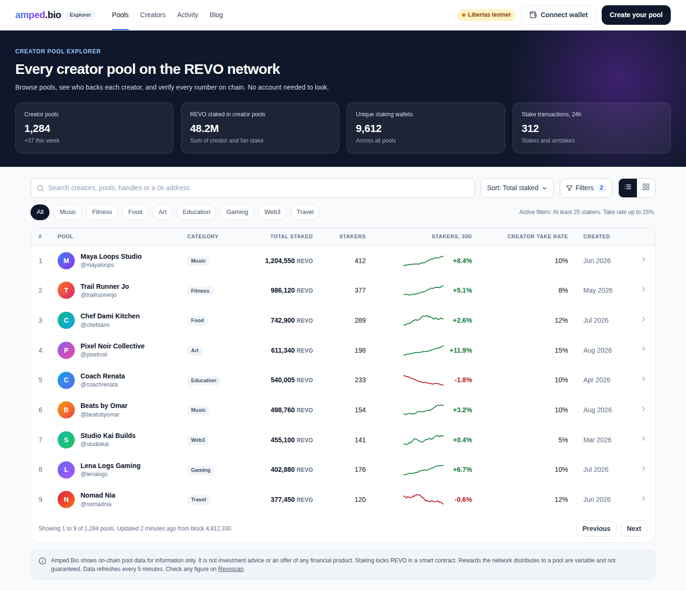
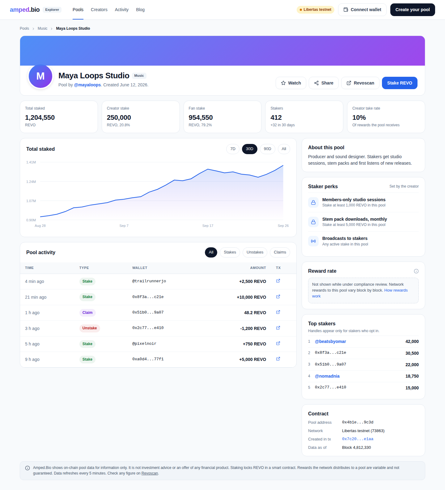
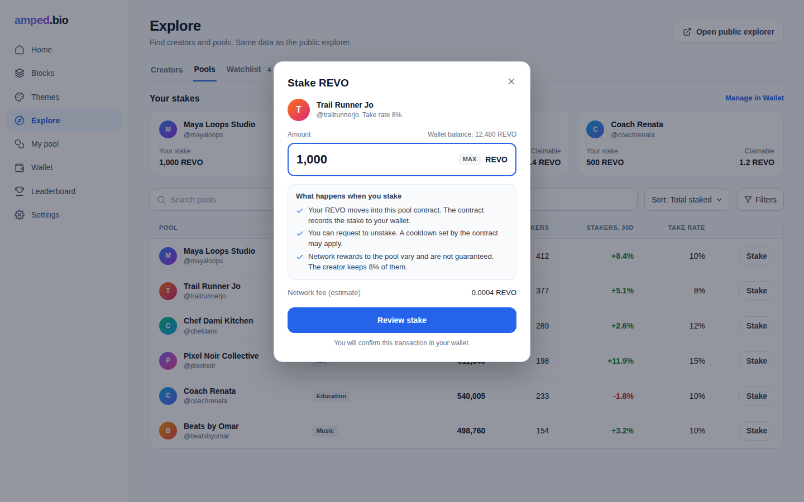
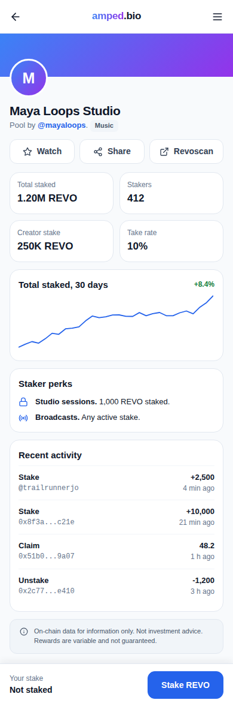
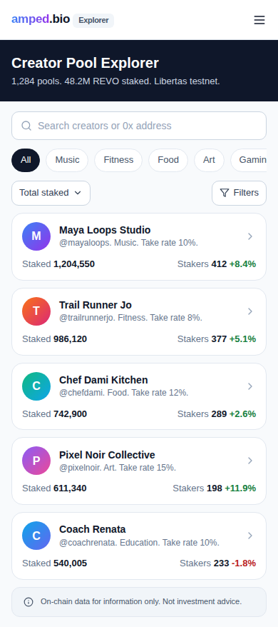

# Creator Pool Explorer

Status: spec for review. Build Board item #9.
Owner: Rob Frasca. Drafted by Claude, 2026-09-26.

Rob's brief: "a standalone Creator Pool Explorer outside Amped.Bio, and also inside Amped.Bio. We need both."

This spec treats both surfaces as one product. One data layer, one set of tRPC procedures, one set of presentational components. Two shells: a public explorer that needs no account, and the Explore panel inside the logged-in editor.

Most of the explorer already exists. This document is a gap analysis plus the target design.

## 1. Research

### 1.1 Current code

**Data model** (`apps/server/prisma/schema.prisma`)

- `CreatorPool`: `walletId`, `chainId`, `name`, `image_file_id`, `description`, `fans` (default 0, not maintained), `revoStaked` (Text), `poolAddress` (unique), `creationTxid`, `hidden`. Unique on `[walletId, chainId]`, so a creator has one pool per chain.
- `CreatorPool` has no `createdAt`. The "newest" sort falls back to `id` (see the comment in `fan.ts`).
- `StakedPool`: one row per wallet per pool, `stakeAmount` as Text, `lastClaim`.
- `StakeEvent`: `amount` as Text, `eventType` "stake" or "unstake", `transactionHash`. No block number, no log index, no claim events.
- Amounts are stored as Text. MySQL cannot sort or sum them. Every sort by stake happens in Node after loading all rows.

**Server** (`apps/server/src/trpc/pools/fan.ts`, `creator.ts`, `admin/pools.ts`)

- `fan.getPools` (public): input `chainId`, `search`, `filter` (`all`, `no-fans`, `more-than-10-fans`, `more-than-10k-stake`), `sort` (`newest`, `name-asc`, `name-desc`, `most-fans`, `most-staked`). It loads every non-hidden pool with all its `stakedPools` rows, runs an on-chain multicall for cache misses, computes APR per pool, then filters and sorts in memory. There is no pagination. Cost grows linearly with pools and stakers.
- `fan.getPools` search matches `description`, `poolAddress` and the creator's `user.name`. It does not match `CreatorPool.name` or the creator's handle. Searching a pool by its own name fails today.
- `fan.getPoolByAddress` (public): on-chain multicall for `totalFanStaked`, `creatorStaked`, `creatorCut`, plus cached APR. It does not check `hidden` and does not lowercase the address, unlike `getPoolDetailsForModal`.
- `fan.getPoolDetailsForModal`, `fan.searchPoolsForBlockEditor`, `fan.getSystemStats` (public). `getSystemStats` returns network totals from `NODE_MANAGER` and `L2_BASE_TOKEN`, not creator pool totals.
- `fan.getUserPoolStake`, `getUserStakedPools`, `confirmStake`, `confirmUnstake`, `confirmClaim` (private).
- `admin.pools.setHidden`, `syncPool`, `syncTransaction`. `syncPool` reads `FanStaked` and `FanUnstaked` logs, but writes only events from wallets linked to an Amped user ("known wallets only").
- Caching (`apps/server/src/utils/cache.ts`): APR 4 hours, pool data 15 minutes, system stats 15 minutes.
- None of the pool procedures select `email`. Good. Keep it that way.

**Chain** (`packages/web3/src/index.ts`, `pools.ts`, `apy.ts`)

- Libertas testnet, chain 73863, explorer `https://libertas.revoscan.io`. Devnet 73861 also configured.
- The factory exposes `getAllPools`, `getPoolForCreator`, `CreatorPoolCreated`. Pools emit `FanStaked`, `FanUnstaked`, `RewardClaimed`, `RewardReceived`. The contract enforces an unstaking cooldown (`UnstakingCooldown`, `canUnstake`).
- `calculatePoolAPY` returns a "24-hour average APR" in basis points, derived from batches sealed in the last 24 hours.

**Public site** (`apps/landingpage`)

- `/i/pools` (`src/app/i/pools/page.tsx`): server-rendered first page via `fetchPoolsPageData`, `revalidate = 300`, then client-side refetch. Filters and sort in `components/pools/PoolsPageContent.tsx`, grid in `PoolsTab.tsx`.
- `/i/pools/[address]` (`src/app/i/pools/[address]/page.tsx`): a client component. No metadata, no server render. Crawlers see an empty shell. The SEO spec (item #10, section 3.9) adds metadata only.
- `/i/pools/[address]/debug` and `/debug-apy` are public, unauthenticated routes. The detail page links to `debug-apy` from the APR card.
- The detail page shows "24-Hour Average APR" with no qualifier, "Total Pool Stake", "Total Fans", "Take Rate", and links to a Freshdesk article titled "How is reward pool APY calculated".
- The "Stake in this Pool" button links to `{NEXT_PUBLIC_PANEL_URL}/i/pools/{address}`. The editor router (`apps/client/src/App.tsx`) has no such route. The catch-all sends the user to the public home page or to `/login`. **The main conversion path from the public pool page is broken.**

**Editor** (`apps/client/src/components/panels`)

- `explore/ExplorePanel.tsx`: tabs Users, Pools, NFTs (NFTs is a stub). Pool sort offers only `newest`, `name-asc`, `name-desc`, while the server supports five.
- `explore/components/PoolsTab.tsx`: clicking a pool navigates away to the public site.
- `explore/StakeModal.tsx`, `UnstakeModal.tsx`, `PoolDetailContent.tsx`, `ExplorePoolDetailsModal.tsx` duplicate the public components with small differences. The editor version carries an APR popover that calls the figure "an instantaneous estimate of the annualized return".
- `leaderboard/LeaderboardPanel.tsx` renders hardcoded mock pools with made-up APR values (12.5%, 8.5%, 15.2%). It is not wired to any data.

**Promotional copy found in the codebase** (to be replaced, see 3.7)

| File | Current string |
|---|---|
| `apps/client/src/components/panels/explore/StakeModal.tsx` | "You're now earning rewards from this pool!" |
| `apps/client/src/components/panels/createrewardpool/CreatorPoolPanel.tsx` | "earn from their stakes", "Percentage you earn from user stakes" |
| `apps/client/src/components/panels/createrewardpool/PoolSummaryModal.tsx` | "Your earnings from stakes" |
| `apps/client/src/components/blocks/CreatorPoolBlock.tsx` | "Stake tokens to earn rewards" |
| `apps/client/src/components/panels/wallet/MyWalletPanel.tsx` | "Earnings to Date", "Total rewards earned from all your staking activities" |
| `apps/client/src/components/panels/explore/PoolDetailContent.tsx` | "annualized return" |
| `apps/client/src/components/panels/leaderboard/LeaderboardPanel.tsx` | mock "24-Hour Average APR" values |
| `apps/landingpage/src/components/pools/PoolDetailContent.tsx` | "24-Hour Average APR" with no qualifier, "Check out this reward pool" |

**Data completeness gap.** `StakeEvent` rows come only from `confirmStake` and `confirmUnstake` (the app reports its own transactions) and from the admin `syncPool`, which drops wallets not linked to an Amped user. A stake sent directly to the contract, or from a wallet with no Amped account, is invisible in history. Pools created outside Amped are invisible too. A standalone explorer that claims to show "every pool on the network" cannot be built on this table. It needs a chain indexer.

### 1.2 Best-in-breed review

| Product | What it does well | Copy | Avoid |
|---|---|---|---|
| [DefiLlama Yields](https://defillama.com/yields) | Dense sortable table across chains. Separates base and reward components. Shows a 30-day mean next to the spot figure. Plain disclaimer that it lists without endorsing. | Table-first layout. "Data only, no endorsement" footer. Showing a trailing average instead of a spot number. | Leading with yield as the primary sort. "Ape at your own risk" tone. |
| [Uniswap Explore](https://app.uniswap.org/explore/pools) ([help](https://support.uniswap.org/hc/en-us/articles/9818094509453-How-to-use-the-Uniswap-Explore-page)) | Three tabs: Tokens, Pools, Transactions. Network selector on every tab. Sort by TVL, volume, volume to TVL. | Pools and Activity tabs. Network selector. A live transactions feed that links each row to the block explorer. | APR columns as a headline metric. |
| [Stakewiz](https://stakewiz.com/) ([Wiz Score](https://docs.stakewiz.com/reference/api-reference/wiz-score)) | A composite quality score with published weights. Explicit penalties for risky configuration. Info completeness is a scored factor. | A published, explainable "profile completeness" signal for ranking. Warnings when a creator changes the take rate. | Opaque scoring. A single number that looks like a rating of investment quality. |
| [validators.app](https://www.validators.app/validators?locale=en&network=mainnet) | Stake shown as absolute and as share of network. Watchlist. Timestamp of the data snapshot on the page. | "Data as of block N" stamp. Watchlist. Share of total stake. | Technical columns that mean nothing to fans. |
| [Substack leaderboards](https://support.substack.com/hc/en-us/articles/5999320475412-What-are-Substack-leaderboards) ([announcement](https://on.substack.com/p/a-new-view-for-leaderboards)) | Category leaderboards with two views: "Rising" (growth velocity) and "Top" (size). One category per publication. | Categories. A "Rising" view based on staker growth, not money. One category per pool. | Ranking by revenue ("Bestsellers"). The creator equivalent would rank by rewards, which is promotional. |
| [Twitch directory](https://www.twitch.tv/directory/all/tags/) ([categories](https://help.twitch.tv/s/article/about-twitch-categories?language=en_US)) | Category browsing with live counts. Creator-first cards. | Creator avatar and handle as the primary identity on every row. Category chips. | Infinite scroll with no sort control. |
| [friend.tech](https://www.dlnews.com/articles/defi/socialfi-rose-in-popularity-last-year-before-falling/) | Proved demand for backing individual creators on chain. | Nothing in the UI. | Price charts, "key price", trending by speculation. Activity collapsed about 90% once speculation stopped. Amped must present pools as community membership, not as assets that go up. |
| [Farcaster channels](https://docs.farcaster.xyz/learn/what-is-farcaster/channels) ([directory](https://github.com/neynarxyz/farcaster-channels)) | A simple directory of communities with member counts and a public, portable registry. | Member count as the headline social proof. An open JSON feed other clients can read. | Unmoderated long tail with no quality floor. |

### 1.3 Patterns to adopt and avoid

**Adopt**

1. Table-first list with sortable columns and a grid toggle. Default sort is total staked, then stakers.
2. Stakers (community size) and staker growth are the headline metrics. Money is shown as a fact, never ranked as an opportunity.
3. A "data as of block N" stamp on every page, and a Revoscan link on every figure that comes from chain.
4. A Pools, Creators, Activity tab structure, with a network selector ready for mainnet.
5. Categories, one per pool, chosen by the creator.
6. A "Rising" view based on 30-day staker growth.
7. Watchlist for logged-in users.
8. A published "profile completeness" signal (image, description, handle, at least one perk) used as a ranking tie-breaker and a listing floor.
9. A plain disclaimer footer: information only, no endorsement, variable rewards.

**Avoid**

1. APR or reward rate as a column, a sort key or a headline number.
2. Any sort or leaderboard by rewards paid.
3. Price-style charts. The only chart is total staked and staker count over time.
4. "Trending" driven by stake flows alone. It invites wash staking.
5. Showing Amped handles next to staker wallets without the staker's consent.

## 2. Overview

### Outcome

- **For creators.** Their pool is findable by name, handle and category, on a page that ranks in search and shares well. Fans see what staking unlocks (perks from the access gating engine) and can stake in one flow.
- **For fans.** One place to find creators on the REVO network, check the numbers against chain, and manage their own stakes.
- **For Amped.** A public, indexable discovery surface that feeds sign-ups and pool creation. A funnel from pool page to stake that works.

### Surfaces

| Surface | Where | Who | Purpose |
|---|---|---|---|
| Public explorer | `amped.bio/pools` (see Decision 1) | Anyone, no account | Discovery, SEO, verification, share links |
| In-app explorer | Explore panel in the editor at `app.amped.bio` | Logged-in users | Discovery plus "Your stakes", watchlist, stake and unstake in place |

Both surfaces call the same `pools.explorer.*` procedures and render the same components from `packages/ui`.

### In scope

1. Chain indexer for pools and pool events, independent of Amped accounts.
2. Materialized pool stats and daily snapshots, with numeric columns that MySQL can sort.
3. Paginated, server-sorted list API. Search on pool name, handle, display name and address.
4. Public explorer: list, pool detail (server-rendered), activity feed, creators tab.
5. In-app explorer: same list and detail, plus "Your stakes", watchlist, stake modal in place.
6. Categories on pools.
7. Staker perks panel on pool detail, read from `AccessRule` (display only).
8. Compliance copy pass across all pool surfaces listed in 1.1.
9. Fix the broken "Stake in this Pool" deep link.
10. Replace the mock Leaderboard panel with real data or remove it.
11. Move debug routes behind admin auth.
12. Opt-in public staker identity.

### Out of scope

- Payments, paid access and any money movement. On hold while Rob builds payments in the Revolution Network project.
- Access rule creation and enforcement. Owned by the access gating engine spec. The explorer only reads rule summaries.
- Broadcast composition. Owned by the broadcast spec. The explorer only states that stakers receive broadcasts.
- Mainnet launch. The design supports a network selector; only Libertas testnet is configured.
- An embeddable explorer widget for third-party sites.
- Per-pool metadata and sitemap entries beyond what the SEO spec (item #10) defines. This spec supplies the data for them.

### Decisions for Rob

1. **Where the public explorer lives.** Recommended: `amped.bio/pools` and `amped.bio/pools/{address}`, served by `apps/landingpage`, with 301 redirects from `/i/pools/*`.
   - SEO: a subfolder inherits the domain authority that bios build. Bios link to pools and pools link to bios, so every page strengthens the other. A subdomain such as `explore.amped.bio` is a separate property in Search Console and splits that authority.
   - Brand: "outside Amped.Bio" is met by the shell. The explorer has its own header, needs no account and no editor. It is outside the product, not outside the domain.
   - Cost: none. It is the same Next.js app.
   - Requirement: `pools` must become a reserved handle. There is no reserved-handle list in the codebase today. Add one in `packages/constants` (at least `pools`, `i`, `blog`, `login`, `register`, `sign`, `auth`, `og`, `explore`, `creators`, `activity`) and check whether a user already holds any of them.
   - Alternative: if Rob wants a Revolution Network branded explorer for all chain activity, host it on the Revolution domain from the same code, with each pool page's canonical pointing to `amped.bio/pools/{address}`. Build that only after mainnet.
2. **Reward rate (APR) display.** Recommended: hide it on both surfaces until securities counsel signs off. Show "Not shown while under compliance review" with a link to a neutral explainer of how network rewards reach a pool. If counsel approves display, the label becomes "Historical reward rate, trailing 30 days. Variable. Not a forecast or a promise of future rewards." It is never a sort key or a column. Remove the "24-Hour Average APR" figure and the public `debug-apy` link now.
3. **Staker identity.** Recommended: show truncated wallet addresses by default. Show an Amped handle next to a stake only when that user turns on "Show my stakes publicly" (default off). Wallet addresses are public on chain; linking them to a person is Amped's act and needs consent.
4. **Listing floor.** Recommended: list a pool in the public explorer only when it has a name, an image or description, a creator with a handle, and at least one staker other than the creator. Unlisted pools stay reachable by direct link with `noindex`. This keeps the default view free of empty test pools.
5. **Pools not created through Amped.** The indexer will find factory pools with no Amped account behind them. Recommended: show them in the explorer with address and on-chain data only, marked "No Amped profile", and never in the default sort's first page.
6. **"Fans" or "Stakers".** Recommended: "Stakers" in the explorer (descriptive, matches chain data), "Supporters" on the creator's own bio if Rob prefers a warmer word there.
7. **Leaderboard panel.** Recommended: delete the mock panel and point its nav item to the in-app explorer sorted by stakers.

## 3. Detailed spec

### 3.1 Screens

**Public explorer, list** (`amped.bio/pools`)



Dark hero with four network totals for creator pools only. Search, sort, filters and a list or grid toggle. Category chips. Table columns: rank, pool (avatar, name, handle), category, total staked, stakers, 30-day staker change with sparkline, creator take rate, created. Footer states row range, the last update and the block height. Disclaimer below the table. No reward rate column.

**Public explorer, pool detail** (`amped.bio/pools/{address}`)



Server-rendered. Header with creator identity and four actions: Watch, Share, Revoscan, Stake REVO. Five stat cards: total, creator stake, fan stake, stakers, take rate. Total staked chart with 7D, 30D, 90D, All. Activity table filtered by type, each row linked to Revoscan. Right column: about, staker perks from `AccessRule`, reward rate card in its "under review" state (Decision 2), top stakers with opt-in handles, contract facts with block height.

**In-app explorer with stake modal** (editor, Explore panel)



Tabs: Creators, Pools, Watchlist. The NFTs stub is removed. "Your stakes" cards show stake and claimable amount per pool, linking to Wallet. The table has an inline Stake button. The stake modal explains what staking does in three factual lines, shows the take rate and the network fee, and hands off to the wallet.

**Mobile, pool detail**



Single column. Stats in a 2 by 2 grid. Chart, perks, recent activity. A bottom bar shows the viewer's own stake and the Stake REVO action.

**Mobile, list**



Cards replace the table. Search, horizontally scrolling category chips, sort and filters.

All numbers in the mockups are sample data.

### 3.2 Data model changes

```prisma
model CreatorPool {
  // existing fields unchanged
  createdAt   DateTime?     @default(now())   // backfill from CreatorPoolCreated block time
  updatedAt   DateTime?     @updatedAt
  category    PoolCategory?
  listed      Boolean       @default(true)    // creator can unlist from the explorer
  stats       PoolStats?
  snapshots   PoolSnapshot[]
  watchers    PoolWatch[]

  @@index([chainId, category])
}

enum PoolCategory {
  MUSIC
  FITNESS
  FOOD
  ART
  EDUCATION
  GAMING
  WEB3
  TRAVEL
  LIFESTYLE
  OTHER
}

/// Current stats per pool. Written by the indexer. Read by every list query.
/// Decimal(65,0) holds wei values and lets MySQL sort and sum them.
model PoolStats {
  poolId           Int      @id
  chainId          String
  totalStakeWei    Decimal  @db.Decimal(65, 0)
  creatorStakeWei  Decimal  @db.Decimal(65, 0)
  fanStakeWei      Decimal  @db.Decimal(65, 0)
  stakerCount      Int
  stakerChange30d  Int                        // absolute change in stakers over 30 days
  stakeChange30dBp Int                        // basis points change in total stake over 30 days
  creatorCutBps    Int
  completeness     Int                        // 0 to 100, see 3.4
  lastEventBlock   BigInt
  refreshedAt      DateTime
  pool             CreatorPool @relation(fields: [poolId], references: [id], onDelete: Cascade)

  @@index([chainId, totalStakeWei])
  @@index([chainId, stakerCount])
  @@index([chainId, stakerChange30d])
  @@map("pool_stats")
}

/// One row per pool per day. Feeds charts and 30-day changes.
model PoolSnapshot {
  id            Int      @id @default(autoincrement())
  poolId        Int
  day           DateTime @db.Date
  totalStakeWei Decimal  @db.Decimal(65, 0)
  stakerCount   Int
  pool          CreatorPool @relation(fields: [poolId], references: [id], onDelete: Cascade)

  @@unique([poolId, day])
  @@map("pool_snapshots")
}

/// Every pool event from chain, for every wallet, Amped user or not.
/// StakeEvent stays as is for existing features; the explorer reads this table.
model PoolChainEvent {
  id            BigInt   @id @default(autoincrement())
  chainId       String
  poolAddress   String   @db.VarChar(42)
  kind          PoolEventKind
  wallet        String   @db.VarChar(42)
  amountWei     Decimal  @db.Decimal(65, 0)
  txHash        String   @db.VarChar(66)
  logIndex      Int
  blockNumber   BigInt
  blockTime     DateTime
  userWalletId  Int?                          // set when the wallet is linked to an Amped user

  @@unique([chainId, txHash, logIndex])
  @@index([chainId, poolAddress, blockNumber])
  @@index([chainId, blockTime])
  @@index([wallet])
  @@map("pool_chain_events")
}

enum PoolEventKind {
  POOL_CREATED
  STAKE
  UNSTAKE
  CLAIM
  REWARD_RECEIVED
}

/// Indexer progress per chain and stream.
model IndexerCursor {
  id        String   @id                      // e.g. "73863:pools"
  lastBlock BigInt
  updatedAt DateTime @updatedAt
  @@map("indexer_cursors")
}

model PoolWatch {
  userId    Int
  poolId    Int
  createdAt DateTime @default(now())
  user      User        @relation(fields: [userId], references: [id], onDelete: Cascade)
  pool      CreatorPool @relation(fields: [poolId], references: [id], onDelete: Cascade)
  @@id([userId, poolId])
  @@map("pool_watches")
}

model User {
  // existing fields unchanged
  showStakesPublicly Boolean  @default(false)
  poolWatches        PoolWatch[]
}
```

Notes:

- Pools found by the indexer with no Amped wallet get no `CreatorPool` row. They live in `PoolChainEvent` and are listed through a query over `POOL_CREATED` events (Decision 5). If Rob rejects Decision 5, skip them.
- `CreatorPool.fans` and `revoStaked` become legacy. Stop reading them once `PoolStats` is live. Remove in a later migration.
- After the migration, run `pnpm run --filter server run prisma:generate`.

### 3.3 Indexer

- A worker in `apps/server` (same process pattern as existing background jobs) polls each configured chain every 30 seconds.
- It reads `CreatorPoolCreated` from `CREATOR_POOL_FACTORY` and `FanStaked`, `FanUnstaked`, `RewardClaimed`, `RewardReceived` from every known pool, from `IndexerCursor.lastBlock + 1` to `latest - 3` (confirmation margin), in chunks of 5,000 blocks.
- Inserts are idempotent on `[chainId, txHash, logIndex]`.
- After each batch it recomputes `PoolStats` for touched pools with one multicall (`totalFanStaked`, `creatorStaked`, `creatorCut`) and the event-derived staker count. Chain values win if they disagree with event sums, and the mismatch is logged.
- A daily job writes `PoolSnapshot` rows at 00:00 UTC and recomputes the 30-day change fields.
- Backfill: one admin-triggered run from the factory deployment block. It replaces the need for per-pool `admin.pools.syncPool` for explorer data.
- `confirmStake` and `confirmUnstake` keep their current behavior. They also enqueue an immediate stats refresh for the pool, so the user sees their stake within seconds.

### 3.4 Ranking and completeness

- Default sort: `totalStakeWei` descending, tie-break by `stakerCount`, then `completeness`.
- "Rising" sort: `stakerChange30d` descending, among pools with at least 10 stakers. Stake flows alone do not drive it.
- `completeness` (0 to 100): pool image 25, description of 40 or more characters 25, creator handle and avatar 25, at least one perk rule 25. Published in the explorer's "How ranking works" page.
- Listing floor per Decision 4. Admin `hidden` and creator `listed = false` both remove a pool from lists.

### 3.5 tRPC procedures

New router `apps/server/src/trpc/pools/explorer.ts`, mounted as `pools.explorer`. Shared zod schemas and output types in `packages/constants/src/explorer.ts`. No procedure returns `email`. Every output type is an explicit select, never a full `User` include.

| Procedure | Access | Input (zod) | Output |
|---|---|---|---|
| `list` | public | `{ chainId: string, q?: string (max 80), category?: PoolCategory, minStakers?: number, maxTakeRateBps?: number, sort: "total_staked" \| "stakers" \| "rising" \| "newest" \| "name", cursor?: string, limit: number (1 to 50, default 25) }` | `{ items: ExplorerPoolRow[], nextCursor: string \| null, total: number, asOfBlock: string, refreshedAt: string }` |
| `get` | public | `{ chainId: string, address: string (0x, 40 hex, lowercased) }` | `ExplorerPoolDetail` or `NOT_FOUND`. Hidden pools return `NOT_FOUND`. Unlisted pools return data with `listed: false`. |
| `history` | public | `{ chainId, address, range: "7d" \| "30d" \| "90d" \| "all" }` | `{ points: { day: string, totalStakeWei: string, stakerCount: number }[] }` |
| `activity` | public | `{ chainId, address?: string, kind?: PoolEventKind, cursor?: string, limit: 1 to 50 }` | `{ items: { kind, wallet, handle: string \| null, amountWei, txHash, blockTime }[], nextCursor }`. `handle` only when the wallet's user has `showStakesPublicly`. |
| `topStakers` | public | `{ chainId, address, limit: 1 to 20 }` | `{ items: { wallet, handle: string \| null, stakeWei }[] }` |
| `perks` | public | `{ chainId, address }` | `{ items: { title, requirement: string, kind: "stake_min" \| "pool_member" }[] }`. Calls the gating engine's public summary function. Never returns gated content or its URLs. |
| `stats` | public | `{ chainId }` | `{ poolCount, totalStakeWei, uniqueStakers, events24h, asOfBlock }` |
| `creators` | public | `{ chainId, q?, category?, cursor?, limit }` | Creator rows (handle, name, avatar, pool summary). No email. |
| `myStakes` | private | `{ chainId }` | `{ items: { pool: ExplorerPoolRow, stakeWei, claimableWei }[] }` |
| `watch` / `unwatch` | private | `{ poolId: number }` | `{ ok: true }` |
| `watchlist` | private | `{ chainId }` | `{ items: ExplorerPoolRow[] }` |
| `setCategory` | private (pool owner) | `{ poolId, category: PoolCategory }` | `{ ok: true }` |
| `setListed` | private (pool owner) | `{ poolId, listed: boolean }` | `{ ok: true }` |
| `sitemapEntries` | public | `{ chainId, cursor?, limit: 1 to 5000 }` | `{ items: { address, updatedAt }[], nextCursor }`. Consumed by the SEO spec's pool sitemap. |
| `admin.pools.reindex` | admin | `{ chainId, fromBlock?: string }` | tracked progress stream, same pattern as `syncPool` |

`ExplorerPoolRow`: `{ id, address, chainId, name, handle, displayName, avatarUrl, imageUrl, category, totalStakeWei, stakerCount, stakerChange30d, sparkline: number[] (30 values), creatorCutBps, createdAt, completeness }`.

`ExplorerPoolDetail`: row fields plus `{ description, creatorStakeWei, fanStakeWei, creationTxHash, asOfBlock, listed, explorerUrl }`. No reward rate field until Decision 2 is resolved. When it is, add `rewardRate: { bps, window: "30d", label: "historical" } | null` behind a server flag.

Existing procedures:

- `fan.getPools`: keep for current callers, reimplement on `PoolStats` so it stops doing on-chain calls per request. Add `CreatorPool.name` and handle to search. Deprecate once both explorers use `explorer.list`.
- `fan.getPoolByAddress`: add the `hidden` check and lowercase the address.

### 3.6 Frontend

- **Shared components** in `packages/ui/src/explorer/`: `PoolTable`, `PoolCard`, `PoolStatCards`, `StakeHistoryChart`, `ActivityTable`, `PerksList`, `TopStakers`, `ExplorerDisclaimer`. Tailwind only. Icons from `lucide-react`. These replace the duplicated `PoolsTab` and `PoolDetailContent` in both apps.
- **Public site** (`apps/landingpage`):
  - `src/app/pools/page.tsx`: server component. Reads `searchParams` for `q`, `category`, `sort`, `cursor` so filtered views have shareable URLs. `revalidate = 60`.
  - `src/app/pools/[address]/page.tsx`: server component with `generateMetadata`, JSON-LD per the SEO spec, `revalidate = 60`. Client islands only for chart range, activity filters, Watch and Stake.
  - `/pools/@{handle}`: 301 to the handle's pool address, for readable share links. Handle it in `src/proxy.ts`, which already rewrites `/@handle`. A folder named `@[handle]` would be read by Next.js as a parallel route slot.
  - `next.config` redirects: `/i/pools` to `/pools`, `/i/pools/:address` to `/pools/:address` (301).
  - `debug` and `debug-apy` move to the admin area of the editor.
  - Header nav: Pools, Creators, Activity, Blog. Network pill. Connect wallet. Create your pool.
- **Stake from the public site.** The Stake REVO button opens the shared stake modal on the public page when the viewer is logged in (the landing page already has `trpcClient` and wagmi). When logged out, it opens login and returns to the same pool page. This removes the broken `{PANEL_URL}/i/pools/{address}` link.
- **Editor** (`apps/client`): Explore panel tabs become Creators, Pools, Watchlist. "Your stakes" strip on the Pools tab. Clicking a pool opens the detail in a side sheet inside the editor, not a navigation to the public site. "Open public explorer" link in the header. Leaderboard panel removed per Decision 7.

### 3.7 Compliance and copy

Rules for every pool surface, public and in-app:

1. No "earn", "earnings", "yield", "returns", "passive income", "APY" or "APR" in UI copy.
2. Describe mechanics, not outcomes: "stake", "unstake", "claim", "rewards the network distributes to the pool", "take rate".
3. No ranking, sorting or highlighting by rewards.
4. Every page with pool numbers carries the disclaimer below and a block height.
5. No price charts and no language about a stake gaining value.

Disclaimer (footer of every explorer page):

> Amped.Bio shows on-chain pool data for information only. It is not investment advice or an offer of any financial product. Staking locks REVO in a smart contract. Rewards the network distributes to a pool are variable and not guaranteed. Data refreshes every 5 minutes. Check any figure on Revoscan.

Replacements:

| Current | Replacement |
|---|---|
| "You're now earning rewards from this pool!" | "Stake confirmed. You now have {amount} REVO staked in this pool." |
| "Set up a reward pool to engage your community and earn from their stakes" | "Set up a creator pool. Fans stake REVO to back you and unlock your perks." |
| "Percentage you earn from user stakes" | "Your take rate. The share of network rewards to this pool that goes to you." |
| "Your earnings from stakes" | "Your take rate share, claimed to date." |
| "Stake tokens to earn rewards" | "Stake REVO to back this creator." |
| "Earnings to Date" | "Claimed to date" |
| "Total rewards earned from all your staking activities" | "Total rewards you have claimed from pools." |
| "24-Hour Average APR" (both detail pages) | Removed. Reward rate card per Decision 2. |
| "Check out this reward pool" (share text) | "{name} on Amped.Bio" |
| "Percentage of rewards taken by the pool creator" | "Share of network rewards to this pool that goes to the creator." |
| Freshdesk link "How is reward pool APY calculated" | Link to a rewritten article: "How network rewards reach a pool". Counsel to review. |

Stake modal body (three lines, as in the mockup):

- "Your REVO moves into this pool contract. The contract records the stake to your wallet."
- "You can request to unstake. A cooldown set by the contract may apply."
- "Network rewards to the pool vary and are not guaranteed. The creator keeps {take rate} of them."

### 3.8 Caching and performance

- List and detail requests read MySQL only. No RPC calls in the request path, except `myStakes.claimableWei` (one multicall per user, cached 60 seconds).
- `PoolStats` indexes cover every sort. Cursor pagination on `(sortKey, id)`. Target p95 under 150 ms for `list` at 10,000 pools.
- Sparklines come from `PoolSnapshot`, 30 values per row, fetched in one query per page.
- Next.js pages revalidate every 60 seconds. `explorer.stats` cached 5 minutes in the existing cache utility.
- The 4-hour APR cache and `calculatePoolAPY` stay in the code but leave the request path of the explorer.
- Images: pool images served through the existing S3 URL with width hints; avatar fallback is a gradient initial, no extra request.

### 3.9 Permissions

| Action | Who |
|---|---|
| Read list, detail, history, activity, perks, stats | Anyone |
| Watch, watchlist, myStakes | Logged-in user |
| setCategory, setListed | Owner of the pool's wallet |
| Hide a pool, reindex | Admin |
| Debug pages | Admin |

### 3.10 Security and privacy

- Never return `email`, internal user ids or wallet ids from public procedures. Output types are explicit selects. Add a test that fails if any `pools.explorer` output contains a key named `email`.
- Handles appear next to wallets only with `showStakesPublicly = true`.
- Address inputs are validated with a strict zod regex and lowercased. Free text search is length-limited and passed as a Prisma parameter.
- Pool descriptions render as text with the existing link parser. No HTML.
- Public procedures are rate-limited per IP (60 requests per minute for `list`, 120 for `get`).
- Perks show only a rule title and requirement. Gated content, signed URLs and content ids never leave the gating engine through the explorer.
- The indexer uses a read-only RPC client. It holds no keys.

### 3.11 Analytics events

Sent through the analytics layer defined in Build Board item #11. Property `surface` is `public` or `app` on every event.

| Event | Properties |
|---|---|
| `explorer_viewed` | `tab`, `chainId` |
| `explorer_searched` | `query_length`, `results` |
| `explorer_filter_changed` | `category`, `sort`, `minStakers`, `maxTakeRateBps` |
| `explorer_pool_opened` | `poolAddress`, `rank`, `sort` |
| `pool_detail_viewed` | `poolAddress`, `listed` |
| `pool_stake_clicked` | `poolAddress`, `loggedIn` |
| `pool_stake_confirmed` | `poolAddress`, `amountBucket` (bucketed, never exact) |
| `pool_unstake_confirmed` | `poolAddress` |
| `pool_watch_toggled` | `poolAddress`, `watched` |
| `pool_shared` | `poolAddress`, `channel` |
| `pool_revoscan_clicked` | `poolAddress`, `target` (`pool`, `tx`) |
| `pool_perk_clicked` | `poolAddress`, `ruleKind` |

Funnel to watch: `pool_detail_viewed` to `pool_stake_clicked` to `pool_stake_confirmed`, split by surface.

### 3.12 Acceptance criteria

1. A stake sent directly to a pool contract from a wallet with no Amped account appears in that pool's activity and totals within 2 minutes.
2. `explorer.list` returns 25 rows in under 150 ms p95 with 10,000 seeded pools, for every sort.
3. Searching a pool's exact name, its creator's handle, or its address returns that pool first.
4. The public pool detail page returns full HTML with pool name, stats and activity when fetched with JavaScript disabled.
5. `/i/pools` and `/i/pools/{address}` return 301 to the new URLs.
6. The Stake REVO button on the public detail page opens the stake modal for a logged-in user and returns a logged-out user to the same page after login. No path lands on the home page.
7. No pool surface in either app contains the whole words "earn", "earning", "earnings", "APY", "APR", "yield" or "returns" (checked by a lint rule or test over the pool component folders).
8. No public explorer response contains a key named `email`.
9. A staker's handle appears in activity or top stakers only after they enable "Show my stakes publicly".
10. `debug` and `debug-apy` pages return 404 to non-admins.
11. Hidden pools return 404 on detail and are absent from lists. Unlisted pools render with `noindex` and are absent from lists.
12. The editor Explore panel offers the same sorts and filters as the public explorer and never navigates away to stake.
13. The Leaderboard panel no longer shows mock data.
14. Typecheck and build pass for server, client, landingpage and packages.
15. The disclaimer and a block height appear on every explorer page.

### 3.13 Phased rollout

| Phase | Scope | Exit |
|---|---|---|
| 0. Hotfix (days) | Copy pass (3.7). Remove APR display and public debug links. Fix the Stake deep link. Remove mock Leaderboard. Add pool name and handle to `getPools` search. `hidden` check in `getPoolByAddress`. | Criteria 6, 7, 10, 13 |
| 1. Data layer | Migration. Indexer and backfill. `PoolStats`, `PoolSnapshot`. `explorer.list`, `get`, `history`, `activity`, `stats`. | Criteria 1, 2, 3 |
| 2. Public explorer | `/pools` routes, redirects, server-rendered detail, shared `packages/ui` components, reserved handles, categories, disclaimer. | Criteria 4, 5, 11, 15 |
| 3. In-app explorer | Explore panel rebuild, "Your stakes", watchlist, in-place detail and stake. `showStakesPublicly` setting. | Criteria 9, 12 |
| 4. Perks and growth | Perks panel from `AccessRule`. Rising sort. Creators and Activity tabs. Analytics events. Sitemap entries for the SEO spec. | Analytics funnel live |
| Later | Reward rate display if counsel approves. Mainnet network selector. Revolution-branded host. | Rob's decision |

## Sources

- DefiLlama Yields: https://defillama.com/yields
- Uniswap Explore pools: https://app.uniswap.org/explore/pools
- Uniswap help, Explore page: https://support.uniswap.org/hc/en-us/articles/9818094509453-How-to-use-the-Uniswap-Explore-page
- Stakewiz: https://stakewiz.com/
- Stakewiz Wiz Score docs: https://docs.stakewiz.com/reference/api-reference/wiz-score
- validators.app: https://www.validators.app/validators?locale=en&network=mainnet
- Substack, What are leaderboards: https://support.substack.com/hc/en-us/articles/5999320475412-What-are-Substack-leaderboards
- Substack, A new view for leaderboards: https://on.substack.com/p/a-new-view-for-leaderboards
- Twitch directory: https://www.twitch.tv/directory/all/tags/
- Twitch, About categories: https://help.twitch.tv/s/article/about-twitch-categories?language=en_US
- DL News, SocialFi and friend.tech decline: https://www.dlnews.com/articles/defi/socialfi-rose-in-popularity-last-year-before-falling/
- Farcaster docs, channels: https://docs.farcaster.xyz/learn/what-is-farcaster/channels
- Neynar Farcaster channel registry: https://github.com/neynarxyz/farcaster-channels
- SEC Division of Corporation Finance, Statement on Certain Protocol Staking Activities (May 29, 2025), background for counsel review only: https://www.sec.gov/newsroom/speeches-statements/statement-certain-protocol-staking-activities-052925
